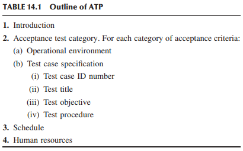
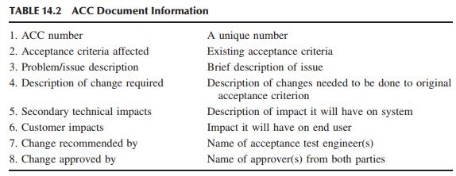
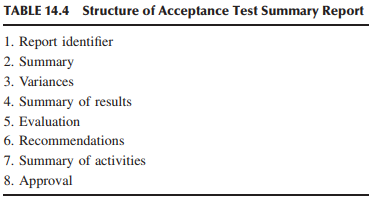
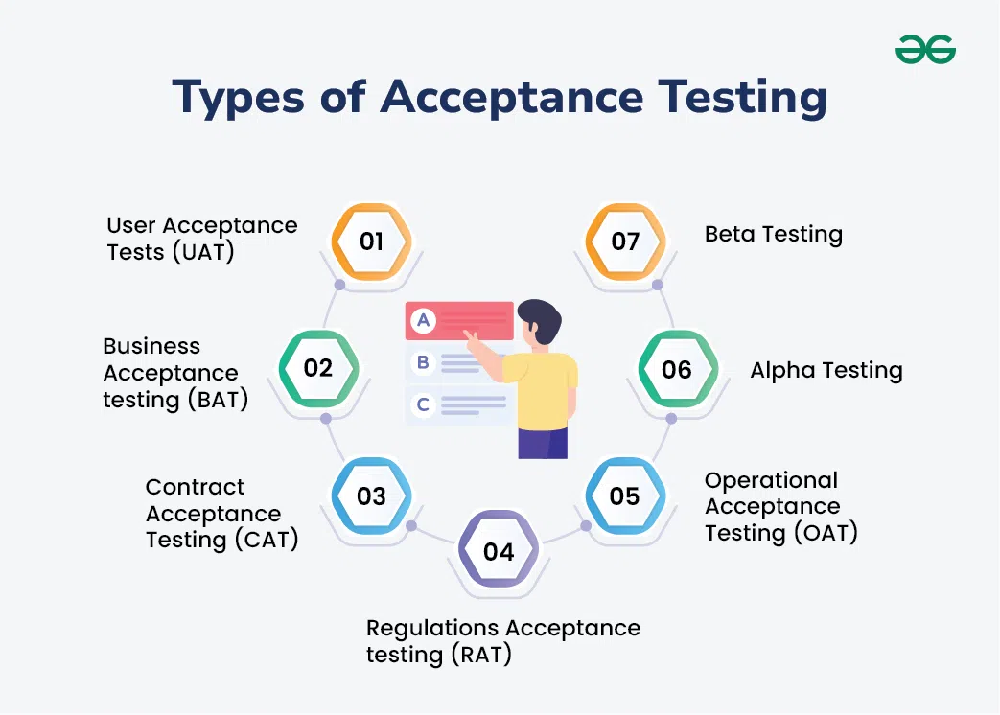

# ACCEPTANCE TESTING

> Acceptance of others, their looks, their behaviors, their beliefs, bring you an inner peace and tranquility—instead of anger and resentment. — Anonymous

## 14.1 TYPES OF ACCEPTANCE TESTING
Suatu produk siap untuk dikirimkan kepada klien setelah kelompok pengujian sistem merasa puas dengan produk tersebut dengan melakukan pengujian tingkat sistem. Klien melaksanakan pengujian penerimaan berdasarkan ekspektasi mereka terhadap produk tersebut. Layanan yang ditawarkan oleh suatu produk perangkat lunak dapat digunakan oleh jutaan pengguna. Misalnya, penyedia layanan jaringan telepon seluler merupakan klien sistem perangkat lunak yang menjalankan jaringan telepon tersebut, sedangkan masyarakat umum membentuk basis pengguna dengan berlangganan layanan telepon tersebut. Tidak jarang seseorang memiliki peran ganda sebagai klien dan pengguna. Penyedia layanan perlu memastikan bahwa produk tersebut memenuhi kriteria tertentu sebelum penyedia menyediakan layanan tersebut kepada masyarakat umum. ~~Pengujian penerimaan adalah pengujian formal yang dilakukan untuk menentukan apakah suatu sistem memenuhi kriteria penerimaannya — kriteria yang harus dipenuhi oleh sistem tersebut agar dapat diterima oleh klien~~. Pengujian ini membantu klien untuk menentukan apakah akan menerima sistem tersebut atau tidak. Klien pada umumnya berhak untuk menolak menerima pengiriman produk jika kasus pengujian penerimaan tidak lulus. Ada dua kategori pengujian penerimaan:

* User acceptance testing (UAT).
* Business acceptance testing (BAT).

UAT dilakukan oleh klien untuk memastikan bahwa sistem memenuhi kriteria penerimaan kontraktual sebelum disetujui sebagai pemenuhan kebutuhan pengguna. Perencanaan dan pelaksanaan aktual pengujian penerimaan tidak harus dilakukan langsung oleh klien. Sering kali firma konsultan pihak ketiga menawarkan layanan mereka untuk melakukan tugas ini. Namun, klien harus menentukan kriteria penerimaan agar pihak ketiga dapat mencarinya dalam produk. BAT dilakukan dalam organisasi pengembangan pemasok untuk memastikan bahwa sistem pada akhirnya akan lulus UAT. Ini adalah latihan UAT di tempat pemasok. Organisasi pengembangan pemasok memperoleh dan melaksanakan kasus uji dari kontrak klien, yang mencakup kriteria penerimaan.

Kriteria penerimaan harus ditetapkan dan disetujui antara pemasok dan klien untuk menghindari segala jenis argumen yang berlarut-larut. Salah satu pihak atau firma konsultan pihak ketiga dapat merancang rencana pengujian penerimaan. Dokumen kriteria penerimaan merupakan bagian dari kontrak dalam kasus pengembangan yang dialihdayakan berdasarkan perjanjian OEM. Jika beberapa perangkat keras merupakan bagian integral dari sistem, maka kriteria penerimaan perangkat keras disertakan dalam perjanjian kontraktual. Secara umum, organisasi pemasaran pembeli menentukan kriteria penerimaan. Akan tetapi, penting bagi tim jaminan kualitas perangkat lunak dari organisasi pembeli untuk memulai dialog dengan penjual dan memberikan serangkaian kriteria penerimaan "straw man" agar departemen pemasaran dapat meninjau dan menanggapinya. Pengguna, teknisi sistem, teknisi dukungan klien, dan kelompok jaminan kualitas perangkat lunak dari organisasi pembeli melakukan perencanaan dan pelaksanaan aktual pengujian penerimaan setelah kriteria disetujui. Personel yang mengembangkan rencana pengujian penerimaan harus memiliki pemahaman menyeluruh tentang kriteria penerimaan yang telah disetujui. Tidak mungkin sistem lulus semua kriteria penerimaan sekaligus untuk sistem yang besar dan kompleks. ~~Penting untuk fokus pada tiga tujuan utama pengujian penerimaan berikut karena alasan praktis~~:

* Pastikan bahwa sistem memenuhi kriteria yang disepakati. Kategori kriteria yang luas dijelaskan di Bagian 14.2.
* Identifikasi dan atasi ketidaksesuaian, jika ada. Sumber ketidaksesuaian dan mekanisme penyelesaiannya telah dijelaskan di Bagian 14.5.
* Tentukan kesiapan sistem untuk operasi langsung. Penerimaan akhir sistem untuk penerapan bergantung pada hasil pengujian penerimaan. Tim pengujian penerimaan membuat laporan pengujian penerimaan yang menguraikan ketentuan penerimaan. Rincian laporan pengujian penerimaan telah dijelaskan di Bagian 14.6.

Pengujian penerimaan hanyalah satu aspek dari pemenuhan kontrak perjanjian antara pemasok dan pembeli. Perjanjian kontrak mungkin mengharuskan penjual untuk menyediakan materi lain, seperti dokumen solusi desain yang membahas dokumen persyaratan pembeli. Tim pengujian penerimaan dapat mengevaluasi penerimaan desain sistem dalam hal antarmuka pengguna grafis, penanganan kesalahan, dan kontrol akses.

## 14.2 ACCEPTANCE CRITERIA
Inti dari setiap perjanjian kontraktual adalah seperangkat kriteria penerimaan. Pertanyaan utamanya adalah kriteria apa yang harus dipenuhi sistem agar dapat diterima? Kriteria penerimaan harus dapat diukur dan, sebaiknya, dapat dikuantifikasi. Prinsip dasar perancangan kriteria penerimaan adalah untuk memastikan bahwa kualitas sistem dapat diterima. Seseorang harus memahami makna kualitas suatu sistem, yang merupakan konsep yang kompleks. Ini berarti hal yang berbeda bagi orang yang berbeda, dan sangat bergantung pada konteks.

Meskipun orang yang berbeda mungkin memiliki pandangan yang berbeda tentang kualitas, pendapat klienlah yang berlaku. Konsep kualitas, pada kenyataannya, rumit dan beraneka ragam. Lima pandangan tentang kualitas, yaitu, pandangan transendental, pandangan pengguna, pandangan manufaktur, pandangan produk, dan pandangan berbasis nilai, telah dijelaskan dalam Bab 17. Kelima pandangan tersebut dalam konteks produksi dan manufaktur secara umum dan dijelaskan dalam konteks pengembangan perangkat lunak. Kelima pandangan tersebut disajikan di bawah ini dalam bentuk yang ringkas:
1. Pandangan transendental melihat kualitas sebagai sesuatu yang dapat dikenali tetapi sulit untuk dijelaskan atau didefinisikan.
2. Pandangan pengguna melihat kualitas sebagai sesuatu yang memuaskan tujuan.
3. Pandangan manufaktur melihat kualitas sebagai sesuatu yang sesuai dengan spesifikasi.
4. Pandangan produk mengaitkan kualitas dengan karakteristik bawaan produk.
5. Pandangan berbasis nilai memberikan angka biaya pada kualitas—jumlah yang bersedia dibayarkan klien untuk itu.

Kriteria penerimaan ditetapkan berdasarkan berbagai aspek atribut kualitas ini. Atribut-atribut ini menentukan ada atau tidaknya kualitas dalam suatu sistem. Pembeli, atau Klien, harus memikirkan relevansi dan kepentingan relatif atribut-atribut ini dalam situasi unik mereka pada saat merumuskan kriteria penerimaan. ~~Atribut kualitas dibahas di bawah ini dan contoh kriteria penerimaan untuk setiap atribut kualitas diberikan~~.

**Ketepatan dan Kelengkapan Fungsional (Functional Correctness and Completeness)** Pertanyaan yang dapat diajukan adalah: _Apakah sistem melakukan apa yang kita inginkan?_ Semua fitur yang dijelaskan dalam spesifikasi awal harus ada dalam sistem. Penting untuk menunjukkan bahwa sistem bekerja dengan benar setidaknya dalam dua hingga tiga kondisi untuk setiap fitur sebagai bagian dari penerimaan.

Seseorang dapat menunjukkan ketepatan fungsional suatu sistem dengan menggunakan basis data persyaratan, seperti yang dibahas dalam Bab 11. Basis data digunakan dalam menghasilkan matriks ketertelusuran persyaratan selama pengujian tingkat sistem. Pada dasarnya, matriks ketertelusuran memberi tahu kita kasus uji yang digunakan untuk memverifikasi persyaratan dan semua persyaratan yang sebagian diverifikasi oleh kasus uji. Matriks ketertelusuran tersebut merupakan alat yang ampuh dalam menunjukkan kepada klien tentang ketepatan fungsional sistem. Penting untuk memperoleh umpan balik awal dari klien tentang matriks ketertelusuran persyaratan. Gagasan di balik umpan balik tersebut adalah untuk mencapai kesepakatan tentang metode validasi yang akan digunakan untuk setiap persyaratan. Keputusan tersebut sangat penting karena beberapa metode validasi lebih mudah diterapkan dan tidak memakan banyak waktu dibandingkan metode lainnya. Misalnya, metode demonstrasi tidak memakan banyak waktu dibandingkan metode pengujian.

Pada kenyataannya, pengujian kebenaran fungsional yang ketat dilakukan selama fase pengujian sistem, bukan selama pengujian penerimaan. Namun, pembeli dapat meminta matriks ketertelusuran persyaratan sebelum dimulainya pengujian penerimaan untuk memastikan bahwa sistem berfungsi sesuai dengan spesifikasi persyaratan.

**Akurasi** Pertanyaannya adalah: _Apakah sistem memberikan hasil yang benar?_ Akurasi mengukur sejauh mana nilai yang dihitung tetap mendekati nilai yang diharapkan. Akurasi umumnya didefinisikan dalam hal besarnya kesalahan. Kesenjangan kecil—juga disebut kesalahan dalam analisis numerik, misalnya—antara nilai aktual yang dihitung oleh sistem dan nilai yang diharapkan umumnya ditoleransi dalam ruang kontinu. Masalah akurasi berbeda dalam ruang diskrit, yang mengarah ke hasil positif palsu dan negatif palsu. Positif palsu dan negatif palsu merupakan kelemahan serius dalam perangkat lunak diagnostik dan pemantauan apa pun.

**Integritas Data** ~~Integritas data mengacu pada akurasi data saat ditransmisikan atau disimpan sedemikian rupa sehingga nilai data tetap tidak berubah saat operasi penerimaan atau pengambilan yang sesuai dijalankan di lain waktu~~. Dengan demikian, data tidak boleh dikompromikan dengan melakukan operasi pembaruan, pemulihan, pengambilan, transmisi, dan penerimaan. Persyaratan integritas data disertakan dalam kriteria uji penerimaan untuk mengungkap kelemahan desain yang dapat mengakibatkan kerusakan data. Dalam sistem komunikasi, penyusup dapat mengubah data tanpa pengirim dan penerima mendeteksi perubahan tersebut. Jika mekanisme pemeriksaan integritas diterapkan, data dapat diubah, tetapi mekanisme akan mendeteksi gangguan tersebut. Mekanisme integritas data mendeteksi perubahan dalam kumpulan data. Konsep _message digest_ dan tanda tangan digital digunakan dalam menjaga integritas data.

> Algoritma _message digest_ menerima pesan masukan dengan panjang yang berubah-ubah dan menghasilkan kode dengan panjang tetap. Kode dengan panjang tetap disebut intisari dari pesan asli. Algoritma _message digest_ yang umum digunakan adalah Message Digest 5 (MD5) dan Secure Hash Algorithm 1 dan 2 (SHA-1 dan SHA-2).

> Tanda tangan digital (digital signature) adalah _message digest_ terenkripsi yang ditambahkan ke dokumen yang akan disimpan atau dikirimkan. Intisari pesan diperoleh dengan menggunakan, misalnya, algoritma MD5, SHA-1, atau SHA-2. Intisari pesan dienkripsi dengan kunci pribadi pihak yang menyimpan atau mengirimkan pesan.

**Konversi Data** Konversi data adalah konversi dari satu bentuk data komputer ke bentuk lainnya. Misalnya, konversi file dari satu versi Microsoft Word ke versi sebelumnya demi mereka yang tidak menginstal versi terbaru Word. Pengujian konversi data adalah pengujian program atau prosedur yang digunakan untuk mengonversi data dari sistem yang ada untuk digunakan dalam sistem pengganti. Data dapat dikonversi ke format yang tidak valid yang tidak dapat diproses oleh sistem baru jika ini tidak dilakukan dengan benar; dengan demikian data tidak akan memiliki nilai. Selain itu, data dapat dihilangkan dari proses konversi yang mengakibatkan kesenjangan atau kesalahan sistem dalam sistem baru. Ketidakmampuan untuk memproses file cadangan atau arsip mengakibatkan ketidakmampuan untuk memulihkan atau menginterogasi data lama.

Kriteria penerimaan untuk konversi data mengukur dan melaporkan kemampuan perangkat lunak untuk mengonversi data aplikasi yang ada ke format baru. Pertanyaan-pertanyaan berikut harus dijawab dalam menentukan kriteria penerimaan konversi data:
* Bagaimana kita dapat membatalkan konversi dan mengembalikan ke versi basis data sebelumnya jika perlu?
* Seberapa banyak keterlibatan manusia yang diperlukan untuk memvalidasi hasil konversi?
* Bagaimana data saat ini digunakan dan bagaimana data yang dikonversi akan digunakan?
* Apakah perangkat lunak konversi data juga akan melakukan pemeriksaan integritas?

**Pencadangan dan Pemulihan (Backup and Recovery)** backup dan pemulihan data adalah fungsi yang perlu ada dalam sistem yang besar dan kompleks. Hal ini karena, meskipun sistem tidak diharapkan mengalami crash, pada kenyataannya, crash sistem bukanlah hal yang jarang terjadi. Kriteria penerimaan pencadangan dan pemulihan menentukan tingkat ketahanan dan pemulihan perangkat lunak di setiap platform perangkat keras. Tujuan dari kriteria uji penerimaan pemulihan adalah untuk menguraikan sejauh mana data dapat dipulihkan setelah sistem crash. Pertanyaan-pertanyaan berikut harus dijawab dalam menentukan kriteria penerimaan pemulihan:
* Berapa banyak data yang dapat dipulihkan setelah crash dan bagaimana?
* Apakah data yang dipulihkan diharapkan konsisten?

Umumnya, sistem tidak dapat pulih dari crash kecuali data telah dicadangkan sebelumnya. Proses pencadangan mencakup pengambilan snapshot berkala dari status sistem dan menyimpannya dalam penyimpanan yang stabil untuk diambil nanti. Pertanyaan-pertanyaan berikut harus dijawab dalam menentukan kriteria penerimaan pencadangan:
* Seberapa sering proses pencadangan dimulai?
* Berapa lama proses pencadangan berlangsung?
* Apakah pencadangan diharapkan bekerja secara online atau offline dengan operasi normal ditangguhkan selama pencadangan?
* Apakah proses pencadangan memeriksa apakah ruang penyimpanan yang tersedia cukup untuk menampung semua data?
* Apakah proses pencadangan sepenuhnya otomatis?

**Keunggulan Kompetitif (Competitive Edge)** Sistem harus memberikan keunggulan tersendiri dibandingkan metode yang ada dan produk pesaing melalui fitur-fitur inovatif. Analisis daya saing produk diberikan kepada pembeli. Dokumen ini berisi studi perbandingan sistem dengan produk yang tersedia di pasar dari vendor lain. Analisis kompetitif dilakukan oleh kelompok rekayasa sistem dari organisasi pemasaran. Pertanyaan-pertanyaan berikut perlu dijawab dalam menentukan kriteria penerimaan laporan analisis kompetitif:
* Siapa pesaing langsung terdekat dari produk tersebut?
* Siapa pesaing tidak langsung dari produk tersebut?
* Siapa pesaing potensial?
* Apakah bisnis di area produk tersebut stabil, berkembang, atau menurun?
* Apa yang dapat dipelajari dari operasi produk atau dari iklan pesaing?
* Apa kekuatan dan kelemahan pesaing?
* Bagaimana produk mereka berbeda dari produk yang sedang dikembangkan?

**Kegunaan (Usability)** Pertanyaannya adalah: _Seberapa mudah menggunakan sistem dan seberapa mudah mempelajarinya?_ Sasaran kriteria penerimaan kegunaan adalah untuk memastikan bahwa sistem tersebut fleksibel, mudah dikonfigurasi dan disesuaikan, bantuan daring tersedia, solusi sementara tersedia, dan antarmuka pengguna ramah. Pertanyaan-pertanyaan berikut perlu dijawab dalam menentukan kriteria penerimaan kegunaan:
* Bagaimana sistem akan membantu pengguna dalam pekerjaan sehari-hari?
* Apakah produktivitas, kepuasan klien, keandalan, dan kualitas kehidupan kerja pengguna akan meningkat dengan menggunakan sistem tersebut?
* Apakah menu, perintah, layar, dan bantuan daring jelas bagi pengguna pada umumnya?
* Apakah prosedur pengguna sederhana, logis, dan jelas bagi pengguna pada umumnya?
* Apakah panduan pengguna jelas, mudah diakses, dan dapat dipahami oleh pengguna pada umumnya?
* Apakah metode penanganan kesalahan dan pengecualian yang digunakan oleh sistem akan meningkatkan keandalan dan produktivitas?
* Apakah laporan yang dihasilkan oleh sistem teratur, konsisten, dan jelas?
* Apakah sistem mudah dipasang?

**Performa** Karakteristik performa sistem yang diinginkan harus ditetapkan agar data yang diukur bermanfaat. Pertanyaan berikut berkaitan dengan spesifikasi kriteria penerimaan performa:
* Jenis karakteristik performa sistem apa yang perlu diukur?
* Berapa nilai yang dapat diterima untuk setiap parameter performa?
* Dengan sumber data atau sistem eksternal apa aplikasi berinteraksi?
* Beban kerja seperti apa yang harus digunakan saat menjalankan uji performa? Beban kerja harus mewakili kemungkinan kondisi operasi dunia nyata dalam hal beban rendah, beban rata-rata, dan beban puncak.
* Apakah diperlukan untuk melakukan perbandingan hasil performa sebelum dan sesudah dengan versi sistem sebelumnya?

**Start-Up Time** Waktu start-up sistem mencerminkan waktu yang dibutuhkan untuk melakukan booting hingga beroperasi. Pertanyaan berikut membahas kriteria penerimaan start-up:
* Bagaimana waktu start-up ditetapkan?
* Apakah waktu start-up mencakup uji mandiri daya untuk semua perangkat keras sistem?
* Berapa waktu start-up terlama yang dapat diterima?

**Tekanan (Stress)** Sistem harus mampu menangani beban yang sangat tinggi atau menegangkan. Perlu mengidentifikasi batasan sistem dan kemudian memberi tekanan pada sistem untuk menemukan hasil saat sistem didorong hingga batas maksimal dan seterusnya. Batasan sistem harus diidentifikasi dalam kriteria penerimaan. Pertanyaan berikut harus dijawab dalam menentukan kriteria penerimaan tekanan: 
* Apa batasan desain sistem?
* Apa perilaku mekanisme pemulihan yang diharapkan dan dapat diterima?
* Lingkungan pengujian seperti apa, yang dekat dengan arsitektur penerapan klien, yang diperlukan untuk memaksa sistem diberi tekanan? 

**Keandalan dan Ketersediaan (Reliability and Availability)** Keandalan perangkat lunak didefinisikan sebagai probabilitas bahwa perangkat lunak berjalan tanpa kegagalan selama jangka waktu tertentu dalam lingkungan tertentu. Semakin lama sistem berjalan tanpa kegagalan, semakin andal sistem tersebut. Sejumlah besar model keandalan tersedia untuk memprediksi keandalan perangkat lunak. Model keandalan perangkat lunak menyediakan serangkaian kurva pertumbuhan yang menggambarkan penurunan tingkat kegagalan saat cacat diajukan dan ditutup selama fase pengujian sistem. Tingkat kegagalan sering dihitung dalam MTBF. Model pertumbuhan dapat menjawab pertanyaan berikut, yang dapat menjadi bagian dari kriteria penerimaan keandalan: 
* Berapa tingkat kegagalan perangkat lunak saat ini? 
* Berapa tingkat kegagalan jika klien terus melakukan pengujian penerimaan dalam waktu lama?
* Berapa banyak cacat yang mungkin ada dalam perangkat lunak?
* Berapa banyak pengujian yang harus dilakukan untuk mencapai tingkat kegagalan tertentu?

Target tingkat kegagalan yang dapat diterima harus ditetapkan secara terpisah untuk setiap tingkat keparahan masalah—dari kritis hingga rendah. Seorang klien mungkin bersedia menoleransi puluhan masalah dengan tingkat keparahan rendah per hari, tetapi tidak lebih dari satu masalah kritis dalam setahun.

Ketersediaan sistem terdiri dari metode proaktif untuk memaksimalkan waktu aktif layanan, meminimalkan waktu henti, dan meminimalkan waktu yang dibutuhkan untuk memulihkan dari pemadaman. Waktu henti diukur dalam bentuk MTTR. Penciptaan lingkungan klien difasilitasi dengan mengumpulkan profil operasional dari klien. Profil operasional menggambarkan cara sistem akan digunakan. Seseorang dapat mengungkap beberapa kekurangan dalam sistem saat menyetel parameter sistem; penyetelan parameter akan meningkatkan tingkat ketersediaan sistem. Klien harus bersedia berbagi profil operasional lingkungan komputasi mereka untuk meningkatkan tingkat ketersediaan target, yang mungkin merupakan informasi hak milik.

**Kemudahan Pemeliharaan dan Kemudahan Servis (Maintainability and Serviceability)** Kemudahan pemeliharaan suatu sistem adalah kemampuannya untuk menjalani perbaikan dan evolusi. Salah satu cara untuk mengkarakterisasi kemudahan pemeliharaan adalah dengan mengukur MTTR, yang mencerminkan waktu yang dibutuhkan untuk menganalisis cacat korektif, merancang modifikasi, menerapkan perubahan, mengujinya, dan mendistribusikannya. Faktor penting, dari sudut pandang klien, adalah responsivitas layanan daripada kemudahan pemeliharaan teknis internal sistem. Berikut ini adalah kriteria penerimaan yang berguna dari sudut pandang klien:
* Klien adalah penentu akhir dalam menentukan tingkat keparahan masalah sistem. Jika klien menyebut masalah kritis, masalah tersebut harus segera diperbaiki.
* Jika masalah sistem dinilai kritis oleh klien, maka staf harus ditugaskan untuk segera menyelesaikan masalah tersebut dengan prioritas tertinggi.
* Jika tingkat keparahan masalah sistem dinilai tinggi oleh klien, maka staf harus ditugaskan untuk menyelesaikan masalah tersebut selama jam kerja normal hingga masalah tersebut teratasi atau hingga solusi sementara diberikan sebagai solusi sementara. Staf yang bertanggung jawab untuk menyelesaikan masalah harus memastikan bahwa ada upaya signifikan yang dilakukan untuk menyelesaikan masalah tersebut. Namun, mereka dapat menghabiskan waktu untuk aktivitas lain sesuai prioritas.
* Jika masalah sistem dinilai rendah oleh klien, maka staf harus ditugaskan untuk menyelesaikan masalah tersebut selama jam kerja normal jika waktu memungkinkan. Jika solusi masalah melibatkan perubahan perangkat lunak, biasanya akan menunggu hingga rilis perangkat lunak berikutnya diimplementasikan untuk memberikan resolusi. 
* Semua perbaikan kritis dan dengan tingkat keparahan tinggi harus berfungsi 100% saat dipasang.

Kemudahan servis terkait erat dengan pemeliharaan sistem, yang dirancang untuk memastikan kebenaran alat yang digunakan untuk mendiagnosis dan memperbaiki sistem. Misalnya, perangkat lunak mungkin perlu diperbaiki dari jarak jauh melalui koneksi Internet. Utilitas diagnostik digunakan untuk memantau pengoperasian dan penyebab kerusakan apa pun. Pertanyaan-pertanyaan berikut harus dijawab dalam menentukan kriteria penerimaan kemudahan servis:
* Jenis alat apa yang akan tersedia untuk memperbaiki sistem?
* Bagaimana alat-alat ini harus digunakan?

**Ketahanan (Robustness)** Ketahanan sistem didefinisikan sebagai kemampuannya untuk pulih dari kesalahan, terus beroperasi dalam kondisi terburuk, dan beroperasi dengan andal untuk jangka waktu yang lama. Pertanyaan-pertanyaan berikut harus dijawab dalam menentukan kriteria penerimaan ketahanan:
* Apa saja jenis kesalahan yang diharapkan dapat diperbaiki oleh sistem?
* Apa penyebab, atau sumber, kesalahan sehingga dapat disimulasikan dalam lingkungan pengujian?
* Bagaimana kesalahan dimulai, atau dipicu, di dunia nyata? * Tindakan korektif dan pemulihan seperti apa yang diperlukan untuk setiap jenis kesalahan?
* Bencana seperti apa yang dapat terjadi? Apa saja skenarionya?
* Apa tanggapan yang dapat diterima untuk setiap skenario yang teridentifikasi ini?
* Apa mekanisme pemulihan untuk setiap skenario? Apakah dapat dilaksanakan, dipahami, dan diterima?
* Bagaimana bencana dapat disimulasikan untuk menguji pemulihan?

**Ketepatan waktu (Timeliness)** Waktu untuk memasarkan merupakan aspek penting dari setiap perjanjian kontraktual. Pemasok harus mampu mengirimkan sistem kepada pembeli dalam jangka waktu yang disepakati. Penghargaan dan penalti dikaitkan dengan kriteria penerimaan ketepatan waktu sebagai berikut:
* Jika pengodean diselesaikan tepat waktu, pembeli akan memberikan hadiah uang tambahan sebesar 5% di atas perjanjian kontraktual.
* Jika pengujian tingkat sistem diselesaikan tepat waktu, pembeli akan memberikan hadiah uang tambahan sebesar 10% di atas perjanjian kontraktual.
* Untuk setiap minggu keterlambatan dalam menyelesaikan pengujian sistem, pemasok harus membayar penalti sebesar 2% di atas perjanjian kontraktual, dengan penalti maksimum sebesar 20%.

**Kerahasiaan dan Ketersediaan (Confidentiality and Availability)** Kriteria penerimaan kerahasiaan mengacu pada persyaratan bahwa data harus dilindungi dari pengungkapan yang tidak sah dan kriteria penerimaan ketersediaan mengacu pada persyaratan bahwa data harus dilindungi dari penolakan layanan (DoS) kepada pengguna yang berwenang. Berbagai jenis kemungkinan kriteria penerimaan kerahasiaan dan ketersediaan adalah sebagai berikut:
* Tidak ada akses yang tidak sah ke sistem yang diizinkan, yaitu, otentikasi pengguna dilakukan. * File dan data lainnya dilindungi dari akses yang tidak sah.
* Sistem dilindungi dari serangan virus, worm, dan bot.
* Tersedia alat untuk mendeteksi serangan.
* Ada dukungan terhadap serangan DoS.
* Privasi dalam komunikasi dicapai dengan menggunakan enkripsi.
* Semua data klien harus disimpan di tempat yang aman sesuai dengan kebijakan hak klien, seperti kerahasiaan.

> _Worm_ didefinisikan sebagai komponen perangkat lunak yang mampu, dengan caranya sendiri, menginfeksi sistem komputer secara otomatis. Di sisi lain, virus menyebar dengan cepat ke sejumlah besar komputer. Namun, virus tidak dapat melakukannya dengan kemampuannya sendiri; virus menyebar menggunakan bantuan program lain.

> _Bot_ adalah agen perangkat lunak. Bot berinteraksi dengan layanan jaringan lain yang ditujukan untuk orang-orang seolah-olah bot adalah manusia. Salah satu penggunaan bot yang umum adalah untuk mengumpulkan informasi. Penggunaan bot yang lebih berbahaya lainnya adalah koordinasi dan pengoperasian serangan otomatis pada komputer yang berjaringan, seperti serangan DoS terdistribusi.

**Kompatibilitas dan Interoperabilitas (Compatibility and Interoperability)** Kompatibilitas suatu sistem didefinisikan sebagai kemampuan untuk beroperasi dengan cara yang sama di berbagai platform dan konfigurasi jaringan dan di hadapan berbagai campuran aplikasi lainnya. Di sisi lain, interoperabilitas suatu sistem didefinisikan sebagai kemampuan untuk berinteraksi dengan elemen jaringan lain dan bekerja dengan benar seperti yang diharapkan. Tantangan utamanya adalah menentukan platform, konfigurasi, dan aplikasi lain yang kompatibel dengan sistem tersebut. Pertanyaan-pertanyaan berikut harus dijawab dalam menentukan kriteria penerimaan kompatibilitas dan interoperabilitas:
* Apa saja platform, atau konfigurasi, yang harus dioperasikan oleh sistem?
* Apakah sistem harus bekerja dengan cara yang persis sama di berbagai konfigurasi? Jika tidak, apa saja variasi yang dapat diterima?
* Apa saja aplikasi yang harus hidup berdampingan dengan sistem tersebut?
* Dengan elemen jaringan apa saja sistem tersebut harus saling beroperasi?

**Compliance** Sistem harus mematuhi standar teknis yang relevan, seperti standar IEEE, standar antarmuka sistem operasi, dan standar IP. Selain itu, sistem harus mematuhi persyaratan peraturan sebagaimana  ditetapkan oleh lembaga eksternal. Pertanyaan-pertanyaan berikut harus dijawab dalam menentukan kriteria penerimaan untuk kepatuhan:
* Sistem harus mematuhi standar teknis apa? Apakah ada pengecualian untuk standar-standar ini? Jika ya, tentukan pengecualiannya.
* Identifikasi badan-badan regulasi yang harus mensertifikasi sistem?

**Installability and Upgradability** ~~Sistem harus dipastikan bisa diinstall dan diupgrade dengan benar di klien~~. Jika karena suatu alasan klien ingin menghapus atau menurunkan versi perangkat lunak sistem, hal itu harus dilakukan dengan lancar. Pemasangan dan peningkatan sistem direncanakan dengan mengidentifikasi tonggak-tonggak utama dan langkah-langkah kontinjensi. Dokumen proses pemasangan dan peningkatan sistem harus tersedia dengan langkah-langkah tertentu. Kriteria penerimaan pemasangan dan peningkatan sistem adalah sebagai berikut:
* Dokumen tersebut harus mengidentifikasi orang yang akan memasang sistem, misalnya, pengguna akhir atau teknisi terlatih dari sisi pemasok.
* Pada rentang platform, konfigurasi, dan versi perangkat lunak pendukung apa proses pemasangan atau pemutakhiran diharapkan dapat berjalan? Persyaratan perangkat keras dan perangkat lunak harus dijelaskan dengan jelas dalam dokumen.
* Dapatkah proses pemasangan atau pemutakhiran mengubah lingkungan pengguna yang ada? Jika ya, risiko perubahan ini harus didokumentasikan dengan jelas.
* Proses pemasangan atau pemutakhiran harus mencakup langkah-langkah diagnostik dan perbaikan yang akan digunakan jika proses tidak berjalan seperti yang diharapkan.
* Proses pemasangan atau pemutakhiran harus berisi proses pencopotan pemasangan, penurunan versi, atau pembatalan pemasangan yang dapat dilakukan jika pemasangan tertentu tidak berjalan seperti yang diharapkan.
* Proses pemasangan atau pemutakhiran harus berjalan dengan benar dari semua
media pengiriman yang berbeda, seperti unduhan melalui File Transfer Protocol (FTP), CD-ROM, dan DVD.
* Jika sistem mencakup proses lisensi dan registrasi, sistem tersebut harus berjalan lancar dan harus didokumentasikan.
* Petunjuk pemasangan atau pemutakhiran harus lengkap, benar, dan dapat digunakan. * Proses pemasangan atau pemutakhiran harus diverifikasi selama pengujian sistem.
* Tidak boleh ada cacat yang menonjol pada proses pemasangan atau pemutakhiran sistem.

**Skalabilitas** Skalabilitas sistem didefinisikan sebagai kemampuannya untuk secara efektif memberikan kinerja yang dapat diterima saat kuantitas berikut meningkat: (i) cakupan area geografis sistem, (ii) ukuran sistem dalam hal jumlah elemen dalam sistem, (iii) jumlah pengguna, dan (iv) volume beban kerja per satuan waktu. Sistem dapat bekerja seperti yang diharapkan dalam skenario penggunaan terbatas tetapi mungkin tidak dapat ditingkatkan dengan baik. Pertanyaan-pertanyaan berikut harus dijawab dalam menentukan kriteria penerimaan skalabilitas:
* Berapa banyak pengguna bersamaan yang diharapkan dapat ditangani oleh sistem?
* Berapa banyak transaksi per satuan waktu yang diharapkan dapat diproses oleh sistem?
* Berapa banyak rekaman basis data yang diharapkan dapat didukung oleh sistem?
* Berapa banyak elemen, atau objek, yang harus dikelola dalam operasi langsung?
* Apa area geografis terbesar yang dapat dicakup oleh sistem?

**Dokumentasi** Kualitas panduan pengguna sistem harus tinggi. Kriteria penerimaan dokumentasi dirumuskan sebagai berikut:
* Semua dokumen pengguna harus ditinjau dan disetujui oleh kelompok jaminan kualitas perangkat lunak untuk mengetahui kebenaran, keakuratan, keterbacaan, dan kegunaannya.
* Bantuan daring harus ditinjau dan ditandatangani oleh kelompok jaminan kualitas perangkat lunak.

## 14.3 PEMILIHAN KRITERIA PENERIMAAN (SELECTION OF ACCEPTANCE CRITERIA)
Kriteria penerimaan yang dibahas di atas memberikan gambaran umum tentang kebutuhan dan harapan klien, tetapi kriteria tersebut terlalu banyak dan sangat umum. Klien perlu memilih sebagian atribut kualitas dan memprioritaskannya agar sesuai dengan situasi spesifik mereka. Selanjutnya, klien mengidentifikasi kriteria penerimaan untuk setiap atribut kualitas yang dipilih. Ketika klien dan vendor perangkat lunak mencapai kesepakatan tentang kriteria penerimaan, kedua belah pihak harus mengingat bahwa kepuasan terhadap kriteria penerimaan merupakan pertukaran antara waktu, biaya, dan kualitas. Terkadang kurang dari sempurna sudah cukup baik. Hanya tujuan dan prioritas bisnis yang dapat menentukan tingkat "kurang dari sempurna" yang dapat diterima oleh kedua belah pihak. Pada akhirnya, kriteria penerimaan harus terkait dengan tujuan bisnis organisasi klien.

Banyak organisasi yang terkait dengan domain aplikasi yang berbeda telah memilih dan menyesuaikan atribut kualitas yang ada untuk menentukan kualitas bagi diri mereka sendiri, dengan mempertimbangkan situasi bisnis dan pasar spesifik mereka. Misalnya, IBM menggunakan daftar atribut kualitas CUPRIMDS - (_capability, usability, performance, reliability, installation, maintenance, documentation, and service_) — untuk produk-produknya. Demikian pula, untuk aplikasi berbasis web, serangkaian atribut kualitas diidentifikasi dalam urutan prioritas yang menurun: _reliability, usability, security, availability, scalability, maintainability, and time to market_. Skema prioritas seperti itu sering digunakan dalam domain aplikasi tertentu. Misalnya, kegunaan dan kemudahan perawatan lebih diutamakan daripada kinerja dan keandalan untuk perangkat lunak pengolah kata. Di sisi lain, mungkin sebaliknya untuk sistem operasi waktu nyata atau perangkat lunak telekomunikasi.

## 14.4 ACCEPTANCE TEST PLAN (ATP)
Perencanaan untuk pengujian penerimaan dimulai segera setelah kriteria penerimaan diketahui. Pengembangan awal rencana pengujian penerimaan (ATP) memberi kita gambaran yang baik tentang produk akhir. Tujuan ATP adalah untuk mengembangkan garis besar terperinci dari proses pengujian sistem sebelum melakukan transisi ke penggunaan sistem yang sebenarnya untuk bisnis. Sering kali, ATP diberikan oleh vendor sebagai perjanjian kontraktual, sehingga pengujian penerimaan bisnis dapat dilakukan dalam organisasi pengembangan vendor untuk memastikan bahwa sistem akhirnya lulus uji penerimaan. Dalam mengembangkan ATP, penekanan diberikan pada pembuktian bahwa sistem bekerja sesuai dengan harapan klien, daripada lulus serangkaian pengujian komprehensif. Dalam hal apa pun, sistem diharapkan telah lulus serangkaian pengujian komprehensif selama pengujian tingkat sistem. ATP harus dibuat sangat sederhana karena audiens rencana ini mungkin mencakup orang-orang dari berbagai latar belakang, seperti manajer pemasaran dan bisnis. Beberapa orang berpendapat bahwa ATP berlebihan dan tidak diperlukan jika rencana pengujian sistem yang komprehensif dikembangkan. Kami percaya bahwa meskipun rencana pengujian sistem memadai, pengujian penerimaan biasanya mengungkap masalah signifikan tambahan. Selain itu, kekhawatiran pengguna tidak ditangani selama pengujian tingkat sistem.

ATP perlu ditulis dan dijalankan oleh kelompok pengguna khusus klien. Kelompok pengguna terdiri dari orang-orang dari latar belakang yang berbeda, seperti teknisi jaminan kualitas perangkat lunak, rekan bisnis, dan teknisi dukungan klien. Selain itu, kasus uji penerimaan dijalankan di lingkungan operasional pengguna, sedangkan kasus uji tingkat sistem dijalankan di lingkungan laboratorium. Rencana uji keseluruhan untuk pengujian penerimaan dan deskripsi pengujian tertentu didokumentasikan dalam ATP. Struktur ATP yang umum diuraikan dalam Tabel 14.1.

Bagian pendahuluan ATP menjelaskan struktur rencana uji dan apa yang ingin kita capai dengan rencana uji ini. Bagian ini biasanya mencakup (i) nama proyek uji, (ii) riwayat revisi, (iii) terminologi dan definisi, (iv) nama pemberi persetujuan dan tanggal persetujuan, (v) ikhtisar lan, dan (vi) referensi. Untuk setiap kategori kualitas dari dokumen yang ditandatangani kriteria penerimaan, dibuat dua subbagian: lingkungan operasional dan spesifikasi kasus uji. Lingkungan operasional membahas tentang pembahasan persiapan lokasi untuk pelaksanaan kasus uji penerimaan. Kasus uji ditentukan untuk setiap kriteria penerimaan dalam kategori mutu.

Garis besar jadwal pelaksanaan uji penerimaan disediakan di bagian jadwal ATP. Pelaksanaan uji penerimaan tidak dimaksudkan untuk menyeluruh, dan karenanya tidak berlangsung lama. Uji penerimaan dapat memakan waktu hingga enam minggu untuk sistem yang besar. Intinya di sini adalah bahwa pengujian penerimaan yang komprehensif, pada tingkat dan kedalaman yang sama seperti yang ditargetkan oleh pengujian tingkat sistem, tidak diperlukan untuk menunjukkan bahwa kriteria penerimaan dipenuhi oleh sistem.

Bagian sumber daya manusia ATP membahas tentang (i) identifikasi penguji penerimaan yang membentuk organisasi klien dan (ii) peran spesifik mereka dalam pelaksanaan kasus uji penerimaan. Bagian ini mencakup persiapan lokasi uji penerimaan, pengawasan pemasangan perangkat keras baru, pemutakhiran perangkat lunak, dan pengaturan jaringan. Mereka adalah orang-orang yang memiliki pengetahuan dalam lingkungan operasional dan operasi bisnis. Selain itu, persyaratan sumber daya manusia dari organisasi pemasok selama pengujian penerimaan disertakan dalam bagian ini. Para teknisi ini biasanya berasal dari kelompok pengujian sistem pemasok, yang berpartisipasi dalam pengujian sistem.

ATP ditinjau dan disetujui oleh kelompok terkait, seperti kelompok pemasaran, dukungan klien, dan jaminan kualitas perangkat lunak. ATP dapat dibagikan dengan organisasi pemasok sistem.

## 14.5 ACCEPTANCE TEST EXECUTION
Kasus uji penerimaan dibagi menjadi dua subkelompok. Subkelompok pertama terdiri dari kasus uji dasar, dan yang kedua terdiri dari kasus uji yang lebih rumit untuk dijalankan. Uji penerimaan dijalankan dalam dua fase. Pada fase pertama, kasus uji dari kelompok uji dasar dijalankan. Jika hasil pengujian memuaskan, maka fase kedua, di mana kasus uji yang rumit dijalankan, diambil alih. Selain kasus uji dasar, sebagian kecil kasus uji tingkat sistem dijalankan oleh teknisi uji penerimaan untuk mengonfirmasi hasil pengujian secara independen. Jelas, pertanyaan utamanya adalah: Sebagian kecil kasus uji tingkat sistem mana yang dipilih? Disarankan untuk memilih secara acak 5–10 kasus uji dari setiap kategori pengujian. Jika sebagian besar, katakanlah lebih dari 0,95, kasus uji dasar lulus, maka fase kedua dapat dilanjutkan. Mungkin kontraproduktif untuk melaksanakan pengujian yang lebih rumit jika sebagian besar pengujian dasar gagal.

Pelaksanaan uji penerimaan merupakan aktivitas penting yang dilakukan oleh klien dengan banyak dukungan dari pengembang. Aktivitas tersebut mencakup tindakan terperinci berikut:
* Pengembang melatih klien tentang penggunaan sistem.
* Pengembang dan klien mengoordinasikan perbaikan masalah apa pun yang ditemukan selama pengujian penerimaan.
* Pengembang dan klien menyelesaikan masalah yang timbul dari setiap ketidaksesuaian kriteria penerimaan.

Personel pengujian tingkat sistem dari organisasi pengembangan melakukan perjalanan ke lokasi klien tempat pengujian penerimaan akan dilakukan. Mereka membantu klien dalam mempersiapkan lokasi pengujian dan melatih teknisi pengujian penerimaan tentang cara menggunakan sistem. Mereka memberikan hasil pengujian tingkat sistem sebelumnya kepada teknisi pengujian klien untuk membuat keputusan informal tentang arah dan fokus upaya pengujian penerimaan. Selain itu, teknisi pengujian sistem di lokasi menjawab pertanyaan klien tentang sistem dan membantu teknisi pengujian penerimaan dalam melaksanakan pengujian penerimaan.

Setiap cacat yang ditemukan selama pengujian penerimaan dilaporkan ke organisasi pengembangan perangkat lunak melalui teknisi pengujian sistem di lokasi. Cacat tersebut dikirimkan melalui sistem pelacakan cacat. Perangkat lunak yang dibuat diuji ulang oleh pemasok dan citra perangkat lunak yang memuaskan disediakan bagi klien untuk melanjutkan pengujian penerimaan saat cacat tersebut diperbaiki. Pengujian yang gagal diulang setelah sistem dimutakhirkan dengan citra perangkat lunak baru. Kesepakatan harus dicapai antara teknisi pengujian sistem di lokasi dan teknisi pengujian penerimaan kapan harus menerima citra perangkat lunak baru untuk pengujian penerimaan. Jumlah kali sistem dapat dimutakhirkan ke citra perangkat lunak baru selama pengujian penerimaan dinegosiasikan antara klien dan pemasok. Beberapa kegagalan sistem selama pengujian penerimaan merupakan indikasi kualitas sistem yang buruk.

Ada kemungkinan bahwa teknisi pengujian penerimaan dapat mengalami masalah yang terkait dengan kriteria penerimaan selama pelaksanaan kasus pengujian penerimaan. Sistem mungkin tidak memberikan layanan kepada pengguna seperti yang dijelaskan dalam kriteria penerimaan. Setiap penyimpangan dari kriteria penerimaan yang ditemukan pada tahap ini mungkin tidak segera diperbaiki. Teknisi pengujian penerimaan dapat membuat dokumen perubahan kriteria penerimaan (ACC) untuk mengomunikasikan kekurangan dalam kriteria penerimaan kepada pemasok. Format representatif dari dokumen ACC ditunjukkan pada Tabel 14.2. Laporan ACC umumnya diberikan kepada departemen pemasaran pemasok melalui teknisi pengujian sistem di lokasi.

## 14.6 ACCEPTANCE TEST REPORT
Aktivitas uji penerimaan dirancang untuk mencapai satu dari tiga kesimpulan: Menerima sistem sebagaimana yang telah dikirimkan, menerima sistem setelah modifikasi yang diminta telah dilakukan, atau tidak menerima sistem. Biasanya beberapa keputusan sementara yang berguna dibuat sebelum membuat keputusan akhir:
* Keputusan dibuat tentang kelanjutan pengujian penerimaan jika hasil dari fase pertama pengujian penerimaan tidak menjanjikan. Kita mungkin ingat bahwa pengujian dasar dilakukan pada fase pertama.
* Jika hasil pengujian tidak memuaskan, perubahan akan dilakukan pada sistem sebelum pengujian penerimaan dapat dilanjutkan ke fase berikutnya.

Keputusan sementara dibuat berdasarkan evaluasi hasil dari fase pertama pengujian. Selain itu, selama pelaksanaan pengujian penerimaan, status pengujian ditinjau pada akhir setiap hari kerja oleh pemimpin tim pengujian penerimaan, teknisi pengujian sistem di lokasi, dan manajer proyek klien dan pemasok. Tim penerimaan menyiapkan laporan pengujian yang menjadi dasar diskusi pada rapat tinjauan sebelum mereka bertemu untuk meninjau. Templat laporan pengujian diberikan dalam Tabel 14.3.

Laporan pengujian ditinjau setiap hari untuk memahami status dan kemajuan pengujian penerimaan. Jika masalah serius ditemukan selama pengujian penerimaan, manajer proyek melaporkan masalah tersebut kepada manajemen senior.

Di akhir fase pertama dan kedua pengujian penerimaan, laporan pengujian penerimaan dibuat oleh ketua tim pengujian. Templat untuk laporan pengujian diuraikan dalam Tabel 14.4. Sebagian besar informasi dari laporan status pengujian dapat digunakan dalam laporan ringkasan pengujian penerimaan.

Pengidentifikasi laporan mengidentifikasi laporan secara unik. Pengidentifikasi ini digunakan untuk melacak dokumen dalam kontrol versi.

Bagian ringkasan merangkum aktivitas pengujian penerimaan yang berlangsung, termasuk fase pengujian, rilis perangkat lunak yang digunakan, dan lingkungan pengujian. Bagian ini biasanya mencakup referensi ke ATP, kriteria penerimaan, dan spesifikasi persyaratan.

Bagian varians menjelaskan setiap perbedaan antara pengujian yang direncanakan dan pengujian aktual yang dilakukan. Bagian ini memberikan wawasan tentang proses untuk meningkatkan perencanaan pengujian penerimaan di masa mendatang.

Di bagian ringkasan hasil dokumen, hasil pengujian dirangkum. Bagian ini memberikan jumlah total kasus uji yang dijalankan, jumlah kasus uji yang lulus, dan jumlah kasus uji yang gagal; mengidentifikasi semua cacat; dan meringkas kriteria penerimaan yang akan diubah.

Bagian evaluasi memberikan penilaian menyeluruh untuk setiap kategori atribut kualitas yang diidentifikasi dalam dokumen kriteria penerimaan, termasuk keterbatasannya. Evaluasi ini didasarkan pada hasil uji dari setiap kategori rencana pengujian. Penyimpangan kriteria penerimaan yang dicatat dalam ACC selama pengujian penerimaan dibahas.

Bagian rekomendasi mencakup rekomendasi menyeluruh dari tim pengujian penerimaan: (i) menerima sistem tanpa syarat, (ii) menerima sistem dengan syarat kondisi tertentu terpenuhi, atau (iii) menolak sistem. Namun, keputusan akhir dibuat oleh pakar bisnis dari pemasok dan organisasi pembeli.

Bagian ringkasan aktivitas merangkum aktivitas pengujian dan peristiwa utama. Bagian ini mencakup informasi tentang sumber daya yang dikonsumsi oleh berbagai aktivitas. Misalnya, total tenaga kerja yang terlibat dan waktu yang dihabiskan untuk setiap aktivitas pengujian utama diberikan. Bagian ini berguna bagi manajemen untuk memperkirakan secara akurat upaya pengujian penerimaan di masa mendatang.

Terakhir, nama dan jabatan semua orang yang akan menyetujui laporan ini tercantum di bagian persetujuan. Idealnya, para pemberi persetujuan laporan ini haruslah orang-orang yang sama yang menyetujui ATP terkait karena laporan ringkasan menggambarkan semua kegiatan yang diuraikan dalam ATP. Jika beberapa peninjau memiliki sedikit perbedaan pendapat, mereka dapat mencatat pandangan mereka sebelum menandatangani dokumen.

## 14.8 KESIMPULAN
Bab ini dimulai dengan pengantar dua jenis pengujian penerimaan: pengujian penerimaan pengguna dan pengujian penerimaan bisnis. Selanjutnya, bab ini menjelaskan kriteria penerimaan dalam hal atribut kualitas. Perumusan kriteria penerimaan diatur oleh tujuan bisnis organisasi klien.

Kami menyajikan garis besar rencana pengujian penerimaan dan menjelaskan secara rinci cara membuat rencana tersebut. Penekanan harus diberikan pada gagasan bahwa sistem bekerja sesuai dengan harapan klien dalam mengembangkan rencana pengujian penerimaan, daripada hanya lulus pengujian komprehensif. Penekanan yang lebih kecil diberikan pada sistem yang lulus serangkaian pengujian komprehensif karena pengujian yang ketat diasumsikan telah terjadi selama fase pengujian sistem.

Selanjutnya, kami membahas pelaksanaan pengujian penerimaan, yang merupakan aktivitas penting yang dilakukan oleh klien dengan dukungan yang sangat dibutuhkan dari pengembang. Tiga aktivitas utama diidentifikasi dan dibahas: (i) memberikan pelatihan kepada teknisi pengujian klien, (ii) memperbaiki masalah selama pengujian penerimaan, dan (iii) menyelesaikan masalah yang berkaitan dengan setiap ketidaksesuaian yang terkait dengan kriteria penerimaan. Setelah itu, kami menjelaskan pembuatan laporan uji penerimaan, yang harus diselesaikan di akhir pengujian penerimaan. Akhirnya, kami menjelaskan bagaimana cerita pengguna digunakan dalam XP sebagai kriteria penerimaan dan kasus uji penerimaan dibuat. Pengujian ini ditinjau, diotomatisasi, dan dijalankan beberapa kali per hari sebagai rangkaian uji penerimaan regresi di hadapan klien di lokasi.

===

# Types of Acceptance Testing (2)

source: https://www.geeksforgeeks.org/acceptance-testing-software-testing/

## 1. User Acceptance Testing (UAT)
- User acceptance testing is used to determine whether the product is working for the user correctly.
- Specific requirements which are quite often used by the customers are primarily picked for testing purposes. This is also termed as End-User Testing.

## 2. Business Acceptance Testing (BAT)
- BAT is used to determine whether the product meets the business goals and purposes or not.
- BAT mainly focuses on business profits which are quite challenging due to the changing market conditions and new technologies, so the current implementation may have to being changed which results in extra budgets.

## 3. Contract Acceptance Testing (CAT)
- CAT is a contract that specifies that once the product goes live, within a predetermined period, the acceptance test must be performed, and it should pass all the acceptance use cases.
- Here is a contract termed a Service Level Agreement (SLA), which includes the terms where the payment will be made only if the Product services are in-line with all the requirements, which means the contract is fulfilled.
- Sometimes, this contract happens before the product goes live.
- There should be a well-defined contract in terms of the period of testing, areas of testing, conditions on issues encountered at later stages, payments, etc.

## 4. Regulations Acceptance Testing (RAT)
RAT is used to determine whether the product violates the rules and regulations that are defined by the government of the country where it is being released.
This may be unintentional but will impact negatively on the business. Generally, the product or application that is to be released in the market, has to go under RAT, as different countries or regions have different rules and regulations defined by its governing bodies.
If any rules and regulations are violated for any country then that country or the specific region then the product will not be released in that country or region.
If the product is released even though there is a violation then only the vendors of the product will be directly responsible.

## 5. Operational Acceptance Testing (OAT)
OAT is used to determine the operational readiness of the product and is non-functional testing.
It mainly includes testing of recovery, compatibility, maintainability, reliability, etc. OAT assures the stability of the product before it is released to production.

## 6. Alpha Testing
Alpha testing is used to determine the product in the development testing environment by a specialized testers team usually called alpha testers.

## 7. Beta Testing
- Beta testing is used to assess the product by exposing it to the real end-users, typically called beta testers in their environment.
- Feedback is collected from the users and the defects are fixed. Also, this helps in enhancing the product to give a rich user experience.

## Use of Acceptance Testing
To find the defects missed during the functional testing phase.
1. How well the product is developed.
2. A product is what actually the customers need.
3. Feedback help in improving the product performance and user experience.
4. Minimize or eliminate the issues arising from the production.

## Advantages of Acceptance Testing
1. This testing helps the project team to know the further requirements from the users directly as it involves the users for testing.
2. Automated test execution.
3. It brings confidence and satisfaction to the clients as they are directly involved in the testing process.
4. It is easier for the user to describe their requirement.
5. It covers only the Black-Box testing process and hence the entire functionality of the product will be tested.

## Disadvantages of Acceptance Testing
1. Users should have basic knowledge about the product or application.
2. Sometimes, users don’t want to participate in the testing process.
3. The feedback for the testing takes a long time as it involves many users and the opinions may differ from one user to another user.
4. Development team is not participated in this testing process.