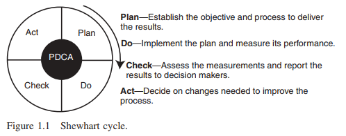
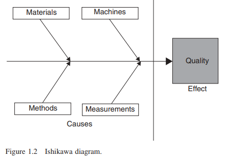
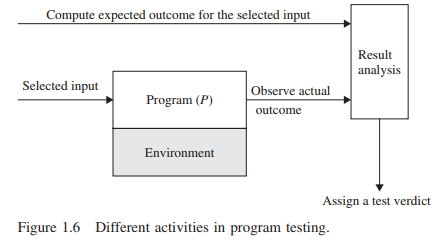

# Konsep Dasar dan Pendahuluan
Pembahasan bab ini diambil dari bab 1 dari buku [Software Testing and Quality Assurance - Theory and Practice](https://drive.google.com/file/d/1UBdGl16MTPAFDFITc5Os8M84x9qIf3mI/view?usp=sharing)

## 1.1 Latar Belakang
Orang mencari kualitas dalam setiap artefak buatan manusia.Tentu saja, konsep kualitas tidak berasal dari sistem perangkat lunak. Sebaliknya, konsep kualitas cenderung setua upaya manusia untuk menghasilkan massa artefak dan objek dengan ukuran besar. Dalam masa lalu selama beberapa dekade revolusi yang berkualitas, telah menyebar dengan cepat ke seluruh dunia dengan ledakan internet.Persaingan global, outsourcing, off-shoring, dan peningkatan harapan pelanggan telah membawa konsep kualitas ke garis depan. Mengembangkan produk berkualitas pada jadwal yang lebih ketat sangat penting bagi perusahaan untuk menjadi sukses dalam ekonomi global yang baru. Secara tradisional, upaya untuk meningkatkan kualitas telah berpusat di sekitar akhir siklus pengembangan produk dengan menekankan deteksi dan koreksi cacat. Sebaliknya, pendekatan baru untuk meningkatkan kualitas mencakup semua fase proses pengembangan produk - dari analisis persyaratan hingga pengiriman akhir produk kepada pelanggan. Setiap langkah dalam proses pengembangan harus dilakukan dengan standar setinggi mungkin. Proses kualitas yang efektif harus fokus pada:
* Memperhatikan banyak kebutuhan pelanggan
* Melakukan upaya untuk terus meningkatkan kualitas
* Mengintegrasikan proses pengukuran dengan desain dan pengembangan produk
* Mendorong konsep kualitas ke tingkat terendah organisasi
* Mengembangkan perspektif tingkat sistem dengan penekanan pada metodologi dan proses
* Menghilangkan _limbah_ melalui perbaikan berkelanjutan

**Gerakan berkualitas dimulai di Jepang selama tahun 1940 -an dan tahun 1950 -an oleh William Edwards Deming, Joseph M. Juran, dan Kaoru Ishikawa**. Dalam sekitar tahun 1947, W. Edwards Deming mengunjungi India juga, kemudian melanjutkan ke Jepang, di mana Dia telah diminta untuk bergabung dengan misi statistik yang bertanggung jawab untuk merencanakan Sensus Jepang 1951. Selama kunjungannya ke Jepang, Deming mengundang ahli statistik untuk pertemuan makan malam dan memberi tahu mereka betapa pentingnya mereka dan apa yang bisa mereka lakukan untuk Jepang. Pada bulan Maret 1950, ia kembali ke Jepang atas undangan Direktur Pelaksana Kenichi Koyanagi dari _Union of Japanese Scientist and Engineers_ (JUSE) untuk mengajar kursus kepada para peneliti, pekerja, eksekutif, dan insinyur Jepang tentang metode _Statistical Quality Control_ (SQC).Kontrol kualitas statistik adalah disiplin berdasarkan pengukuran dan statistik.Keputusan dibuat dan rencana dikembangkan berdasarkan pengumpulan dan evaluasi data aktual dalam bentuk metrik, daripada intuisi dan pengalaman. Metode SQC menggunakan tujuh alat manajemen kualitas dasar: analisis pareto, diagram sebab-dan-akibat, bagan aliran, grafik tren, histogram, diagram pencar, dan bagan kontrol.

Pada Juli 1950, Deming memberikan seminar delapan hari berdasarkan metode Shewhart kontrol kualitas statistik untuk insinyur dan eksekutif Jepang. Dia memperkenalkan _plan-do-check-act_ (PDCA) dalam seminar, yang dia sebut siklus Shewhart (Gambar 1.1). Siklus Shewhart menggambarkan urutan aktivitas berikut: menetapkan tujuan, menugaskan mereka ke tonggak yang terukur, dan menilai kemajuan terhadap tonggak tersebut. Catatan kuliah 1950 Deming membentuk dasar untuk serangkaian seminar tentang metode SQC yang disponsori oleh Juse dan memberikan kriteria untuk hadiah deming terkenal Jepang. Pekerjaan Deming telah merangsang beberapa jenis industri yang berbeda, seperti untuk radio, transistor, kamera, teropong, mesin jahit, dan mobil.

\
**Gambar 1.1**

Antara sekitar tahun 1950 dan sekitar tahun 1970, industri mobil di Jepang, khususnya Toyota Motor Corporation, muncul dengan prinsip inovatif untuk memompres periode waktu dari pesanan pelanggan hingga pembayaran perbankan, yang dikenal sebagai "prinsip lean."Tujuannya adalah untuk meminimalkan konsumsi sumber daya yang tidak menambah nilai pada suatu produk.Prinsip Lean telah ditentukan oleh _Program Kemitraan Penyuluhan Manufaktur_ dari _National Institute of Standards and Technology_ (NIST) sebagai “pendekatan sistematis untuk mengidentifikasi dan menghilangkan limbah melalui peningkatan berkelanjutan, mengalir produk saat menarik pelanggan dalam mengejar kesempurnaan,”. Biasanya diyakini bahwa prinsip -prinsip lean dimulai di Jepang oleh Taiichi Ohno dari Toyota, tetapi Henry Ford telah menggunakan bagian lean sejak sekitar tahun 1920, sebagaimana dibuktikan dengan kutipan berikut (Henry Ford, 1926):

>Salah satu prestasi penting dalam menjaga harga produk Ford tetap rendah adalah pemendekan secara bertahap dari siklus produksi. Semakin lama sebuah artikel dalam proses pembuatan dan semakin banyak yang dipindahkan, semakin besar biaya utamanya. 

Konsep ini dipopulerkan di Amerika Serikat oleh studi Massachusetts Institute of Technology (MIT) tentang gerakan dari produksi massal menuju produksi, seperti yang dijelaskan dalam mesin yang mengubah dunia, oleh James P. Womack, Daniel T. Jones, dan Daniel Roos, New York: Rawson and Associates, 1990. Lean Thinking terus menyebar ke setiap negara di dunia, dan para pemimpin mengadaptasi prinsip-prinsip di luar manufaktur mobil, ke logistik dan distribusi, layanan, ritel, Perawatan Kesehatan, Konstruksi, Pemeliharaan, dan Pengembangan Perangkat Lunak.

Catatan: Walter Andrew Shewhart adalah seorang ahli fisika, insinyur, dan ahli statistik Amerika dan dikenal sebagai bapak kontrol kualitas statistik. Shewhart bekerja di laboratorium telepon Bell dari yayasannya pada tahun 1925 hingga pensiunnya pada tahun 1956. Karyanya dirangkum dalam bukunya Economic Control of Quality of Manufactured Product, yang diterbitkan oleh McGraw-Hill pada tahun 1931. Pada tahun 1938, karyanya menjadi perhatian dari perhatian Fisikawan W. Edwards Deming, yang mengembangkan beberapa proposal metodologis Shewhart di Jepang sejak tahun 1950 dan seterusnya dan dinamai miliknya _Sintesis Siklus Shewhart_.

**Pada tahun 1954, Joseph M. Juran dari Amerika Serikat mengusulkan meningkatkan tingkat manajemen kualitas dari unit manufaktur ke seluruh organisasi.** Dia menekankan pentingnya pemikiran sistem yang dimulai dengan persyaratan produk, desain, pengujian prototipe, operasi peralatan yang tepat, dan umpan balik proses yang akurat.Seminar Juran juga menjadi bagian dari program pendidikan Juse. Juran memacu perpindahan dari SQC ke TQC (_Total Quality Control_) di Jepang. Ini termasuk kegiatan dan pendidikan di seluruh perusahaan dalam _Quality Control_ (QC), audit, lingkaran kualitas, dan promosi prinsip -prinsip manajemen kualitas.Istilah TQC diciptakan oleh seorang Amerika, Armand V. Feigenbaum, dalam bukunya 1951 Prinsip QC, Praktik, dan Administrasi. Itu diterbitkan ulang pada tahun 2004. Pada tahun 1968, Kaoru Ishikawa, salah satu ayah TQC di Jepang, telah diuraikan, seperti Ditampilkan di berikut ini, elemen kunci manajemen TQC:

* Kualitas didahulukan, bukan keuntungan jangka pendek.
* Pelanggan lebih dulu, bukan produser.
* Keputusan didasarkan pada fakta dan data.
* Manajemen adalah partisipatif dan menghormati semua karyawan.
* Manajemen didorong oleh komite lintas fungsi yang mencakup perencanaan produk, desain produk, pembelian, manufaktur, penjualan, pemasaran, dan distribusi.

Catatan: Lingkaran berkualitas adalah kelompok sukarelawan pekerja, biasanya anggota departemen yang sama, yang bertemu secara teratur untuk membahas masalah dan membuat presentasi kepada manajemen dengan ide -ide mereka untuk mengatasinya.Lingkaran kualitas dimulai di Jepang pada tahun 1962 oleh Kaoru Ishikawa sebagai metode lain untuk meningkatkan kualitas. Gerakan di Jepang dikoordinasikan oleh Juse.

Salah satu metodologi TQC inovatif yang dikembangkan di Jepang disebut sebagai diagram Ishikawa atau sebab-akibat. Kaoru Ishikawa ditemukan dari data statistik bahwa dispersi dalam kualitas produk berasal dari empat penyebab umum, yaitu _Material_ (bahan), _Machine_ (mesin), _Methods_ (metode), dan _Measurements_ (pengukuran), yang dikenal sebagai 4M (Gambar 1.2). Panah horizontal tebal menunjuk ke kualitas, sedangkan panah diagonal pada Gambar 1.2 kemungkinan penyebab memiliki efek pada kualitas. Bahan seringkali berbeda ketika sumber persyaratan pasokan atau ukuran bervariasi. Mesin, atau peralatan, juga berfungsi secara berbeda tergantung pada variasi bagian mereka, dan mereka beroperasi secara optimal hanya untuk sebagian waktu. Metode, atau proses, menyebabkan variasi yang lebih besar karena kurangnya pelatihan dan instruksi tulisan tangan yang buruk. Akhirnya, pengukuran juga bervariasi karena peralatan yang sudah ketinggalan zaman dan kalibrasi yang tidak tepat. Variasi dalam parameter 4M memiliki efek pada kualitas suatu produk. Diagram Ishikawa telah memengaruhi perusahaan Jepang untuk memfokuskan perhatian kontrol kualitas mereka pada peningkatan bahan, mesin, metode, dan pengukuran.

Gerakan TQC di Jepang telah menyebabkan keterlibatan manajemen puncak yang meresap. Banyak perusahaan di Jepang memiliki dokumentasi yang luas tentang kegiatan berkualitas mereka. Eksekutif senior di Amerika Serikat tidak percaya kualitas penting atau tidak tahu harus mulai dari mana sampai National Broadcasting Corporation (NBC), sebuah jaringan televisi Amerika, menyiarkan film dokumenter “If Japan Can... Why Can't We?" (jika Jepang bisa? Mengapa kita tidak bisa?) pada jam 9:30 malam. Pada 24 Juni 1980. Film dokumenter ini diproduksi oleh Clare Crawford-Mason dan diriwayatkan oleh Lloyd Dobyns. Lima belas menit siaran itu dikhususkan untuk Dr. Deming dan pekerjaannya. Setelah siaran, banyak eksekutif dan pemimpin pemerintah menyadari bahwa penekanan baru pada kualitas tidak lagi menjadi pilihan bagi perusahaan-perusahaan Amerika tetapi suatu keharusan untuk melakukan bisnis dalam pasar dunia yang kompetitif dan lebih menuntut. Ford Motor Company dan General Motors segera mengadopsi metodologi SQC Deming ke dalam proses pembuatannya. Perusahaan lain seperti Dow Chemical dan Pesawat Hughes mengikutinya. Filosofi manajemen TQC Ishikawa mendapatkan popularitas di Amerika Serikat. Lebih lanjut, penekanan yang memicu kualitas di perusahaan manufaktur Amerika memimpin Kongres A.S. Keunggulan kualitas sebagai keunggulan kompetitif. Dalam Baldrige National Award, kualitas dipandang sebagai sesuatu yang ditentukan oleh pelanggan dan dengan demikian fokusnya adalah pada kualitas yang didorong oleh pelanggan. Di sisi lain, kualitas juga dipandang sebagai sesuatu yang ditentukan oleh produsen dengan menyesuaikan diri dengan spesifikasi dan dengan demikian fokusnya adalah pada kesesuaian dengan spesifikasi.

\
**Gambar 1.2**

Komentar: Malcolm Baldrige adalah Sekretaris Perdagangan AS dari tahun 1981 hingga kematiannya dalam kecelakaan rodeo pada Juli 1987. Baldrige adalah pendukung manajemen kualitas sebagai kunci kemakmuran dan kekuatan jangka panjang negaranya. Dia menaruh minat pribadi pada Undang-Undang Peningkatan Kualitas, yang akhirnya dinamai menurut namanya, dan membantu menyusun salah satu versi awalnya. Sebagai pengakuan atas kontribusinya, Kongres menunjuk penghargaan untuk menghormatinya.

Secara tradisional, konsep TQC dan Lean diterapkan dalam proses pembuatan. Proses pengembangan perangkat lunak menggunakan konsep-konsep ini sebagai alat lain untuk memandu produksi perangkat lunak berkualitas. Konsep-konsep ini menyediakan kerangka kerja untuk membahas masalah produksi perangkat lunak. Arsitektur Model Kematangan Perangkat Lunak (CMM) yang dikembangkan di Software Engineering Institute didasarkan pada prinsip-prinsip kualitas produk yang telah dikembangkan oleh W. Edwards Deming, Joseph M. Juran, Kaoru Ishikawa, dan Philip Crosby.

## 1.2 Software Quality
Pertanyaan “Apa itu kualitas perangkat lunak?” memunculkan banyak jawaban yang berbeda. Kualitas adalah konsep yang kompleks, artinya berbeda bagi orang yang berbeda, dan sangat bergantung pada konteks. Kualitas perangkat lunak bisa dipersepsikan dengan cara yang berbeda dalam domain yang berbeda, seperti filsafat, ekonomi, pemasaran, dan manajemen. 

Ada lima sudut pandang dalam kita melihat kualitas:

1. **Trancendental View**: Pandangan ini memandang kualitas sebagai sesuatu yang dapat dikenali tetapi sulit didefinisikan. Pandangan transendental tidak hanya terbatas pada kualitas perangkat lunak saja, tetapi telah diterapkan di berbagai bidang kehidupan sehari-hari yang kompleks.
2. **User View**: Pandangan ini memandang kualitas sebagai kesesuaian dengan tujuan. Menurut pandangan ini, saat mengevaluasi kualitas suatu produk, seseorang harus mengajukan pertanyaan kunci: “Apakah produk tersebut memenuhi kebutuhan dan harapan pengguna?”
3. **Manufacturing View**: Di sini kualitas dipahami sebagai kesesuaian dengan spesifikasi. Tingkat kualitas suatu produk ditentukan oleh sejauh mana produk tersebut memenuhi spesifikasinya.
4. **Produk View**: Dalam hal ini, kualitas dipandang terkait dengan karakteristik bawaan produk. Karakteristik bawaan suatu produk, yaitu kualitas internal, menentukan kualitas eksternalnya.
5. **Value-Based View**: Kualitas, dalam perspektif ini, bergantung pada jumlah yang bersedia dibayarkan pelanggan untuk produk tersebut.

## 1.3 Peran Pengujian
Pengujian memainkan peran penting dalam mencapai dan menilai kualitas produk perangkat lunak. Di satu sisi, **kita meningkatkan kualitas produk saat kita mengulang siklus _pengujian–menemukan cacat–memperbaiki_ selama pengembangan**. Di sisi lain, kita menilai seberapa baik sistem kita saat kita melakukan pengujian tingkat sistem sebelum merilis produk.

Dengan demikian, pengujian perangkat lunak adalah proses verifikasi untuk penilaian dan peningkatan kualitas perangkat lunak. **Secara umum, aktivitas untuk penilaian kualitas perangkat lunak dapat dibagi menjadi dua kategori besar**, yaitu analisis statis dan analisis dinamis.

* **Analisis Statis**: Analisis ini didasarkan pada pemeriksaan sejumlah dokumen, yaitu dokumen persyaratan, model perangkat lunak, dokumen desain, dan kode sumber. Analisis statis tradisional mencakup tinjauan kode, inspeksi, penelusuran, analisis algoritme, dan pembuktian kebenaran. Analisis ini tidak melibatkan eksekusi aktual kode yang sedang dikembangkan. Sebaliknya, analisis ini memeriksa kode dan alasan atas semua kemungkinan perilaku yang mungkin muncul selama waktu proses. Optimasi kompiler adalah analisis statis standar.

* **Analisis Dinamis**: Analisis dinamis sistem perangkat lunak melibatkan eksekusi program aktual untuk mengungkap kemungkinan kegagalan program. Properti perilaku dan kinerja program juga diamati. Program dieksekusi dengan nilai masukan yang umum dan dipilih dengan cermat. Sering kali, set masukan suatu program bisa sangat besar dan tidak praktis. Kita mengamati beberapa perilaku program yang representatif dan mencapai kesimpulan tentang kualitas sistem. Pemilihan set pengujian terbatas yang cermat sangat penting untuk mencapai kesimpulan yang tepat.

Dengan melakukan analisis statis dan dinamis, penguji ingin mengidentifikasi sebanyak mungkin kesalahan sehingga kesalahan tersebut diperbaiki pada tahap awal pengembangan perangkat lunak. Analisis statis dan analisis dinamis bersifat saling melengkapi, dan untuk efektivitas yang lebih baik, keduanya harus dilakukan berulang kali dan bergantian. 

## 1.4 Verifikasi dan Validasi
Dua konsep serupa yang terkait dengan pengujian perangkat lunak yang sering digunakan oleh praktisi adalah verifikasi dan validasi. Kedua konsep tersebut bersifat abstrak, dan masing-masing dapat diwujudkan melalui serangkaian aktivitas konkret yang dapat dieksekusi. Kedua konsep tersebut dijelaskan sebagai berikut:
*   **Verifikasi**: Aktivitas semacam ini membantu kita mengevaluasi sistem perangkat lunak
dengan menentukan apakah produk dari fase pengembangan tertentu memenuhi persyaratan yang ditetapkan sebelum dimulainya fase tersebut. Perlu dicatat bahwa suatu produk dapat berupa produk antara, seperti spesifikasi persyaratan, spesifikasi desain, kode, buku petunjuk pengguna, atau bahkan produk akhir. Aktivitas yang memeriksa kebenaran fase pengembangan disebut
aktivitas verifikasi.
*   **Validasi**: Aktivitas semacam ini membantu kita mengonfirmasi bahwa suatu produk memenuhi tujuan penggunaannya. Aktivitas validasi bertujuan untuk mengonfirmasi bahwa suatu produk memenuhi harapan pelanggannya. Dengan kata lain, aktivitas validasi berfokus pada produk akhir, yang diuji secara ekstensif dari sudut pandang pelanggan. Validasi menetapkan apakah produk tersebut memenuhi harapan keseluruhan pengguna.

    Pelaksanaan kegiatan validasi yang terlambat sering kali berisiko karena menyebabkan biaya pengembangan yang lebih tinggi. Kegiatan validasi dapat dilaksanakan pada tahap awal siklus pengembangan perangkat lunak. Contoh pelaksanaan kegiatan validasi yang lebih awal dapat ditemukan dalam metodologi pengembangan perangkat lunak eXtreme Programming (XP). Dalam metodologi XP, pelanggan berinteraksi erat dengan kelompok pengembangan perangkat lunak dan melakukan uji penerimaan selama setiap iterasi pengembangan.

Proses verifikasi menetapkan korespondensi fase implementasi dari proses pengembangan perangkat lunak dengan spesifikasinya, sedangkan validasi menetapkan korespondensi antara sistem dan harapan pengguna. Seseorang dapat membandingkan verifikasi dan validasi sebagai berikut: 
*   **Aktivitas verifikasi bertujuan untuk mengonfirmasi bahwa seseorang membangun produk dengan benar, sedangkan aktivitas validasi bertujuan untuk mengonfirmasi bahwa seseorang membangun produk yang benar**. 
*   Aktivitas verifikasi meninjau produk kerja sementara, seperti spesifikasi persyaratan, desain, kode, dan buku petunjuk pengguna, selama siklus hidup proyek untuk memastikan kualitasnya. Atribut kualitas yang dicari oleh aktivitas verifikasi adalah konsistensi, kelengkapan, dan kebenaran pada setiap tahap utama pengembangan sistem. Di sisi lain, validasi dilakukan menjelang akhir pengembangan sistem untuk menentukan apakah seluruh sistem memenuhi kebutuhan dan harapan pelanggan.
*   Aktivitas verifikasi dilakukan pada produk sementara dengan menerapkan sebagian besar teknik analisis statis, seperti inspeksi, penelusuran, dan tinjauan, serta menggunakan standar dan daftar periksa. Verifikasi juga dapat mencakup analisis dinamis, seperti pelaksanaan program aktual. Di sisi lain, validasi dilakukan pada keseluruhan sistem dengan menjalankan sistem di lingkungan sebenarnya dan menggunakan berbagai pengujian.

## 1.5 Failure, Error, Fault dan Defect
Dalam literatur tentang pengujian perangkat lunak, seseorang dapat menemukan referensi tentang istilah Failure (kegagalan), error, fault (kesalahan), dan defect (cacat). Meskipun maknanya saling terkait, ada perbedaan penting antara keempat konsep ini.
* Failure (Kegagalan): Kegagalan dikatakan terjadi setiap kali perilaku eksternal suatu sistem tidak sesuai dengan yang ditentukan dalam spesifikasi sistem.
* Error: Error adalah keadaan sistem. Jika tidak ada tindakan korektif oleh sistem, keadaan kesalahan dapat menyebabkan kegagalan yang tidak akan dikaitkan dengan peristiwa apa pun setelah kesalahan.
* Fault (Kesalahan): Kesalahan adalah penyebab error yang dinilai.

Kesalahan (fault) mungkin tidak terdeteksi dalam waktu lama, hingga suatu kejadian mengaktifkannya. Ketika suatu kejadian mengaktifkan kesalahan, pertama-tama ia membawa program ke dalam status kesalahan (intermediate error state). Jika komputasi dibiarkan berlanjut dari status kesalahan tanpa tindakan korektif, program tersebut akhirnya menyebabkan kegagalan (failure). Sebagai tambahan, dalam komputasi yang toleran terhadap kesalahan, tindakan korektif dapat diambil untuk mengeluarkan program dari status kesalahan ke status yang diinginkan sehingga komputasi berikutnya tidak akhirnya menyebabkan kegagalan. Oleh karena itu, proses manifestasi kegagalan dapat secara ringkas direpresentasikan sebagai rantai perilaku sebagai berikut: _fault_ → _error_ → _failure_. Rantai perilaku tersebut dapat berulang untuk sementara waktu, yaitu, kegagalan satu komponen dapat menyebabkan kegagalan komponen lain yang berinteraksi.

Definisi kegagalan di atas mengasumsikan bahwa spesifikasi yang diberikan dapat diterima oleh pelanggan. Namun, jika spesifikasi tersebut tidak memenuhi harapan pelanggan, maka, tentu saja, bahkan implementasi yang bebas kesalahan pun gagal memuaskan pelanggan. Merupakan tugas yang sulit untuk memberikan definisi yang tepat tentang kesalahan, error, atau kegagalan perangkat lunak, karena "faktor manusia" yang terlibat dalam penerimaan keseluruhan suatu sistem. Dalam bisnis perangkat lunak modern, kegagalan perangkat lunak berarti "harapan pelanggan tidak terpenuhi dan/atau pelanggan tidak dapat melakukan pekerjaan yang bermanfaat dengan produk".

Ada perbedaan tipis antara cacat dan kesalahan dalam contoh di atas, yaitu, pelaksanaan kebijakan yang cacat (defect) dapat menyebabkan pengambilan keputusan yang salah. Dalam konteks perangkat lunak, sistem perangkat lunak mungkin cacat karena masalah desain; status sistem tertentu akan memperlihatkan cacat, yang mengakibatkan perkembangan kesalahan yang didefinisikan sebagai nilai sinyal atau keputusan yang salah dalam sistem. Dalam industri, istilah cacat digunakan secara luas, sedangkan di kalangan peneliti istilah kesalahan lebih umum. Untuk semua tujuan praktis, kedua istilah tersebut adalah sinonim. Dalam buku ini, kami menggunakan kedua istilah tersebut secara bergantian sebagaimana diperlukan.

## 1.6 PENGERTIAN KEANDALAN (RELIABILITY) PERANGKAT LUNAK
Tidak peduli seberapa sering kita menjalankan siklus _pengujian–menemukan kesalahan–memperbaiki_ selama pengembangan perangkat lunak, beberapa kesalahan mungkin luput dari perhatian kita, dan ini pada akhirnya akan muncul di lokasi user. Oleh karena itu, ukuran kuantitatif yang berguna dalam menilai kualitas perangkat lunak adalah keandalannya. Keandalan perangkat lunak didefinisikan sebagai probabilitas pengoperasian sistem perangkat lunak tanpa kegagalan selama waktu tertentu dalam lingkungan tertentu. Tingkat keandalan sistem bergantung pada masukan yang menyebabkan kegagalan diamati oleh pengguna akhir. Keandalan perangkat lunak dapat diperkirakan melalui pengujian acak, seperti yang disarankan oleh Hamlet. Karena pengertian keandalan bersifat khusus untuk "lingkungan tertentu", data pengujian harus diambil dari distribusi masukan agar menyerupai penggunaan sistem di masa mendatang. Menangkap pola penggunaan sistem di masa mendatang secara umum dijelaskan dalam bentuk yang disebut profil operasional. Konsep profil operasional sistem dirintis oleh John D. Musa di AT&T Bell Laboratories antara tahun 1970-an dan 1990-an

## 1.7 Tujuan Pengujian
Para pemangku kepentingan dalam proses pengujian adalah programer, _test engineer_, manajer proyek, dan user. Pemangku kepentingan adalah orang atau organisasi yang memengaruhi perilaku sistem atau yang dipengaruhi oleh sistem itu. Pemangku kepentingan yang berbeda melihat proses pengujian dari berbagai perspektif seperti yang dijelaskan di bawah ini:
* **Sistem berfungsi**: Saat menerapkan unit program, programmer mungkin ingin menguji apakah unit bekerja dalam keadaan normal atau tidak.Itu Programmer mendapat kepercayaan diri jika unit bekerja untuk kepuasannya.Gagasan yang sama berlaku untuk seluruh sistem juga - setelah sistem telah diintegrasikan, pengembang mungkin ingin menguji apakah sistem melakukan fungsi dasar atau tidak.Di sini, untuk alasan psikologis, Tujuan pengujian adalah untuk menunjukkan bahwa sistem berfungsi, daripada tidak berfungsi.
* **Sistem tidak berfungsi**: Setelah programmer (atau tim pengembangan) puas bahwa unit (atau sistem) bekerja pada tingkat tertentu, lebih banyak tes dilakukan dengan tujuan menemukan kesalahan dalam unit (atau sistem).Di sini, idenya adalah mencoba membuat unit (atau sistem) gagal.
* **Mengurangi risiko kegagalan**: Sebagian besar sistem perangkat lunak yang kompleks mengandung kesalahan, yang menyebabkan sistem gagal dari waktu ke waktu.Konsep "gagal dari waktu ke waktu" ini menimbulkan gagasan tingkat kegagalan.Ketika kesalahan ditemukan dan diperbaiki saat melakukan lebih banyak tes, tingkat kegagalan suatu sistem umumnya berkurang.Dengan demikian, tujuan tingkat yang lebih tinggi dari melakukan tes adalah untuk menurunkan risiko gagal ke tingkat yang dapat diterima.
* **Mengurangi biaya pengujian**: Berbagai jenis biaya yang terkait dengan proses pengujian termasuk biaya merancang, memelihara, dan menjalankan kasus uji, biaya menganalisis hasil pelaksanaan setiap kasus uji, biaya mendokumentasikan kasus uji,dan biaya untuk benar -benar mengeksekusi sistem dan mendokumentasikannya.

    Oleh karena itu, semakin sedikit jumlah kasus uji yang dirancang, semakin sedikit biaya pengujian yang terkait.Namun, menghasilkan sejumlah kecil kasus uji sewenang -wenang bukanlah cara yang baik untuk menghemat biaya.Level tertinggi tujuan melakukan tes adalah untuk menghasilkan perangkat lunak berisiko rendah dengan jumlah kasus uji yang lebih sedikit.Gagasan ini membawa kita ke konsep efektivitas kasus uji.Oleh karena itu insinyur uji harus memilih kasus uji yang lebih sedikit dan efektif.

## 1.8 Apa itu test case?
Dalam bentuknya yang paling mendasar, **test case adalah sepasang `<input, hasil yang diharapkan>` sederhana**. Jika suatu program yang diuji diharapkan untuk menghitung akar kuadrat dari angka non -negatif, maka empat contoh kasus uji seperti yang ditunjukkan pada contoh berikut

```
TB1: <0, 0>
TB2: <25, 5>
TB3: <40, 6.02343254>
TB4: <100.5, 330.3239128>
```
**gambar 1.3**

```
TS1: <cek saldo, 1000000>, <tarik tunai, "jumlah?">, <200000, "Rp. 200.000">, <cek saldo, 800000>
```
**gambar 1.4**

Dalam _stateless system_, di mana hasilnya hanya bergantung pada input saat ini, kasus uji sangat sederhana dalam struktur, seperti yang ditunjukkan pada Gambar 1.3. Program untuk menghitung akar kuadrat dari angka positif adalah contoh dari _stateless system_. Kompiler untuk bahasa pemrograman C adalah contoh lain dari _stateless system_. Kompiler adalah _stateless system_ karena untuk mengkompilasi program yang tidak perlu diketahui tentang program yang dikompilasi sebelumnya.

Dalam _state-oriented system_, di mana hasil program tergantung pada keadaan saat ini sistem dan input saat ini, kasus uji dapat terdiri dari urutan `<input, hasil yang diharapkan>` yang diharapkan. Sistem switching telepon dan mesin teller otomatis (ATM) adalah contoh _state-oriented system_.Untuk mesin ATM, test case untuk pengujian fungsi penarikan ditunjukkan pada Gambar 1.4. Di sini, kita berasumsi bahwa pengguna telah memasukkan input yang divalidasi, seperti uang tunai Kartu dan Nomor PIN.

Dalam kasus uji TS1, "cek saldo" dan "tarik tunai" di set pertama, kedua, dan keempat mewakili penekanan tombol yang sesuai pada keypad ATM. Diasumsikan bahwa akun pengguna memiliki 1.000.000 di atasnya, dan pengguna ingin menarik jumlah 200.000. Hasil yang diharapkan "Rp. 200.000" dalam set ketiga mewakili uang tunai yang dikeluarkan oleh ATM. Setelah operasi penarikan, pengguna memastikan bahwa saldo yang tersisa adalah 800.000

Untuk _state-oriented system_, sebagian besar kasus ujinya berkaitan dengan memberikan input yang biasanya berhubungan dengan suatu keputusan waktu dan waktu. Contoh kasusnya akan akan dibahas pada bagian lain.

## 1.9 Hasil yang diharapkan
Hasil eksekusi program bisa berupa output sebagai berikut:
* Nilai yang dihasilkan oleh program:
    Output untuk observasi lokal (integer, text, audio, image)
    Output (pesan) untuk penyimpanan jarak jauh, manipulasi, atau pengamatan
* Perubahan kondisi:
    Perubahan kondisi program
    Perubahan kondisi database (karena penambahan, penghapusan, dan operasi update)
* Urutan atau set nilai yang harus ditafsirkan bersama untuk hasilnya valid

Konsep penting dalam desain tes adalah _konsep oracle_. Sebuah oracle adalah entitas apa pun - program, proses, ahli manusia, atau badan data - yang memberi tahu kita hasil yang diharapkan dari tes atau serangkaian tes tertentu.Kasus uji hanya bermakna jika dimungkinkan untuk memutuskan penerimaan hasil yang dihasilkan oleh program yang sedang diuji.

Idealnya, hasil tes yang diharapkan harus dihitung saat merancang uji kasus. Dengan kata lain, hasil tes dihitung sebelum program dieksekusi dengan input tes yang dipilih. Idenya di sini adalah bahwa seseorang harus dapat menghitung hasil yang diharapkan dari pemahaman tentang persyaratan program.Prekomputasi hasil yang diharapkan akan menghilangkan bias implementasi jika kasus uji dirancang oleh pengembang.

Dalam kasus yang luar biasa, di mana sangat sulit, tidak mungkin, atau bahkan tidak diinginkan untuk menghitung hasil yang diharapkan tunggal, seseorang harus mengidentifikasi hasil yang diharapkan dengan memeriksa hasil tes yang sebenarnya, seperti yang dijelaskan dalam hal berikut:
1. Jalankan program dengan input yang dipilih.
2. Amati hasil aktual dari eksekusi program.
3. Pastikan bahwa hasil yang sebenarnya adalah hasil yang diharapkan.
4. Gunakan hasil aktual yang diverifikasi sebagai hasil yang diharapkan dalam menjalankan kasus uji berikutnya.

## 1.10 Konsep Pengujian Lengkap
Bukan hal yang aneh untuk menemukan orang membuat klaim seperti "Saya telah melakukan pengujian lengkap pada program.". _Pengujian lengkap_ berarti _tidak ada kesalahan yang belum ditemukan pada akhir fase uji_. Semua masalah harus diketahui di akhir pengujian lengkap. Untuk sebagian besar sistem, pengujian lengkap hampir mustahil karena alasan berikut:
* Domain input yang mungkin dari suatu program terlalu besar untuk sepenuhnya digunakan dalam menguji suatu sistem. Ada kedua input yang valid dan input yang tidak valid.Program ini mungkin memiliki sejumlah besar negara bagian. Mungkin ada batasan waktu pada input, yaitu, input mungkin valid pada waktu tertentu dan tidak valid di waktu lain. Nilai input yang valid tetapi tidak tepat waktu disebut input yang tidak tepat. Domain input suatu sistem bisa sangat besar untuk sepenuhnya digunakan dalam menguji suatu program.
* Masalah desain mungkin terlalu rumit untuk diuji sepenuhnya.Desainnya mungkin termasuk keputusan dan asumsi desain implisit. Misalnya, seorang programmer dapat menggunakan variabel global atau variabel statis untuk mengontrol eksekusi program.
* Mungkin tidak mungkin untuk menciptakan semua lingkungan eksekusi yang mungkin dari sistem. Ini menjadi lebih signifikan ketika perilaku sistem perangkat lunak tergantung pada dunia yang nyata, luar, seperti cuaca, suhu, ketinggian, tekanan, dan sebagainya.

## 1.12 TESTING ACTIVITIES
Untuk menguji suatu program, _test engineer_ harus melakukan urutan kegiatan pengujian. Sebagian besar kegiatan ini telah ditunjukkan pada Gambar 1.6 dan dijelaskan sebagai berikut.Penjelasan ini fokus pada satu kasus uji.



* Identifikasi tujuan yang akan diuji: Aktivitas pertama adalah mengidentifikasi tujuan yang akan diuji.Tujuan mendefinisikan niat, atau tujuan, merancang satu atau lebih kasus uji untuk memastikan bahwa program mendukung tujuan tersebut.Tujuan yang jelas harus dikaitkan dengan setiap kasus uji.

* **Select inputs** (tentukan data yang akan diinput): Aktivitas kedua adalah memilih input tes. Pemilihan input uji dapat didasarkan pada spesifikasi persyaratan, kode sumber, atau harapan kami.Input tes dipilih dengan menjaga tujuan tes dalam pikiran.
* **Compute the expected outcome** (Hitung hasil yang diharapkan): Kegiatan ketiga adalah menghitung hasil yang diharapkan dari program dengan input yang dipilih. Dalam kebanyakan kasus, ini dapat dilakukan dari pemahaman tingkat tinggi secara keseluruhan tentang tujuan tes dan spesifikasi program yang sedang diuji.
* **Set up lingkungan (environment) pengujian** : Langkah keempat adalah mempersiapkan lingkungan eksekusi (environment) yang tepat dari program ini. Pada langkah ini semua asumsi di luar program harus dipenuhi.Beberapa contoh asumsi eksternal dari suatu program adalah sebagai berikut:
    - Inisialisasi sistem lokal, eksternal ke program. Ini mungkin termasuk membuat koneksi jaringan tersedia, menyediakan sistem basis data yang tepat, dan sebagainya.
    - Inisialisasi setiap sistem eksternal jarak jauh (Contoh: Proses mitra jarak jauh dalam aplikasi terdistribusi.) Misalnya, untuk menguji kode klien, kita mungkin perlu memulai server di situs jarak jauh.
* **Jalankan program**: Pada langkah kelima, _test engineer_ menjalankan program dengan input yang dipilih dan mengamati hasil aktual dari program. Untuk menjalankan kasus uji, input dapat disediakan untuk program di lokasi fisik yang berbeda pada waktu yang berbeda. Konsep koordinasi uji digunakan dalam menyinkronkan komponen yang berbeda dari suatu uji kasus.
* **Menganalisis hasil tes**: Aktivitas uji akhir adalah menganalisis hasil eksekusi uji.Di sini, tugas utama adalah membandingkan hasil aktual dari eksekusi program dengan hasil yang diharapkan.Kompleksitas perbandingan tergantung pada kompleksitas data yang akan diamati. Jenis data yang diamati dapat sesederhana bilangan bulat atau string karakter atau serumit gambar, video, atau klip audio. Ada tiga jenis kemungkinan hasil, yaitu: _lulus (pass)_, _gagal (fail)_, dan _belum bisa dipastikan (inconclusive)_, seperti yang dijelaskan di bawah ini.
    - Jika program menghasilkan hasil yang diharapkan dan tujuan dari kasus uji terpenuhi, maka hasilnya adalah _lulus_.
    - Jika program tidak menghasilkan hasil yang diharapkan, maka hasilnya: _gagal_.
    - Namun, dalam beberapa kasus mungkin tidak mungkin untuk menetapkan _lulus_ yang jelas atau _gagal_. Misalnya, jika terjadi _timeout_ ketika pengujian dilakukan. Dalam kondisi tersebut penguji belum bisa menetapkan _lulus_ atau _gagal_. Dalam kasus tersebut, putusan berarti _inconclusive_. _Inconclusive_ berarti bahwa tes lebih lanjut diperlukan untuk memperbaiki keputusan yang _inconclusive_ menjadi _lulus_  atau _gagal_.

Laporan tes harus ditulis setelah menganalisis hasil tes. Motivasi untuk menulis laporan tes adalah memperbaiki kesalahan jika tes mengungkapkan kesalahan. Laporan tes berisi item berikut untuk informatif: 
    - Jelaskan cara mereproduksi kegagalan.
    - Menganalisis kegagalan untuk dapat menggambarkannya.
    - Pointer ke hasil aktual dan test case, lengkap dengan input, hasil yang diharapkan, dan lingkungan eksekusi.


## 1.19 TEST TEAM ORGANIZATION AND MANAGEMENT
Testing is a distributed activity conducted at different levels throughout the life cycle of a software. These different levels are unit testing, integration testing, system testing, and acceptance testing. It is logical to have different testing groups in an organization for each level of testing. However, it is more logical—and is the case in reality—that unit-level tests be developed and executed by the programmers themselves rather than an independent group of unit test engineers. The programmer who develops a software unit should take the ownership and responsibility of producing good-quality software to his or her satisfaction. System integration testing is performed by the system integration test engineers. The integration test engineers involved need to know the software modules very well. This means that all development engineers who collectively built all the units being integrated need to be involved in integration testing. Also, the integration test engineers should thoroughly know the build mechanism, which is key to integrating large systems.

A team for performing system-level testing is truly separated from the development team, and it usually has a separate head count and a separate budget. The mandate of this group is to ensure that the system requirements have been met and the system is acceptable. Members of the system test group conduct different categories of tests, such as functionality, robustness, stress, load, scalability, reliability, and performance. They also execute business acceptance tests identified in the user acceptance test plan to ensure that the system will eventually pass user acceptance testing at the customer site. However, the real user acceptance testing is executed by the client’s special user group. The user group consists of people from different backgrounds, such as software quality assurance engineers, business associates, and customer support engineers. It is a common practice to create a temporary user acceptance test group consisting of people with different backgrounds, such as integration test engineers, system test engineers, customer support engineers, and marketing engineers. Once the user acceptance is completed, the group is dismantled. It is recommended to have at least two test groups in an organization: integration test group and system test group.

Hiring and retaining test engineers are challenging tasks. Interview is the primary mechanism for evaluating applicants. Interviewing is a skill that improves with practice. It is necessary to have a recruiting process in place in order to be effective in hiring excellent test engineers. In order to retain test engineers, the management must recognize the importance of testing efforts at par with development efforts. The management should treat the test engineers as professionals and as a part of the overall team that delivers quality products