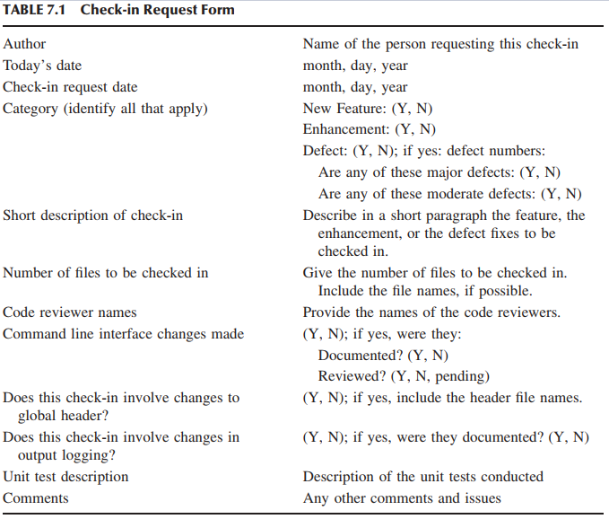
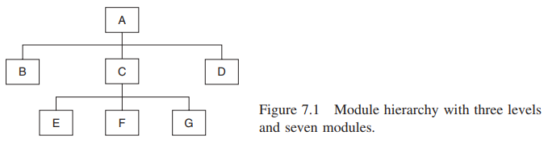
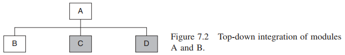
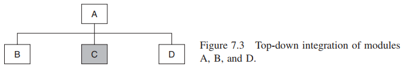
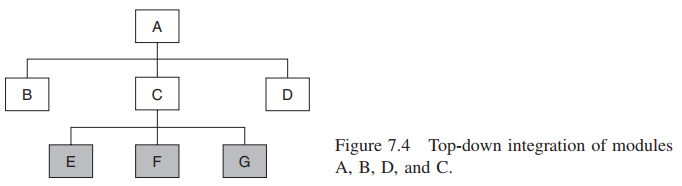
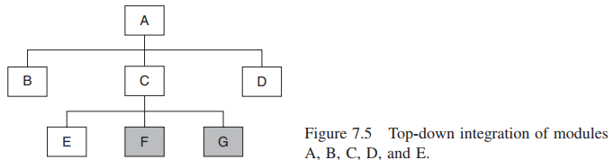
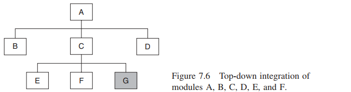
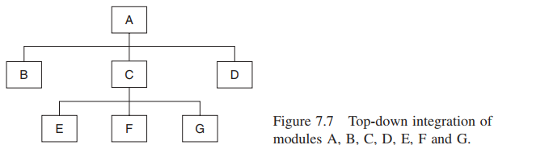

# System Integration Testing

> I criticize by creation, not by finding fault. — Marcus Tullius Cicero

## 7.1 KONSEP PENGUJIAN INTEGRASI (_INTEGRATION TESTING_)
Modul perangkat lunak, atau komponen, adalah elemen mandiri dari suatu sistem. Modul memiliki antarmuka yang terdefinisi dengan baik dengan modul lainnya. Modul dapat berupa sub, fungsi, prosedur, kelas, atau kumpulan elemen dasar tersebut yang disatukan untuk memberikan layanan tingkat tinggi. Sistem adalah kumpulan modul yang saling terhubung dengan cara tertentu untuk mencapai tujuan yang nyata. Subsistem adalah sistem sementara yang tidak sepenuhnya terintegrasi dengan semua modul. Ia juga dikenal sebagai subrakitan. Dalam proyek sedang hingga besar, puluhan hingga ratusan programmer mengimplementasikan bagian kode mereka dalam bentuk modul. Modul diuji secara individual, yang umumnya dikenal sebagai pengujian unit, oleh programmer masing-masing menggunakan teknik pengujian kotak putih. Pada tingkat pengujian unit, sistem ada dalam beberapa bagian di bawah kendali programmer. Tugas utama berikutnya adalah menyatukan modul, yaitu bagian-bagian, untuk membangun sistem yang lengkap. Membangun sistem yang berfungsi dari bagian-bagian bukanlah tugas yang mudah, karena banyaknya kesalahan antarmuka. Bahkan membangun sistem yang cukup stabil dari komponen-komponen memerlukan banyak pengujian. Jalur dari komponen yang diuji hingga membangun sistem yang dapat dikirimkan berisi dua fase pengujian utama, yaitu, pengujian integrasi dan pengujian sistem. ~~Tujuan utama pengujian integrasi adalah untuk menyusun sistem yang cukup stabil dalam lingkungan pengujian sehingga sistem terintegrasi dapat bertahan terhadap pengujian sistem di lingkungan sistem yang sebenarnya.~~ Pentingnya pengujian integrasi didasarkan dari tiga alasan seperti yang diuraikan di bawah ini.

* Modul yang berbeda umumnya dibuat oleh kelompok pengembang yang berbeda. Pengembang mungkin bekerja di lokasi yang berbeda. Terlepas dari upaya terbaik kami dalam desain dan dokumentasi sistem, salah tafsir, kesalahan, dan kelalaian memang terjadi dalam kenyataan. Kesalahan antarmuka antara modul yang dibuat oleh programmer yang berbeda dan bahkan oleh programmer yang sama merajalela. Kami akan membahas sumber kesalahan antarmuka di bab 7.2.
* Pengujian unit modul individual dilakukan dalam lingkungan yang terkendali dengan menggunakan driver pengujian dan stub. Stub adalah modul tiruan yang hanya mengembalikan nilai yang telah ditentukan sebelumnya. Jika modul yang diuji unit memanggil beberapa modul lain, efektivitas pengujian unit dibatasi oleh kemampuan programmer untuk menguji semua jalur secara efektif. Oleh karena itu, dengan keterbatasan bawaan pengujian unit, sulit untuk memprediksi perilaku modul di lingkungan aktualnya setelah pengujian unit dilakukan.
* Beberapa modul lebih rentan terhadap kesalahan daripada modul lain, karena kompleksitas bawaannya. Sangat penting untuk mengidentifikasi modul yang paling banyak menyebabkan kegagalan.

~~Tujuan integrasi sistem adalah untuk membangun versi sistem yang "berfungsi" dengan (i) menyatukan modul secara bertahap dan (ii) memastikan bahwa modul tambahan berfungsi seperti yang diharapkan tanpa mengganggu fungsionalitas modul yang telah disatukan.~~ Dengan kata lain, pengujian integrasi sistem adalah teknik sistematis untuk merakit sistem perangkat lunak sambil melakukan pengujian untuk mengungkap kesalahan yang terkait dengan antarmuka. Kami memastikan bahwa modul yang diuji unit beroperasi dengan benar saat digabungkan bersama seperti yang ditentukan oleh desain. Pengujian integrasi biasanya berlanjut dari subrakitan kecil yang berisi beberapa modul ke subrakitan yang lebih besar yang berisi lebih banyak modul. Produk perangkat lunak yang besar dan kompleks dapat melalui beberapa iterasi siklus pembuatan dan pengujian sebelum terintegrasi sepenuhnya.

Pengujian integrasi dikatakan selesai ketika sistem terintegrasi sepenuhnya, semua kasus pengujian telah dijalankan, semua cacat parah dan sedang yang ditemukan telah diperbaiki, dan sistem diuji ulang.

## 7.2 JENIS-JENIS INTERFACE DAN KESALAHAN INTERFACE
Modularisasi merupakan prinsip penting dalam desain perangkat lunak, dan modul-modul dihubungkan dengan modul-modul lain untuk mewujudkan persyaratan fungsional sistem. Antarmuka antara dua modul memungkinkan satu modul untuk mengakses layanan yang disediakan oleh modul lainnya. Modul ini menerapkan mekanisme untuk meneruskan kontrol dan data antar modul. Tiga paradigma umum untuk menghubungkan modul-modul adalah sebagai berikut:
* **Antarmuka Panggilan Prosedur**: Prosedur dalam satu modul memanggil prosedur di modul lain. Pemanggil meneruskan kontrol ke modul yang dipanggil. Pemanggil dapat meneruskan data ke prosedur yang dipanggil, dan prosedur yang dipanggil dapat meneruskan data ke pemanggil sambil mengembalikan kontrol kembali ke pemanggil.
* **Antarmuka Memori Bersama**: Blok memori dibagi antara dua modul. Blok memori dapat dialokasikan oleh salah satu dari dua modul atau modul ketiga. Data ditulis ke dalam blok memori oleh satu modul dan dibaca dari blok oleh modul lainnya. 
* **Antarmuka Pengiriman Pesan**: Satu modul menyiapkan pesan dengan menginisialisasi bidang struktur data dan mengirim pesan ke modul lain. Bentuk interaksi modul ini umum dalam sistem berbasis klien-server dan sistem berbasis web.

Programmer menguji modul sesuai dengan apa yang mereka pandang baik. Pertanyaannya adalah: Jika semua modul yang diuji unit berfungsi secara individual, mengapa modul-modul ini tidak dapat berfungsi saat disatukan? Masalah muncul saat kita "menyatukannya". Kesalahan antarmuka adalah kesalahan yang terkait dengan struktur yang ada di luar lingkungan lokal modul tetapi digunakan oleh modul tersebut. Kesalahan antarmuka mencakup hingga seperempat dari semua kesalahan dalam sistem yang mereka periksa. Mereka menemukan bahwa dari semua kesalahan yang memerlukan perbaikan dalam satu modul, lebih dari setengahnya disebabkan oleh kesalahan antarmuka. Kesalahan interface ini dapat dikategorikan sebagai berikut:
1. **Konstruksi**: Beberapa bahasa pemrograman, seperti _C_, umumnya memisahkan spesifikasi antarmuka dari kode implementasi. Dalam program _C_, programmer dapat menulis pernyataan `#include header.h`, di mana `header.h` berisi spesifikasi antarmuka. Karena spesifikasi antarmuka terletak di suatu tempat yang jauh dari kode yang sebenarnya, programmer mengabaikan spesifikasi antarmuka saat menulis kode. Oleh karena itu, penggunaan pernyataan `#include` yang tidak tepat menyebabkan kesalahan konstruksi.
2. **Fungsionalitas yang Tidak Memadai** (_Inadequate Functionality_): Ini adalah kesalahan yang disebabkan oleh asumsi implisit di satu bagian sistem bahwa bagian lain dari sistem akan menjalankan suatu fungsi. Namun, pada kenyataannya, "bagian lain" tidak menyediakan fungsionalitas yang diharapkan—baik secara sengaja maupun tidak sengaja oleh programmer yang membuat kode bagian lain.
3. **Lokasi Fungsionalitas** (_Location of Functionality_): Ketidaksepakatan atau kesalahpahaman tentang lokasi kapabilitas fungsional dalam perangkat lunak menyebabkan kesalahan semacam ini. Masalah muncul karena metodologi desain, karena perselisihan ini seharusnya tidak terjadi pada tingkat kode. Ada kemungkinan juga bahwa personel yang tidak berpengalaman berkontribusi terhadap masalah tersebut.
4. **Perubahan Fungsionalitas**: Mengubah satu modul tanpa menyesuaikan dengan benar perubahan tersebut pada modul terkait lainnya akan memengaruhi fungsionalitas program.
5. **Fungsionalitas Tambahan**: Modul fungsional atau kapabilitas yang sama sekali baru ditambahkan sebagai modifikasi sistem. Setiap fungsi tambahan setelah modul dicek masuk ke sistem kontrol versi tanpa CR dianggap sebagai kesalahan.
6. **Penyalahgunaan Antarmuka**: Satu modul membuat kesalahan saat menggunakan antarmuka modul yang dipanggil. Hal ini kemungkinan terjadi pada antarmuka prosedur-panggilan. Penyalahgunaan antarmuka dapat berupa jenis parameter yang salah, urutan parameter yang salah, atau jumlah parameter yang salah.
7. **Kesalahpahaman Antarmuka**: Modul pemanggil dapat salah memahami spesifikasi antarmuka modul yang dipanggil. Modul yang dipanggil dapat berasumsi bahwa beberapa parameter yang diteruskan kepadanya memenuhi kondisi tertentu, sedangkan pemanggil tidak memastikan bahwa kondisi tersebut berlaku. Misalnya, asumsikan bahwa modul yang dipanggil diharapkan mengembalikan indeks elemen dalam array bilangan bulat. Modul yang dipanggil dapat memilih untuk mengimplementasikan pencarian biner dengan asumsi bahwa modul pemanggil memberinya array yang diurutkan. Jika pemanggil gagal mengurutkan array sebelum memanggil modul kedua, kita akan mengalami contoh kesalahpahaman antarmuka.
8. **Perubahan Struktur Data**: Ini serupa dengan masalah fungsionalitas yang dibahas di atas, tetapi kemungkinan besar terjadi pada tingkat desain terperinci. Masalah muncul ketika ukuran struktur data tidak memadai atau gagal memuat sejumlah bidang informasi yang memadai. Masalah ini bermula dari kegagalan desain tingkat tinggi untuk sepenuhnya menentukan persyaratan kapabilitas struktur data. Mari kita pertimbangkan contoh di mana modul membaca data dan menyimpannya dalam struktur rekaman. Setiap rekaman berisi nama orang diikuti oleh nomor karyawan dan gaji mereka. Sekarang, jika struktur data ditetapkan untuk 1000 rekaman, maka ketika jumlah rekaman bertambah melebihi 1000, program tersebut pasti akan gagal. Selain itu, jika manajemen memutuskan untuk memberikan bonus kepada beberapa karyawan berprestasi, mungkin tidak ada ruang penyimpanan yang dialokasikan untuk informasi tambahan.
9. **Pemrosesan Kesalahan yang Tidak Memadai** (_Inadequate Error Processing_): Modul yang dipanggil dapat mengembalikan kode kesalahan ke modul pemanggil. Namun, modul pemanggil mungkin gagal menangani kesalahan dengan benar. 10. Penambahan pada Pemrosesan Kesalahan: Kesalahan ini disebabkan oleh perubahan pada modul lain yang mendiktekan perubahan dalam penanganan kesalahan modul. Dalam kasus ini, fungsionalitas yang diperlukan tidak ada dalam pemrosesan kesalahan saat ini yang akan membantu melacak kesalahan atau teknik pemrosesan kesalahan saat ini memerlukan modifikasi.
11. **Pasca-pemrosesan yang Tidak Memadai** (_Inadequate Postprocessing_): Kesalahan ini disebabkan oleh kegagalan umum untuk melepaskan sumber daya yang tidak lagi diperlukan, misalnya, kegagalan untuk mendealokasikan memori.
12. **Dukungan Antarmuka yang Tidak Memadai** (_Inadequate Interface Support_): Fungsionalitas aktual yang disediakan tidak memadai untuk mendukung kemampuan antarmuka yang ditentukan. Misalnya, modul meneruskan nilai suhu dalam Celcius ke modul yang menginterpretasikan nilai tersebut dalam Fahrenheit.
13. **Kesalahan Inisialisasi/Nilai**: Kegagalan untuk menginisialisasi, atau menetapkan, nilai yang sesuai ke struktur data variabel menyebabkan jenis kesalahan ini. Masalah semacam ini biasanya disebabkan oleh kelalaian sederhana. Misalnya, nilai pointer dapat berubah; mungkin menunjuk ke karakter pertama dalam string, lalu ke karakter kedua, setelah itu ke karakter ketiga, dan seterusnya. Jika programmer lupa menginisialisasi ulang pointer sebelum menggunakan fungsi tersebut sekali lagi, pointer tersebut akhirnya dapat menunjuk ke kode.
14. **Pelanggaran Batasan Data**: Hubungan yang ditentukan di antara item data tidak didukung oleh implementasi. Hal ini dapat terjadi karena spesifikasi desain terperinci yang tidak lengkap.
15. **Masalah Waktu/Kinerja**: Kesalahan ini disebabkan oleh sinkronisasi yang tidak memadai di antara proses yang berkomunikasi. Kondisi balapan adalah contoh dari jenis kesalahan ini. Dalam balapan klasik, ada dua kemungkinan kejadian, yaitu kejadian a dan kejadian b yang terjadi dalam proses yang berkomunikasi, yaitu proses A dan proses B. Ada dasar logis untuk mengharapkan kejadian a mendahului kejadian b. Namun, dalam kondisi abnormal, kejadian b dapat terjadi sebelum kejadian a. Program akan gagal jika pengembang perangkat lunak tidak mengantisipasi kemungkinan kejadian b mendahului kejadian a dan tidak menulis kode apa pun untuk menangani situasi tersebut.
16. **Koordinasi Perubahan**: Kesalahan ini disebabkan oleh kegagalan mengomunikasikan perubahan ke satu modul perangkat lunak kepada mereka yang bertanggung jawab atas modul terkait lainnya.
17. **Antarmuka Perangkat Keras/Perangkat Lunak**: Kesalahan ini muncul dari penanganan perangkat keras yang tidak memadai oleh perangkat lunak. Misalnya, sebuah program dapat mengirim data dengan kecepatan tinggi hingga buffer input perangkat yang terhubung penuh. Kemudian program harus berhenti sejenak hingga perangkat mengosongkan buffer inputnya. Program mungkin tidak mengenali sinyal dari perangkat yang menyatakan bahwa ia tidak lagi siap menerima lebih banyak data. Kehilangan data akan terjadi karena kurangnya sinkronisasi antara program dan perangkat.

Kesalahan antarmuka tidak dapat dideteksi dengan melakukan pengujian unit pada modul karena pengujian unit menyebabkan komputasi terjadi dalam modul, sedangkan interaksi diperlukan untuk terjadi antara modul agar kesalahan antarmuka dapat dideteksi. Sulit untuk mengamati kesalahan antarmuka dengan melakukan pengujian tingkat sistem, karena kesalahan ini cenderung terkubur dalam internal sistem. Keuntungan utama dari melakukan pengujian integrasi sistem adalah sebagai berikut:
* Cacat terdeteksi lebih awal.
* Lebih mudah untuk memperbaiki cacat yang terdeteksi lebih awal.
* Kami mendapatkan umpan balik lebih awal tentang kesehatan dan penerimaan modul individual dan sistem secara keseluruhan.
* Penjadwalan perbaikan cacat bersifat fleksibel, dan dapat tumpang tindih dengan pengembangan.

Pengujian integrasi sistem dilakukan oleh tim khusus. Teknisi pengujian integrasi perlu mengetahui detail modul perangkat lunak. Ini berarti bahwa tim teknisi yang membangun modul perlu dilibatkan dalam integrasi sistem. Penguji integrasi harus terbiasa dengan mekanisme antarmuka. Arsitek sistem harus dilibatkan dalam pengujian integrasi sistem perangkat lunak yang kompleks karena fakta bahwa mereka memiliki gambaran yang lebih besar tentang sistem tersebut.

## 7.3 GRANULARITAS PENGUJIAN INTEGRASI SISTEM
Pengujian integrasi sistem dilakukan pada berbagai tingkat granularitas. Pengujian integrasi mencakup pendekatan pengujian _white-box_ dan _black-box_. Pengujian _black-box_ mengabaikan mekanisme internal suatu sistem dan hanya berfokus pada output yang dihasilkan sebagai respons terhadap input dan kondisi eksekusi yang dipilih. Kode dianggap sebagai kotak hitam besar oleh penguji yang tidak dapat memeriksa detail internal sistem. Penguji mengetahui input ke kotak hitam dan mengamati hasil yang diharapkan dari eksekusi. Pengujian _white-box_ menggunakan informasi tentang struktur sistem untuk menguji kebenarannya. Pengujian ini memperhitungkan mekanisme internal sistem dan modul. Berikut ini, kami menjelaskan gagasan pengujian intrasistem, pengujian antarsistem, dan pengujian berpasangan.
1. **Pengujian Intrasistem** (_Intrasystem Testing_): Bentuk pengujian ini merupakan pengujian integrasi tingkat rendah dengan tujuan menggabungkan modul bersama-sama untuk membangun sistem yang kohesif. Proses penggabungan modul dapat berlangsung secara bertahap seperti membangun dan menguji build berturut-turut, yang dijelaskan di Bab 7.4.1. Misalnya, dalam sistem berbasis klien-server, baik klien maupun server merupakan entitas berbeda yang berjalan di lokasi berbeda. Sebelum interaksi klien dengan server diuji, penting untuk membangun sistem klien dan server secara individual dari set modul masing-masing secara bertahap. Dokumen desain tingkat rendah, yang merinci spesifikasi modul dalam arsitektur, merupakan sumber kasus pengujian.
2. **Pengujian Antarsistem** (_Intersystem Testing_): Pengujian antarsistem merupakan fase pengujian tingkat tinggi yang memerlukan antarmuka sistem yang diuji secara independen. Dalam fase ini, semua sistem dihubungkan bersama, dan pengujian dilakukan dari ujung ke ujung. Istilah ujung ke ujung digunakan dalam sistem protokol komunikasi, dan pengujian ujung ke ujung berarti memulai pengujian antara dua terminal akses yang saling terhubung oleh jaringan. Tujuan dalam kasus ini adalah untuk memastikan bahwa interaksi antara sistem bekerja sama, tetapi bukan untuk melakukan pengujian komprehensif. Hanya satu fitur yang diuji pada satu waktu dan secara terbatas. Kemudian, pada saat pengujian sistem, pengujian komprehensif dilakukan berdasarkan persyaratan, dan ini mencakup fungsionalitas, interoperabilitas, tekanan, kinerja, dan sebagainya. Mengintegrasikan sistem klien–server, setelah mengintegrasikan modul klien dan modul server secara terpisah, merupakan contoh pengujian antarsistem. Mengintegrasikan sistem kontrol panggilan dan sistem penagihan dalam jaringan telepon merupakan contoh lain pengujian antarsistem. Kasus pengujian berasal dari dokumen desain tingkat tinggi, yang merinci arsitektur sistem secara keseluruhan.
3. **Pengujian Berpasangan** (_Pairwise Testing_): Ada banyak tingkat menengah pengujian integrasi sistem antara dua tingkat ekstrem di atas, yaitu pengujian intrasistem dan pengujian antarsistem. Pengujian berpasangan merupakan jenis pengujian integrasi tingkat menengah. Dalam integrasi berpasangan, hanya dua sistem yang saling terhubung dalam sistem keseluruhan yang diuji pada satu waktu. Tujuan pengujian berpasangan adalah untuk memastikan bahwa dua sistem yang dipertimbangkan dapat berfungsi bersama, dengan asumsi bahwa sistem lain dalam lingkungan keseluruhan berperilaku seperti yang diharapkan. Seluruh infrastruktur jaringan perlu tersedia untuk mendukung pengujian interaksi kedua sistem, tetapi sistem lainnya tidak tunduk pada pengujian. Infrastruktur pengujian jaringan harus sederhana dan stabil selama pengujian berpasangan. Meskipun pengujian berpasangan mungkin terdengar sederhana, beberapa masalah dapat mempersulit proses pengujian. Masalah terbesar adalah efek samping yang tidak diinginkan. 

## 7.4 TEKNIK INTEGRASI SISTEM
Salah satu tujuan pengujian integrasi adalah menggabungkan modul perangkat lunak ke dalam sistem yang berfungsi sehingga pengujian tingkat sistem dapat dilakukan pada sistem yang lengkap. Pengujian integrasi tidak perlu menunggu hingga semua modul sistem dikodekan dan diuji unitnya. Sebaliknya, pengujian dapat dimulai segera setelah modul yang relevan tersedia. Suatu modul dikatakan tersedia untuk digabungkan dengan modul lain saat formulir permintaan check-in modul, yang akan dibahas di bagian ini, sudah siap. Beberapa pendekatan umum untuk melakukan integrasi sistem adalah sebagai berikut:
* Incremental
* Top down
* Bottom up
* Sandwich
* Big bang

Di bagian selanjutnya dari bagian ini, kami menjelaskan pendekatan-pendekatan di atas.

### 7.4.1 Incremental
Dalam pendekatan ini, pengujian integrasi dilakukan secara bertahap sebagai serangkaian siklus pengujian seperti yang disarankan oleh Deutsch. Dalam setiap siklus pengujian, beberapa modul lagi diintegrasikan dengan versi yang sudah ada dan teruji untuk menghasilkan versi yang lebih besar. Idenya adalah untuk menyelesaikan satu siklus pengujian, membiarkan pengembang memperbaiki semua kesalahan yang ditemukan, dan melanjutkan siklus pengujian berikutnya. Sistem yang lengkap dibangun secara bertahap, siklus demi siklus, hingga seluruh sistem beroperasi dan siap untuk pengujian tingkat sistem.

Sistem dibangun sebagai rangkaian lapisan, dimulai dengan beberapa modul inti. Dalam setiap siklus, lapisan baru ditambahkan ke inti dan diuji untuk membentuk inti baru. Inti baru dimaksudkan untuk berdiri sendiri dan stabil. Di sini, "berdiri sendiri" berarti berisi semua kode yang diperlukan untuk mendukung serangkaian fungsi, dan "stabil" berarti bahwa subsistem (yaitu, sistem baru yang parsial) dapat tetap aktif selama 24 jam tanpa anomali apa pun. Jumlah siklus pengujian integrasi sistem dan total waktu integrasi ditentukan oleh parameter berikut:
* Jumlah modul dalam sistem
* Kompleksitas relatif modul (kompleksitas siklomatik)
* Kompleksitas relatif antarmuka antara modul
* Jumlah modul yang perlu dikelompokkan bersama dalam setiap siklus pengujian
* Apakah modul yang akan diintegrasikan telah diuji secara memadai sebelumnya
* Waktu penyelesaian untuk setiap siklus pengujian–debug–perbaikan

Membangun build adalah proses di mana modul individual diintegrasikan untuk membentuk citra perangkat lunak sementara. Citra perangkat lunak adalah biner perangkat lunak yang dikompilasi. Build adalah citra perangkat lunak sementara untuk pengujian internal dalam organisasi. Akhirnya, build final akan menjadi kandidat untuk pengujian sistem, dan sistem yang diuji tersebut dirilis kepada pelanggan. Membangun citra perangkat lunak melibatkan aktivitas berikut:
* Mengumpulkan versi modul terbaru yang telah diuji unit dan disahkan
* Mengompilasi kode sumber modul tersebut
* Memeriksa kode yang dikompilasi ke repositori
* Menghubungkan modul yang dikompilasi ke dalam sub-rakitan
* Memverifikasi bahwa sub-rakitan tersebut sudah benar
* Menjalankan kontrol versi

Pembuatan sederhana hanya melibatkan sejumlah kecil modul yang diintegrasikan dengan pembuatan yang telah diuji sebelumnya pada platform yang andal dan dipahami dengan baik. Tidak ada alat atau prosedur khusus yang perlu dikembangkan dan didokumentasikan untuk pembuatan sederhana. Di sisi lain, prosedur yang terorganisasi dan terdokumentasi dengan baik diterapkan untuk pembuatan yang kompleks. Proses pembuatan menjadi rumit jika sejumlah besar modul diintegrasikan bersama-sama, dan sejumlah besar modul tersebut baru dengan antarmuka yang kompleks. Antarmuka ini dapat berada di antara modul perangkat lunak dan perangkat keras, lintas platform, dan lintas jaringan. Untuk pembuatan yang kompleks, alat kontrol versi sangat disarankan untuk mengotomatiskan proses pembuatan dan untuk penyelesaian cepat siklus pengujian–debug–perbaikan.

Pembuatan build harian sangat populer di banyak organisasi karena memfasilitasi pengiriman sistem yang lebih cepat. Hal ini menekankan pada pengujian inkremental kecil, peningkatan jumlah kasus pengujian secara bertahap, dan pengujian regresi dari build ke build. Sistem terintegrasi diuji menggunakan kasus pengujian yang dapat digunakan kembali dan otomatis. Upaya dilakukan untuk memperbaiki cacat yang ditemukan selama siklus pengujian. Versi baru sistem dibuat dari modul yang sudah ada, direvisi, dan baru dikembangkan dan tersedia untuk pengujian ulang. Versi build sebelumnya disimpan untuk referensi dan rollback. Jika cacat tidak ditemukan dalam modul build tempat modul tersebut diperkenalkan, modul tersebut akan dibawa maju dari build ke build hingga ditemukan. Memiliki akses ke versi tempat modul yang cacat awalnya diperkenalkan berguna dalam debugging dan perbaikan, membatasi efek samping dari perbaikan, dan melakukan analisis akar penyebab. Selama pengembangan, integrasi, dan pengujian sistem, praktik yang umum adalah menyimpan 7–10 build sebelumnya.

Pengembang perangkat lunak mengisi formulir permintaan check-in sebelum modul perangkat lunak baru atau modul dengan perbaikan kesalahan diintegrasikan ke dalam build. Formulir tersebut ditinjau oleh kelompok rekayasa pembangunan untuk memberikan persetujuan. Setelah disetujui, modul dapat dipertimbangkan untuk diintegrasikan. Bagian utama dari formulir check-in diberikan dalam Tabel 7.1. Ide di balik mekanisme permintaan check-in ada empat:
1. Semua berkas yang memerlukan pembaruan harus diidentifikasi dan diketahui oleh anggota tim lainnya.
2. Kode baru harus telah ditinjau sebelum diintegrasikan.
3. Kode baru harus telah diuji unit.
4. Cakupan check-in diidentifikasi.

Catatan rilis yang berisi informasi berikut menyertai pembangunan:
* Apa yang berubah sejak pembangunan terakhir?
* Cacat luar biasa apa yang telah diperbaiki?
* Cacat luar biasa apa dalam pembangunan?
* Modul atau fitur baru apa yang telah ditambahkan?
* Modul atau fitur apa saja yang sudah disempurnakan, dimodifikasi, atau dihapus?
* Apakah ada area yang mungkin mengalami perubahan yang tidak diketahui? Strategi pengujian dibuat untuk setiap versi baru berdasarkan informasi di atas. Masalah berikut ditangani saat merencanakan strategi pengujian:
* Kasus pengujian apa yang perlu dipilih dari rencana pengujian integrasi sistem, seperti yang dibahas di Bagian 7.6, untuk menguji perubahan? Apakah kasus pengujian ini akan memberikan cakupan fitur dari fitur baru dan yang dimodifikasi? Jika perlu, tambahkan kasus pengujian baru ke rencana pengujian integrasi sistem.
* Kasus pengujian apa saja yang sudah ada yang dapat digunakan kembali tanpa modifikasi untuk menguji sistem yang dimodifikasi? Kasus pengujian apa saja yang sebelumnya gagal sekarang harus dijalankan kembali untuk menguji perbaikan dalam versi baru?
* Bagaimana cakupan pengujian regresi parsial harus ditentukan? Pengujian regresi penuh mungkin tidak dijalankan pada setiap versi karena seringnya pembalikan versi. Paling tidak, kasus pengujian sebelumnya yang berkaitan dengan area yang telah dimodifikasi harus dijalankan kembali.
* Berapa perkiraan waktu, permintaan sumber daya, dan biaya untuk menguji versi ini? Beberapa pembangunan mungkin dilewati berdasarkan estimasi ini dan aktivitas saat ini, karena teknisi pengujian integrasi mungkin memilih untuk menunggu pembangunan berikutnya.

### 7.4.2 Top Down
Sistem dengan struktur hierarkis dengan mudah cocok untuk pendekatan top-down dan bottom-up untuk integrasi. Dalam sistem hierarkis, ada modul tingkat atas pertama yang didekomposisi menjadi beberapa modul tingkat kedua. Beberapa modul tingkat kedua dapat didekomposisi lebih lanjut menjadi modul tingkat ketiga, dan seterusnya. Beberapa atau semua modul pada tingkat mana pun dapat berupa modul terminal, di mana modul terminal adalah modul yang tidak lagi didekomposisi. Modul internal, juga dikenal sebagai modul nonterminal, melakukan beberapa perhitungan, memanggil modul bawahannya, dan mengembalikan kontrol dan hasil kepada pemanggilnya. Dalam pendekatan top-down dan bottom-up, dokumen desain yang memberikan hierarki modul digunakan sebagai referensi untuk mengintegrasikan modul. Contoh hierarki modul ditunjukkan pada Gambar 7.1, di mana modul A adalah modul paling atas; modul A telah didekomposisi menjadi modul B, C, dan D. Modul B, D, E, F, dan G adalah modul terminal, karena ini belum didekomposisi lebih lanjut. Pendekatan top-down dijelaskan sebagai berikut:
1. Biarkan IM mewakili himpunan modul yang telah terintegrasi dan stub yang diperlukan. Awalnya, IM berisi modul tingkat atas dan stub yang sesuai dengan semua modul bawahan dari modul tingkat atas. Diasumsikan bahwa modul tingkat atas telah lulus kriteria entri.
    
2. Pilih anggota stub M′ dalam himpunan IM. Biarkan M menjadi modul aktual yang sesuai dengan stub M′. Kita memperoleh himpunan baru CM dari IM dengan mengganti stub M′ dengan M dan memasukkan dalam CM semua stub yang sesuai dengan modul bawahan M. Kita menganggap CM sebagai gabungan dari empat himpunan: {M}, CMs, CMi, CMr, di mana CMs adalah himpunan stub, CMi adalah himpunan modul yang memiliki antarmuka langsung dengan M, dan CMr adalah modul lainnya dalam CM.
3. Sekarang, uji perilaku gabungan CM. Menguji CM berarti menerapkan input ke modul tingkat atas sistem. Perlu dicatat bahwa meskipun tim integrasi memiliki akses ke modul teratas sistem, semua jenis pengujian tidak dapat dilakukan. Hal ini terlihat dari fakta bahwa CM tidak mewakili sistem secara keseluruhan. Pada langkah ini, tim integrasi menguji sebagian fungsi sistem yang diimplementasikan oleh modul aktual dalam CM. Tim integrasi melakukan dua jenis pengujian:
    1. Jalankan kasus uji untuk menemukan cacat antarmuka antara M dan anggota CMi.
    2. Lakukan uji regresi untuk memastikan bahwa integrasi modul dalam dua set CMi dan CMr memuaskan dengan adanya modul M. Perlu dicatat bahwa dalam iterasi sebelumnya antarmuka antara modul dalam CMi dan CMr diuji dan cacatnya diperbaiki. Namun, pengujian tersebut dilakukan dengan M′ —sebuah rintisan dari M—dan bukan M. Keberadaan M dalam sistem terintegrasi hingga saat ini memungkinkan kita untuk menguji antarmuka antara modul dalam set gabungan CMi dan CMr, karena kemungkinan sistem mendukung lebih banyak fungsi dengan M.\
    Dua jenis pengujian di atas dilanjutkan hingga tim integrasi merasa yakin bahwa tidak ada kesalahan antarmuka yang diketahui. Jika kesalahan antarmuka ditemukan, kesalahan tersebut harus diperbaiki sebelum melanjutkan ke langkah berikutnya.

4. Jika himpunan CM kosong, maka berhentilah; jika tidak, tetapkan IM = CM dan lanjutkan ke langkah 2.

Sekarang, mari kita pertimbangkan contoh integrasi top-down menggunakan Gambar 7.1. Integrasi modul A dan B dengan menggunakan stub C′ dan D′ (diwakili oleh kotak abu-abu) ditunjukkan pada Gambar 7.2. Interaksi antara modul A dan B sangat dibatasi oleh sifat dummy C′ dan D′. Interaksi antara A dan B bersifat konkret, dan, sebagai konsekuensinya, lebih banyak pengujian dilakukan setelah modul tambahan diintegrasikan. Selanjutnya, seperti yang ditunjukkan pada Gambar 7.3, stub D′ telah diganti dengan instansi aktualnya D. Kami melakukan dua jenis pengujian: pertama, menguji antarmuka antara A dan D; Kedua, lakukan uji regresi untuk mencari cacat antarmuka antara A dan B dengan adanya modul D. Stub C′ telah diganti dengan modul C yang sebenarnya, dan stub baru E′, F′, dan G′ telah ditambahkan ke sistem terintegrasi (Gambar 7.4). Kami melakukan pengujian sebagai berikut: Pertama, uji antarmuka antara A dan C; kedua, uji modul gabungan A, B, dan D dengan adanya C (Gambar 7.4). Sisa proses integrasi digambarkan dalam Gambar 7.5 dan 7.6 untuk mendapatkan sistem akhir dari Gambar 7.7.

Keuntungan dari pendekatan top-down adalah sebagai berikut:
* _System integration test (SIT) engineer_ terus mengamati fungsi tingkat sistem saat proses integrasi berlanjut. Seberapa cepat fungsi tersebut diamati bergantung pada pilihan mereka tentang urutan integrasi modul. Pengamatan awal fungsi sistem penting karena memberi mereka keyakinan yang lebih baik.
* Isolasi kesalahan antarmuka menjadi lebih mudah karena sifat integrasi top-down yang bertahap. Akan tetapi, tidak dapat disimpulkan bahwa kesalahan antarmuka disebabkan oleh modul M yang baru terintegrasi. Kesalahan antarmuka mungkin disebabkan oleh implementasi yang salah dari modul yang telah terintegrasi jauh sebelumnya. Hal ini dimungkinkan karena pengujian sebelumnya dilakukan dengan atau tanpa stub untuk M, dan kapabilitas penuh M memungkinkan teknisi pengujian untuk melakukan lebih banyak pengujian yang mungkin dilakukan karena M.
* Kasus pengujian yang dirancang untuk menguji integrasi modul M digunakan kembali selama pengujian regresi yang dilakukan setelah mengintegrasikan modul lain.
* Karena masukan pengujian diterapkan ke modul tingkat atas, wajar jika kasus pengujian tersebut sesuai dengan fungsi sistem, dan lebih mudah untuk merancang kasus pengujian tersebut daripada kasus pengujian yang dirancang untuk memeriksa fungsi sistem internal. Kasus pengujian tersebut dapat digunakan kembali saat melakukan pengujian tingkat sistem yang lebih ketat.

Keterbatasan pendekatan top-down adalah sebagai berikut:
* Hingga serangkaian modul tertentu telah terintegrasi, mungkin tidak mungkin untuk mengamati fungsi sistem yang berarti karena tidak adanya modul tingkat bawah dan adanya _stub_. Analisis yang cermat diperlukan untuk mengidentifikasi urutan modul untuk integrasi sehingga fungsi sistem dapat diamati sedini mungkin.
* Pemilihan kasus uji dan desain _stub_ menjadi semakin sulit ketika _stub_ terletak jauh dari modul tingkat atas. Hal ini karena _stub_ mendukung perilaku terbatas, dan setiap uji coba di tingkat atas harus dibatasi untuk menjalankan perilaku terbatas _stub_ tingkat bawah.

### 7.4.3 Bottom Up
Dalam pendekatan _bottom-up_, integrasi sistem dimulai dengan integrasi modul tingkat terendah. Suatu modul dikatakan berada pada tingkat terendah jika tidak memanggil modul lain. Diasumsikan bahwa semua modul telah diuji secara individual sebelumnya. Untuk mengintegrasikan sekumpulan modul tingkat yang lebih rendah dalam pendekatan ini, kita perlu membuat modul driver pengujian yang memanggil modul yang akan diintegrasikan. Setelah integrasi sekelompok modul tingkat yang lebih rendah yang diinginkan terbukti memuaskan, driver tersebut diganti dengan modul yang sebenarnya dan satu lagi driver pengujian digunakan untuk mengintegrasikan lebih banyak modul dengan sekumpulan modul yang telah terintegrasi. Proses integrasi _bottom-up_ berlanjut hingga semua modul telah terintegrasi.

Sekarang kami memberikan contoh integrasi _bottom-up_ untuk hierarki modul pada Gambar 7.1. Modul tingkat terendah adalah E, F, dan G. Kami merancang driver pengujian untuk mengintegrasikan ketiga modul ini, seperti yang ditunjukkan pada Gambar 7.8. Perlu dicatat bahwa modul E, F, dan G tidak memiliki antarmuka langsung di antara mereka. Namun, nilai balik yang dihasilkan oleh satu modul kemungkinan akan digunakan dalam modul lain, sehingga memiliki antarmuka tidak langsung. Driver pengujian pada Gambar 7.8 memanggil modul E, F, dan G dengan cara yang mirip dengan pemanggilannya oleh modul C. Driver pengujian meniru modul C untuk mengintegrasikan E, F, dan G dengan cara yang terbatas, karena kemampuannya jauh lebih sederhana daripada modul C. Driver pengujian diganti dengan modul yang sebenarnya—dalam hal ini C—dan driver pengujian baru digunakan setelah penguji merasa puas dengan perilaku gabungan E, F, dan G (Gambar 7.9). Saat ini, lebih banyak modul, seperti B dan D, yang terintegrasi dengan sistem yang sejauh ini terintegrasi. Driver pengujian meniru perilaku modul A. Kita perlu menyertakan modul B dan D karena modul tersebut dipanggil oleh A dan driver pengujian meniru A (Gambar 7.9). Driver pengujian diganti dengan modul A (Gambar 7.10), dan pengujian lebih lanjut dilakukan setelah penguji merasa puas dengan sistem terintegrasi yang ditunjukkan pada Gambar 7.9.

Keuntungan dari pendekatan _bottom-up_ adalah sebagai berikut. Jika modul tingkat rendah dan fungsi gabungannya sering dipanggil oleh modul lain, maka akan lebih berguna untuk mengujinya terlebih dahulu sehingga integrasi modul lain yang efektif dan bermakna dapat dilakukan. Jika tidak ada strategi seperti itu, penguji menulis rintisan untuk meniru modul tingkat rendah yang sering dipanggil, yang hanya akan menyediakan
kemampuan pengujian antarmuka yang terbatas.

Kerugian dari pendekatan _bottom-up_ adalah sebagai berikut:
* Teknisi pengujian tidak dapat mengamati fungsi tingkat sistem dari sistem yang terintegrasi sebagian. Bahkan, mereka tidak dapat mengamati fungsi tingkat sistem hingga driver pengujian tingkat atas tersedia.
* ​​Umumnya, keputusan desain utama diwujudkan dalam modul tingkat atas, sedangkan sebagian besar modul tingkat rendah sebagian besar menjalankan fungsi input–output yang umum diketahui. Penemuan kelemahan utama dalam desain sistem mungkin tidak dapat dilakukan hingga modul tingkat atas telah terintegrasi. 

Sekarang kita bandingkan pendekatan _top-down_ dan _bottom-up_ sebagai berikut:
* **Validasi Keputusan Desain Utama**: Modul tingkat atas berisi keputusan desain utama. Kesalahan dalam keputusan desain terdeteksi lebih awal jika integrasi dilakukan secara _top-down_. Dalam pendekatan _bottom-up_, kesalahan tersebut terdeteksi menjelang akhir proses integrasi.
* **Pengamatan Terhadap Fungsi pada Tingkat Sistem**: Seseorang menerapkan masukan pengujian ke modul tingkat atas, yang mirip dengan melakukan pengujian tingkat sistem dengan cara yang sangat terbatas dalam pendekatan _top-down_. Ini memberi kesempatan kepada personel SIT dan tim pengembangan untuk mengamati fungsi tingkat sistem di awal proses integrasi. Namun, pengamatan serupa dapat dilakukan dalam pendekatan _bottom-up_ hanya di akhir integrasi sistem.
* **Kesulitan dalam Mendesain Test Case**: Dalam pendekatan _top-down_, karena semakin banyak modul yang terintegrasi dan _stub_ terletak lebih jauh dari modul tingkat atas, semakin sulit untuk mendesain perilaku _stub_ dan menguji masukan. Hal ini karena _stub_ mengembalikan nilai yang telah ditentukan sebelumnya, dan teknisi pengujian harus menghitung nilai tersebut untuk input pengujian tertentu di tingkat atas. Namun, dalam pendekatan _bottom-up_, seseorang merancang perilaku _driver_ pengujian dengan menyederhanakan perilaku modul yang sebenarnya.
* **Reusability of Test Case**: Dalam pendekatan _top-down_, _test case_ yang dirancang untuk menguji antarmuka modul yang baru terintegrasi digunakan kembali dalam melakukan pengujian regresi dalam iterasi berikutnya. _test case_ tersebut digunakan kembali sebagai _test case_ tingkat sistem. Namun, dalam pendekatan _bottom-up_, semua _test case_ yang dimasukkan ke dalam _driver_ pengujian, kecuali _driver_ pengujian tingkat atas, tidak dapat digunakan kembali. Pendekatan _top-down_ menghemat sumber daya dalam bentuk waktu dan uang.

## 7.4.4 Sandwich and Big Bang
In the sandwich approach, a system is integrated by using a mix of the _top-down_ and _bottom-up_ approaches. A hierarchical system is viewed as consisting of three layers. The bottom layer contains all the modules that are often invoked. The _bottom-up_ approach is applied to integrate the modules in the bottom layer. The top layer contains modules implementing major design decisions. These modules are integrated by using the _top-down_ approach. The rest of the modules are put in the middle layer. We have the advantages of the _top-down_ approach where writing stubs for the low-level module is not required. As a special case, the middle layer may not exist, in which case a module falls either in the top layer or in the bottom layer. On the other hand, if the middle layer exists, then this layer can be integrated by using the big-bang approach after the top and the bottom layers have been integrated.

In the big-bang approach, first all the modules are individually tested. Next, all those modules are put together to construct the entire system which is tested as a whole. Sometimes developers use the big-bang approach to integrate small systems. However, for large systems, this approach is not recommended for the following reasons:
* In a system with a large number of modules, there may be many interface defects. It is difficult to determine whether or not the cause of a failure is due to interface errors in a large and complex system.
* In large systems, the presence of a large number of interface errors is not an unlikely scenario in software development. Thus, it is not cost effective to be optimistic by putting the modules together and hoping it will work.

The empirical study indicated that _top-down_ integration strategies are most effective in terms of defect correction. _top-down_ and big-bang strategies produced the most reliable systems. _bottom-up_ strategies are generally least effective at correcting defects and produce the least reliable systems. Systems integrated by the sandwich strategy are moderately reliable in comparison.