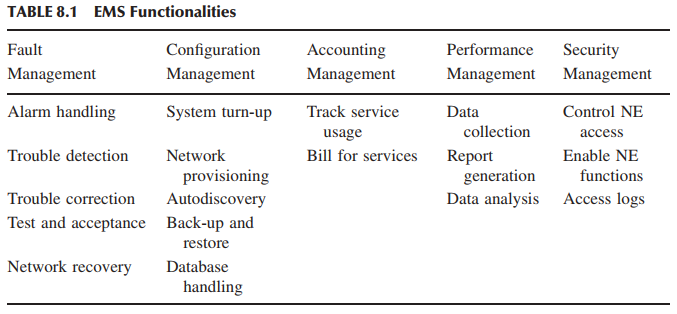

# System Test Categories

> As a rule, software systems do not work well until they have been used, and have failed repeatedly, in real applications. — Dave Parnas

## 8.1 TAXONOMY OF SYSTEM TESTS
Tujuan pengujian tingkat sistem, yang juga disebut pengujian sistem, adalah untuk menetapkan apakah implementasi sesuai dengan persyaratan yang ditetapkan oleh pelanggan. Diperlukan banyak upaya untuk menjamin bahwa persyaratan pelanggan telah terpenuhi dan sistem dapat diterima. Berbagai pengujian juga dijalankan untuk memenuhi berbagai harapan yang tidak ditetapkan. Karena sistem terintegrasi, yang terdiri dari komponen perangkat keras dan perangkat lunak, sering digunakan dalam kenyataan, ada kebutuhan untuk memiliki pandangan yang jauh lebih luas tentang perilaku sistem. Misalnya, sistem pengalihan telepon tidak hanya diharuskan untuk menyediakan koneksi antara dua pengguna tetapi juga diharapkan untuk melakukannya bahkan jika ada banyak koneksi yang sedang berlangsung di bawah batas atas tertentu. Ketika batas atas jumlah koneksi simultan tercapai, sistem tidak diharapkan untuk berperilaku dengan cara yang tidak diinginkan. Dalam bab ini, kami mengidentifikasi berbagai kategori pengujian selain pengujian fungsionalitas inti. Mengidentifikasi kategori pengujian memberi kita keuntungan berikut:
* _Test Engineer_ dapat secara akurat berfokus pada berbagai aspek sistem, satu per satu, sambil mengevaluasi kualitasnya.
* _Test Engineer_ dapat memprioritaskan tugas mereka berdasarkan kategori pengujian. Misalnya, akan lebih bermakna dan berguna untuk mengidentifikasi keterbatasan sistem hanya setelah memastikan bahwa sistem menjalankan semua fungsi dasar untuk menguji kepuasan teknisi. Oleh karena itu, uji stres, yang bertujuan untuk mengidentifikasi keterbatasan sistem, dijalankan setelah pengujian fungsionalitas.
* Merencanakan fase pengujian sistem berdasarkan kategorisasi pengujian memungkinkan teknisi pengujian memperoleh rangkaian pengujian yang seimbang. Keterbatasan praktis membuat pengujian menjadi sulit dilakukan secara menyeluruh, dan pertimbangan ekonomi dapat membatasi proses pengujian untuk dilanjutkan lebih jauh. Namun, penting untuk merancang rangkaian pengujian yang seimbang, daripada yang tidak seimbang dengan banyak kasus pengujian dalam satu kategori dan tidak ada pengujian di kategori lain.

Berikut ini, pertama-tama kami menyajikan taksonomi pengujian sistem. Setelah itu, kami menjelaskan setiap kategori secara terperinci.
* Pengujian dasar (_Basic Tests_) memberikan bukti bahwa sistem dapat diinstal, dikonfigurasi, dan dibawa ke kondisi operasional.
* Pengujian fungsionalitas (_Functionality Tests_)memberikan pengujian komprehensif atas seluruh rentang persyaratan dalam kemampuan sistem.
* Pengujian ketahanan (_Robustness Tests_) menentukan seberapa baik sistem pulih dari berbagai kesalahan input dan situasi kegagalan lainnya.
* Uji interoperabilitas (_Interoperability Tests_) menentukan apakah sistem dapat beroperasi dengan produk pihak ketiga lainnya.
* Uji kinerja (_Performance Tests_) mengukur karakteristik kinerja sistem, misalnya, throughput dan waktu respons, dalam berbagai kondisi.
* Uji skalabilitas (_Scalability Test_)menentukan batas penskalaan sistem dalam hal penskalaan pengguna, penskalaan geografis, dan penskalaan sumber daya.
* Uji stres (_Stress Tests_)memberi tekanan pada sistem untuk menentukan keterbatasan sistem dan, ketika gagal, untuk menentukan cara kegagalan terjadi. Uji beban dan stabilitas memberikan bukti bahwa sistem tetap stabil untuk jangka waktu yang lama di bawah beban penuh.
* Uji keandalan (_Stress Tests_) mengukur kemampuan sistem untuk terus beroperasi dalam waktu lama tanpa mengalami kegagalan.
* Uji regresi (_Regresi Tests_) menentukan bahwa sistem tetap stabil saat berputar melalui integrasi subsistem lain dan melalui tugas pemeliharaan.
* Uji dokumentasi (_Documentation Tests_) memastikan bahwa panduan pengguna sistem akurat dan dapat digunakan.
* Uji regulasi (_Regulatory Tests_) memastikan bahwa sistem memenuhi persyaratan badan regulasi pemerintah di negara tempat sistem akan digunakan.

### 8.2.1 BASIC TESTS
Pengujian dasar memberikan bukti awal bahwa sistem siap untuk pengujian yang lebih ketat. Pengujian ini menyediakan pengujian sistem yang terbatas terkait fitur utama dalam spesifikasi persyaratan. Tujuannya adalah untuk menetapkan bahwa ada cukup bukti bahwa sistem dapat beroperasi tanpa mencoba melakukan pengujian menyeluruh. Pengujian dasar dilakukan untuk memastikan bahwa fungsi yang umum digunakan, yang tidak semuanya mungkin secara langsung berhubungan dengan fungsi tingkat pengguna, berfungsi sesuai harapan kami. Kami menekankan fakta bahwa _test engineer_ mengandalkan implementasi fungsi ini yang tepat untuk melakukan pengujian fungsi tingkat pengguna. Berikut ini adalah kategori utama subsistem yang pengujian memadainya disebut pengujian dasar.

### 8.2.1 Boot Tests
Pengujian boot dirancang untuk memverifikasi bahwa sistem dapat melakukan booting citra perangkat lunak (atau build) dari opsi booting yang didukung. Opsi booting meliputi booting dari ROM, kartu FLASH, dan kartu PCMCIA (Personal Computer Memory Card International Association). Konfigurasi minimum dan maksimum sistem harus dicoba saat melakukan booting. Misalnya, konfigurasi minimum router terdiri dari satu kartu baris di slotnya, sedangkan konfigurasi maksimum router berarti semua slot berisi kartu baris.

### 8.2.2 Upgrade/Downgrade Tests
Pengujian upgrade/downgrade dirancang untuk memverifikasi bahwa perangkat lunak sistem dapat diupgrade atau diturunkan (rollback) dengan cara yang baik dari versi sebelumnya ke versi saat ini atau sebaliknya. Misalkan sistem menjalankan versi (n − 1) dari perangkat lunak dan versi n baru dari perangkat lunak tersebut tersedia. Pertanyaannya adalah bagaimana cara mengupgrade perangkat dari versi (n − 1) ke versi n. Proses upgrade yang membawa sistem dari versi (n − 1) ke versi n mungkin tidak berhasil, dalam hal ini sistem dikembalikan ke versi (n − 1). Pengujian dirancang dalam subkelompok ini untuk memverifikasi bahwa sistem berhasil kembali ke versi (n − 1). Proses pemutakhiran dapat gagal karena sejumlah kondisi berbeda: pembatalan yang dilakukan pengguna (pengguna menghentikan proses pemutakhiran), gangguan jaringan saat proses berlangsung (lingkungan jaringan mati), boot ulang sistem saat proses berlangsung (terjadi gangguan daya), atau deteksi sendiri atas kegagalan pemutakhiran (ini disebabkan oleh hal-hal seperti ruang disk tidak mencukupi dan ketidakcocokan versi).

### 8.2.3 Light Emitting Diode Tests
Pengujian LED (light emitting diode) dirancang untuk memverifikasi bahwa indikator status LED sistem berfungsi sebagaimana mestinya. LED terletak di panel depan sistem. LED ini memberikan indikasi visual status operasional modul. Misalnya, perhatikan status sasis sistem: Hijau menunjukkan bahwa sasis beroperasi, mati menunjukkan bahwa tidak ada daya, dan hijau berkedip dapat menunjukkan bahwa satu atau beberapa submodulnya rusak. Pengujian LED dirancang untuk memastikan bahwa status operasional visual sistem dan submodulnya benar. Contoh pengujian LED pada level sistem dan subsistem adalah sebagai berikut:
* Pengujian LED sistem: hijau = OK, hijau berkedip = rusak, mati = tidak ada daya.
* Pengujian LED tautan Ethernet: hijau = OK, hijau berkedip = aktif, mati = rusak.
* Pengujian LED tautan kabel: hijau = OK, hijau berkedip = aktif, mati = rusak.
* Pengujian LED kartu baris T1 yang ditentukan pengguna: hijau = OK, hijau berkedip = aktif, merah = rusak, mati = tidak ada daya.

### 8.2.4 Diagnostic Tests
Pengujian diagnostik dirancang untuk memverifikasi bahwa komponen perangkat keras (atau modul) sistem berfungsi sebagaimana mestinya. Pengujian ini juga dikenal sebagai uji mandiri bawaan (BIST). Pengujian diagnostik memantau, mengisolasi, dan mengidentifikasi masalah sistem tanpa pemecahan masalah manual. Berikut ini adalah beberapa contoh pengujian diagnostik:
* Uji Mandiri Daya (POST): Ini adalah serangkaian rutinitas diagnostik otomatis yang dijalankan selama fase booting setiap submodul dalam sistem. POST dimaksudkan untuk menentukan apakah perangkat keras berada dalam kondisi yang tepat untuk menjalankan citra perangkat lunak. Pengujian ini tidak dimaksudkan untuk menganalisis perangkat keras secara menyeluruh; sebaliknya, pengujian ini memberikan tingkat keyakinan yang tinggi bahwa perangkat keras beroperasi. POST dijalankan pada jenis elemen berikut:
    - Memori
    - Bus alamat dan data
    - Perangkat periferal
* Uji Loop-Back Ethernet: Pengujian ini menghasilkan dan mengirimkan sejumlah paket yang diinginkan, yang merupakan parameter yang dapat disetel, dan mengharapkan untuk menerima sejumlah paket Ethernet yang sama melalui antarmuka loop-back—eksternal atau internal. Jika terjadi kesalahan (misalnya, paket tidak cocok atau batas waktu habis), pesan kesalahan yang menunjukkan jenis kesalahan, kemungkinan penyebabnya, dan tindakan yang disarankan akan ditampilkan di konsol. Data yang dikirim dihasilkan oleh generator angka acak dan dimasukkan ke dalam buffer data. Setiap kali paket dikirim, paket tersebut dipilih dari titik awal buffer data yang berbeda, sehingga dua paket yang dikirim secara berurutan tidak mungkin identik. Pengujian ini dilakukan untuk memastikan bahwa kartu Ethernet berfungsi sebagaimana mestinya.
* _Bit Error Test_ (BERT): BERT _on-board_ menyediakan pola kesalahan bit standar, yang dapat dikirim melalui saluran untuk tujuan diagnostik. BERT melibatkan pengiriman pola bit yang diketahui dan kemudian menguji pola yang dikirim untuk kesalahan. Rasio jumlah bit dengan kesalahan terhadap jumlah total bit yang dikirim disebut bit _error rate_ (BER). Pengujian dirancang untuk mengonfigurasi semua BERT dari antarmuka baris perintah (CLI). Pengujian ini dilakukan untuk memastikan bahwa perangkat keras berfungsi sebagaimana mestinya.

### 8.2.5 Command Line Interface Tests
The CLI tests are designed to verify that the system can be configured, or provisioned, in specific ways. This is to ensure that the CLI software module processes the user commands correctly as documented. This includes accessing the relevant information from the system using CLI. In addition to the above tests, test scenariosmay be developed to verify the error messages displayed.

## 8.2.6 FUNCTIONALITY TESTS
Functionality tests (Figure 8.3) verify the system as thoroughly as possible over
the full range of requirements specified in the requirements specification document.
This category of tests is partitioned into different functionality subgroups as follows.

### 8.3.1 Communication Systems Tests
Communication systems tests are designed to verify the implementation of the
communication systems as specified in the customer requirements specification.

For example, one of the customer requirements can be to support Request for
Comment (RFC) 791, which is the Internet Protocol (IP) specification. Tests are
designed to ensure that an IP implementation conforms to the RFC791 standard.
Four types of communication systems tests are recommended according to the
extent to which they provide an indication of conformance [1]:
• Basic interconnection tests provide evidence that an implementation can
establish a basic connection before thorough testing is performed.
• Capability tests check that an implementation provides the observable capabilities based on the static communication systems requirements. The static
requirements describes the options, ranges of values for parameters, and
timers.
• Behavior tests endeavor to verify the dynamic communication systems
requirements of an implementation. These are the requirements and options
that define the observable behavior of a protocol. A large part of behavior
tests, which constitute the major portion of communication systems tests,
can be generated from the protocol standards.
• Systems resolution tests probe to provide definite “yes” or “no” answers to
specific requirements.

### 8.3.2 Module Tests
Module tests are designed to verify that all the modules function individually
as desired within the systems. Mutual interactions among the modules glue these components together into a whole system. The idea here is to ensure that individual
modules function correctly within the whole system. One needs to verify that the
system, along with the software that controls these modules, operate as specified
in the requirement specification. For example, an Internet router contains modules
such as line cards, system controller, power supply, and fan tray. Tests are designed
to verify each of the functionalities. For Ethernet line cards, tests are designed to
verify (i) autosense, (ii) latency, (iii) collisions, (iv) frame types, and (v) frame
lengths. Tests are designed to ensure that the fan status is accurately read, reported
by the software, and displayed in the supply module LEDs (one green “in service”
and one red “out of service”). For T1/E1 line cards, tests are designed to verify:
• Clocking: Internal (source timing) and receive clock recovery (loop
timing).
• Alarms: Detection of loss of signal (LOS), loss of frame (LOF), alarm
indication signal (AIS), and insertion of AIS.
• Line Coding: Alternate mark inversion (AMI) for both T1 and E1, bipolar
8 zero substitution (B8ZS) for T1 only, and high-density bipolar 3 (HDB3)
for E1 only.
• Framing: Digital signal 1 (DS1) and E1 framing.
• Channelization: Ability to transfer user traffic across channels multiplexed from one or more contiguous or non contiguous time slots on a T1
or E1 link.

### 8.3.3 Logging and Tracing Tests
Logging and tracing tests are designed to verify the configurations and operations
of logging and tracing. This also includes verification of “flight data recorder:
non-volatile flash memory” logs when the system crashes. Tests may be designed
to calculate the impact on system performance when all the logs are enabled.

### 8.3.4 Element Management Systems Tests
The EMS tests verify the main functions which are to manage, monitor, and upgrade
the communication system network elements (NEs). Table 8.1 summarizes the
functionalities of an EMS. An EMS communicates with its NEs by using, for
example, the Simple Network Management Protocol (SNMP) [2] and a variety of
proprietary protocols and mechanisms.
An EMS is a valuable component of a communication systems network. Not
all EMSs will perform all of the tasks listed in Table 8.1. An EMS can support
a subset of the tasks. A user working through the EMS graphical user interface
(GUI) may accomplish some or all of the tasks. Remote access to an EMS allows
the operators to access management and control information from any location.
This facilitates the deployment of a distributed workforce that can rapidly respond
to failure notifications. This means that thin client workstations can operate over
the Internet and service provider intranets. In this subgroup, tests are designed to verify the five functionalities of an EMS (Table 8.1). This includes both the EMS
client and the EMS server. Examples of EMS tests are given below.
• Auto-Discovery: EMS discovery software can be installed on the server
to discover elements attached to the EMS through the IP network.
• Polling and Synchronization: An EMS server detects a system unreachable condition within a certain time duration. The EMS server synchronizes
alarm status, configuration data, and global positioning system (GPS) time
from the NE.
• Audit Operations: An audit mechanism is triggered whenever an
out-of-service network element comes back. The mechanism synchronizes
alarms between out-of-service NEs coming back online and the EMS.
• Fault Manager: Generation of critical events, such as reboot and reset,
are converted to an alert and stored in the EMS database. The EMS can
send an email/page to a configured address when an alarm is generated.
• Performance Manager: Data are pushed to the EMS server when the data
buffer is full in the NE. Data in the server buffer are stored in the backup
files once it is full.
• Security Manager: It supports authentication and authorization of EMS
clients and NEs. The EMS server does the authorization based on user
privileges.
• Policies: An EMS server supports schedulable log file transfer from the
system. The EMS database is periodically backed up to a disk.
• Logging: An EMS server supports different logging levels for every major
module to debug. An EMS server always logs errors and exceptions.
• Administration and Maintenance: This test configures the maximum
number of simultaneous EMS clients. The EMS server backs up and
restores database periodically.
• Invoke Clients: Several clients can be invoked to interact with the EMS
server.
• Live Data View: A client can provide a live data viewer to monitor performance and show statistics of the system.
• System Administration Task: A client can shut down the server, configure logging levels, display server status, and enable auto-discovery.
• File Transfer: A client can check on-demand file transfer with a progress
bar to indicate the progress and abort an on-demand file transfer operation.

SNMP Example The SNMP is an application layer protocol that facilitates the
exchange of management information between network elements. The SNMP is
a part of the Internet network management architecture consisting of three components: network elements, agents, and network management stations (NMSs). A
NE is a network node that contains an SNMP agent and that resides on a managed
network. Network elements collect and store management information and make
this information available to the NMS over the SNMP protocol. Network elements
can be routers, servers, radio nodes, bridges, hubs, computer hosts, printers, and
modems. An agent is a network management software module that (i) resides on
a NE, (ii) has the local knowledge of management information, and (iii) translates
that information into a form compatible with the SNMP. An NMS, sometimes
referred to as a console, executes management applications to monitor and control
network elements. One or more NMSs exist on each managed networks. An EMS
can act as an NMS.
A management information base (MIB) is an important component of a network management system. The MIB identifies the network elements (or managed
objects) that are to be managed. Two types of managed objects exist:
• Scalar objects define a single object instance.
• Tabular objects define multiple related object instances that are grouped in
MIB tables.
Essentially, a MIB is a virtual store providing a model of the managed information. For example, a MIB can contain information about the number of packets
that have been sent and received across an interface. It contains statistics on the
number of connections that exist on a Transmission Control Protocal (TCP) port
as well as information that describes each user’s ability to access elements of the
MIB. The SNMP does not operate on the managed objects directly; instead, the
protocol operates on a MIB. In turn, a MIB is the reflection of the managed objects,
and its management mechanism is largely proprietary, perhaps through the EMS.
The important aspect of a MIB is that it defines (i) the elements that are
managed, (ii) how a user accesses them, and (iii) how they can be reported. A
MIB can be depicted as an abstract tree with an unnamed root; individual items
are represented as leaves of the tree. An object identifier uniquely identifies a MIB
object in the tree. The organization of object identifiers is similar to a telephone
number hierarchy; they are organized hierarchically with specific digits assigned by
different organizations. The Structure of Management Information (SMI) defines the rules for describing the management information. The SMI specifies that all
managed objects have a name, a syntax, and an encoding mechanism. The name
is used as the object identifier. The syntax defines the data type of the object.
The SMI syntax uses a subset of the Abstract Syntax Notation One (ASN.1) definitions. The encoding mechanism describes how the information associated with
the managed object is formatted as a series of data items for transmission on the
network.
Network elements are monitored and controlled using four basic SNMP commands: read, write, trap, and traversal operations. The read command is used by
an NMS to monitor NEs. An NMS examines different variables that are maintained
by NEs. The write command is used by an NMS to control NEs. With the write
command, an NMS changes the values of variables stored within NEs. The trap
command is used by NEs to asynchronously report events to an NMS. When certain types of events occur, an NE sends a trap to an NMS. The traversal operations
are used by the NMS to determine the variables an NE supports and to sequentially
gather information in a variable table, such as a routing table.
The SNMP is a simple request/response protocol that can send multiple
requests. Six SNMP operations are defined. The Get operation allows an NMS
to retrieve an object instant from an agent. The GetNext operation allows an NMS
to retrieve the next object instance from a table or list within an agent. The GetBulk
operation allows an NMS to acquire large amounts of related information without
repeatedly invoking the GetNext operation. The Set operation allows an NMS to
set values for object instances within an agent. The Trap operation is used by an
agent to asynchronously inform an NMS of some event. The Inform operation
allows one NMS to send trap information to another.
The SNMP messages consist of two parts: a header and a protocol data unit
(PDU). The message header contains two fields, namely, a version number and a
community name. A PDU has the following fields: PDU type, request ID, error
status, error index, and variable bindings. The following descriptions summarize
the different fields:
• Version Number: The version number specifies the version of the SNMP
being used.
• Community Name: This defines an access environment for a group of
NMSs. NMSs within a community are said to exist within the same administrative domain. Community names serve as a weak form of authentication
because devices that do not know the proper community name are precluded from SNMP operations.
• PDU Type: This specifies the type of PDU being transmitted.
• Request ID: A request ID is associated with the corresponding response.
• Error Status: This indicates an error and shows an error type. In GetBulk
operations, this field becomes a nonrepeater field by defining the number of
requested variables listed that should be retrieved no more than once from
the beginning of the request. The field is used when some of the variables
are scalar objects with one variable.
• Error Index: An error index associates the error with a particular object
instance. In GetBulk operations, this field becomes a Max-repetitions field.
This field defines the maximum number of times that other variables beyond
those specified by the nonrepeater field should be retrieved.
• Variable Bindings (varbinds): This comprises the data of an SNMP PDU.
Variables bindings associate particular object instances with their current
values (with the exception of Get and GetNext requests, for which the
value is ignored).

### 8.3.5 Management Information Base Tests
The MIB tests are designed to verify (i) standard MIBs including MIB II and (ii)
enterprise MIBs specific to the system. Tests may include verification of the agent
within the system that implements the objects it claims to. Every MIB object is
tested with the following primitives: Get, GetNext, GetBulk, and Set. It should
be verified that all the counters related to the MIBs are incremented correctly
and that the agent is capable of generating (i) well known traps (e.g., coldstart,
warmstart, linkdown, linkup) and (ii) application-specific traps (X.25 restart and
X.25 reset).

### 8.3.6 Graphical User Interface Tests
In modern-day software applications, users access functionalities via GUIs. Users
of the client-server technology find it convenient to use GUI based applications.
The GUI tests are designed to verify the interface to the users of an application. These tests verify different components (objects) such as icons, menu bars,
dialogue boxes, scroll bars, list boxes, and radio buttons. Ease of use (usability)
of the GUI design and output reports from the viewpoint of actual system users
should be checked. Usefulness of the online help, error messages, tutorials, and user
manuals are verified. The GUI can be utilized to test the functionality behind the
interface, such as accurate response to database queries. GUIs need to be compatible, as discussed in Section 8.5, and consistent across different operating systems,
environments, and mouse-driven and keyboard-driven inputs.
Similar to GUI testing, another branch of testing, called usability testing, has
been evolving over the past several years. The usability characteristics which can
be tested include the following:
• Accessibility: Can users enter, navigate, and exit with relative ease?
• Responsiveness: Can users do what they want and when they want in a
way that is clear? It includes ergonomic factors such as color, shape, sound,
and font size.
• Efficiency: Can users do what they want with a minimum number of steps
and time?
• Comprehensibility: Do users understand the product structure with a minimum amount of effort?