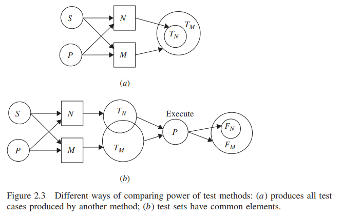
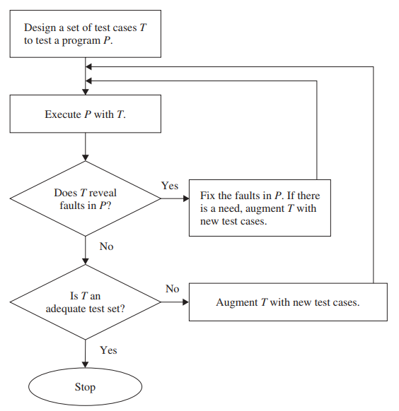

# Teori dalam Pengujian Program
Pembahasan bab ini diambil dari bab 2 dari buku [Software Testing and Quality Assurance](https://drive.google.com/file/d/1UBdGl16MTPAFDFITc5Os8M84x9qIf3mI/view?usp=sharing)

> Orang yang hanya menyukai praktek tanpa teori bagaikan pelaut yang menaiki kapal tanpa kemudi dan kompas dan tidak pernah tahu ke mana ia akan berlayar. — Leonardo da Vinci

## 2.1 Konsep Dasar dalam Teori Pengujian
Gagasan pengujian program setua pemrograman komputer. Seiring dengan semakin berkembangnya program komputer sejak awal kemunculannya di tahun 1960-an, kebutuhan untuk menghilangkan cacat dari program tersebut secara sistematis semakin diperhatikan. Baik komunitas peneliti maupun praktisi semakin terlibat dalam pengujian perangkat lunak. Dengan demikian, pada tahun 1970-an, bidang penelitian baru yang disebut _teori pengujian_ muncul. Teori pengujian menekankan hal-hal berikut:

* Mendeteksi cacat melalui pengujian berbasis eksekusi
* Mendesain kasus uji dari berbagai sumber, yaitu, spesifikasi persyaratan, kode sumber, dan domain input dan output program
* Memilih sebagian kecil kasus uji dari kumpulan semua kasus uji yang memungkinkan
* Efektivitas strategi pemilihan kasus uji
* Oracle uji yang digunakan selama pengujian
* Memprioritaskan eksekusi kasus uji yang dipilih
* Analisis kecukupan kasus uji

Landasan teoritis pengujian memberikan wawasan berharga kepada penguji dan pengembang mengenai sistem perangkat lunak dan proses pengembangan. Sebagai konsekuensinya, penguji merancang kasus pengujian yang lebih efektif dengan biaya yang lebih rendah. Saat mempertimbangkan teori pengujian, mungkin ada ekspektasi yang lebih tinggi bahwa teori tersebut memungkinkan kita mendeteksi semua cacat dalam program komputer. Setiap teori pengujian harus mewarisi keterbatasan mendasar pengujian. Pengujian hanya dapat mengungkapkan keberadaan kesalahan, tidak pernah ketidakhadirannya. Terlepas dari keterbatasan tersebut, pengujian tetap menjadi metode yang paling praktis dan andal untuk deteksi cacat dan peningkatan kualitas.

Dalam bab ini, tiga teori pengujian yang terkenal dibahas. Yaitu _teori Goodenough dan Gerhart_, _teori Weyuker dan Ostrand_, dan _teori Gourlay_. _Goodenough dan Gerhart_ memperkenalkan beberapa konsep utama seperti pengujian ideal, reliabilitas dan validitas pengujian, kriteria pemilihan pengujian, pengujian menyeluruh, dan lima kategori kesalahan program. _Weyuker dan Ostrand_ menyempurnakan beberapa ide di atas dalam bentuk kriteria reliabilitas seragam, kriteria validitas seragam, dan pengujian ideal seragam. _Gourlay_ memperkenalkan konsep sistem pengujian dan metode umum untuk membandingkan berbagai metode pengujian.

## 2.2 TEORI GOODENOUGH DAN GERHART
Teori **Goodenough and Gerhart** dalam konteks *software testing* merujuk pada konsep-konsep yang dikemukakan oleh John B. Goodenough dan Susan L. Gerhart pada tahun 1975 dalam makalah mereka tentang pengujian perangkat lunak. Mereka mendefinisikan beberapa prinsip dasar yang masih relevan hingga sekarang. Konsep ini berfokus pada bagaimana mengukur efektivitas dari *test case* dalam pengujian perangkat lunak. Berikut adalah penjelasan singkat mengenai konsep ini:

### 2.2.1 *Test Case Adequacy* (Kecukupan Kasus Uji)
   - Goodenough dan Gerhart membahas bagaimana menentukan apakah suatu set *test case* sudah cukup untuk menguji sebuah program. Mereka menekankan bahwa suatu *test case* dikatakan cukup jika dapat menunjukkan adanya kesalahan dalam program, bukan hanya jika ia memberikan hasil yang benar.
   - Konsep ini mendorong pengujian yang lebih menyeluruh dan bertujuan untuk menemukan potensi kesalahan daripada hanya memastikan bahwa program berjalan sesuai ekspektasi.

### 2.2.2 *Test Data Adequacy Criteria* (Kriteria Kecukupan Data Uji)
   - Mereka memperkenalkan kriteria kecukupan untuk data uji, yang berarti bahwa data uji harus cukup luas untuk menutupi berbagai skenario dan kondisi yang mungkin terjadi dalam sebuah program.
   - Kriteria ini membantu dalam menentukan apakah cakupan pengujian sudah memadai, artinya sudah mencakup semua jalur yang mungkin dilalui oleh kode, atau skenario-skenario penting yang berpotensi menimbulkan masalah.

### 2.2.3 Fokus pada *Input Domain* dan *Behavioral Testing*
   - Goodenough dan Gerhart juga menekankan pentingnya menguji perangkat lunak dengan menggunakan pendekatan berdasarkan domain input, yaitu memastikan bahwa berbagai rentang input yang mungkin terjadi telah diuji.
   - Selain itu, mereka menekankan pentingnya *behavioral testing* yang menilai bagaimana perangkat lunak bereaksi terhadap input yang berbeda-beda, baik itu input valid maupun input yang tidak valid.

### 2.2.4 *Reliable Software Testing* (Pengujian yang Andal)
   - Goodenough dan Gerhart menggarisbawahi bahwa pengujian tidak hanya bertujuan untuk memastikan bahwa perangkat lunak memenuhi kebutuhan spesifikasinya, tetapi juga untuk meningkatkan keandalan perangkat lunak secara keseluruhan.
   - Ini berarti pengujian harus membantu menemukan kesalahan-kesalahan yang ada serta memperbaikinya, sehingga perangkat lunak menjadi lebih stabil dan dapat diandalkan oleh pengguna.

Secara keseluruhan, teori Goodenough dan Gerhart memberikan landasan bagi pendekatan sistematis dalam pengujian perangkat lunak, yang menekankan bahwa pengujian harus bertujuan untuk menemukan kesalahan dan memastikan bahwa data uji mencakup semua aspek penting dari program. Teori ini menjadi dasar bagi berbagai metodologi pengujian modern, seperti *black-box testing* dan *white-box testing*, dengan tujuan memastikan kualitas perangkat lunak yang lebih baik.

## 2.3 TEORI WEYUKER DAN OSTRAND
Kombinasi teori Weyuker dan Ostrand dalam konteks *software testing* memberikan panduan menyeluruh untuk memahami dan mengimplementasikan pengujian perangkat lunak secara lebih efektif. Meskipun masing-masing teori memiliki fokus yang berbeda—Weyuker pada evaluasi kriteria pengujian, dan Ostrand pada *testability* perangkat lunak—menggabungkan kedua teori ini memberikan perspektif yang lebih komprehensif tentang bagaimana perangkat lunak dapat diuji dan bagaimana proses pengujian dapat dirancang agar lebih efektif. Berikut adalah penjelasan mengenai kombinasi ini:

### 2.3.1 Evaluasi Kriteria Pengujian (Weyuker) dan Kemudahan Pengujian (Ostrand)
   - **Teori Weyuker** memberikan dasar untuk menilai kualitas dan kecukupan suatu kriteria pengujian melalui serangkaian aksioma. Ini membantu penguji memahami apakah suatu metode atau strategi pengujian dapat diandalkan dalam mendeteksi kesalahan. Misalnya, Weyuker menekankan pentingnya *test coverage* yang mencakup semua jalur eksekusi dalam kode dan bagaimana kriteria pengujian harus mampu menangkap perbedaan antara program yang berbeda.

   - **Teori Ostrand**, di sisi lain, membantu dalam memahami faktor-faktor yang memengaruhi seberapa mudah perangkat lunak tersebut untuk diuji. Dengan mengetahui faktor seperti kompleksitas kode, modularitas, keterhubungan antar modul, serta kemampuan penguji dan alat yang tersedia, teori ini memungkinkan penguji merancang pengujian yang lebih sesuai dengan karakteristik perangkat lunak yang diuji.

   - Kombinasi keduanya memungkinkan penguji untuk:
     - Menilai kriteria pengujian yang tepat menggunakan prinsip Weyuker, sambil mempertimbangkan sejauh mana perangkat lunak tersebut mudah atau sulit diuji menurut faktor-faktor yang dijelaskan oleh Ostrand.
     - Mengoptimalkan pemilihan pendekatan pengujian dengan mempertimbangkan karakteristik perangkat lunak, sehingga pengujian dapat dilakukan dengan cara yang paling efisien.

### 2.3.2 Mencapai Cakupan Pengujian Maksimal
   - Weyuker menekankan pada kebutuhan untuk mencapai cakupan pengujian yang memadai melalui prinsip-prinsipnya, seperti cakupan yang harus mampu membedakan antara dua program yang berbeda dalam hal hasilnya, bahkan jika keduanya tampak serupa dari luar (Aksioma Equivalence dan Antiextensionality).

   - Ostrand berfokus pada bagaimana struktur dan kompleksitas kode memengaruhi jumlah pengujian yang diperlukan. Ia menyarankan penggunaan metrik seperti *cyclomatic complexity* dan *branch coverage* untuk memastikan bahwa semua jalur eksekusi dalam program telah diuji.

   - Dengan menggabungkan kedua perspektif ini, tim penguji dapat:
     - Menggunakan metrik untuk menilai kompleksitas kode (dari teori Ostrand) sebagai dasar untuk menentukan jumlah kasus uji yang dibutuhkan.
     - Memastikan bahwa cakupan tersebut cukup untuk membedakan semua jalur program yang mungkin (seperti yang disarankan oleh teori Weyuker), sehingga tidak ada jalur yang terlewat.

### 2.3.3 Memperbaiki Desain Perangkat Lunak agar Lebih Mudah Diuji
   - **Teori Ostrand** mengidentifikasi bahwa *testability* sangat dipengaruhi oleh faktor-faktor internal, seperti struktur kode, modularitas, dan keterhubungan antar modul (*coupling*). Dengan mengetahui ini, pengembang dapat merancang perangkat lunak agar lebih mudah diuji dengan membuat kode yang lebih modular, mengurangi kompleksitas berlebih, dan membatasi interaksi antar komponen.

   - **Prinsip Weyuker** bisa membantu pengembang dan penguji dalam memahami bagaimana setiap perubahan desain akan memengaruhi proses pengujian. Misalnya, prinsip Monotonicity dalam teori Weyuker menggarisbawahi bahwa penambahan fitur pada perangkat lunak seharusnya tidak membuat pengujian menjadi lebih mudah, tetapi justru seharusnya memerlukan lebih banyak pengujian.

   - Kombinasi ini dapat membantu pengembang:
     - Merancang perangkat lunak yang secara struktural lebih mudah diuji (berdasarkan teori Ostrand).
     - Memahami bahwa perubahan pada desain, misalnya penambahan fitur, akan membutuhkan adaptasi dalam kriteria pengujian untuk memastikan bahwa cakupan pengujian tetap memadai (berdasarkan teori Weyuker).

### 2.3.4 Strategi Pengujian yang Lebih Adaptif
   - **Teori Weyuker** menekankan bahwa tidak ada satu kriteria pengujian yang cocok untuk semua situasi (Aksioma Generality). Oleh karena itu, penguji harus fleksibel dalam memilih kriteria pengujian yang sesuai dengan sifat perangkat lunak yang diuji.

   - Dengan **teori Ostrand**, penguji mendapatkan panduan untuk memahami kompleksitas program dan dapat memperkirakan berapa banyak upaya yang diperlukan untuk menguji setiap modul atau komponen. Ini memungkinkan penguji untuk menyesuaikan strategi pengujian berdasarkan tingkat kesulitan yang dihadapi dalam setiap bagian perangkat lunak.

   - Dengan kombinasi ini, penguji dapat:
     - Memilih kriteria pengujian yang tepat dan melakukan penyesuaian sesuai dengan kesulitan yang ditemukan selama proses pengujian.
     - Mengalokasikan sumber daya pengujian secara lebih efisien, fokus pada bagian perangkat lunak yang lebih rumit atau yang lebih rentan terhadap kesalahan.

### 2.3.5 Peningkatan Efisiensi dan Efektivitas Pengujian
   - Dengan menggunakan **aksioma Weyuker**, penguji dapat memastikan bahwa setiap upaya pengujian memberikan nilai yang signifikan dalam hal deteksi kesalahan dan jaminan kualitas perangkat lunak.
   - Sementara itu, **teori Ostrand** membantu dalam merencanakan pengujian dengan mempertimbangkan faktor-faktor praktis seperti ketersediaan waktu, sumber daya, dan alat uji yang dapat mempercepat proses pengujian.

   - Kombinasi ini memastikan bahwa:
     - Pengujian tidak hanya menyeluruh, tetapi juga difokuskan pada area yang paling kritis dan berpotensi memiliki cacat.
     - Penguji dapat menghindari melakukan pengujian berlebihan pada bagian perangkat lunak yang sederhana, sehingga fokus pengujian bisa diarahkan pada area yang lebih membutuhkan perhatian.

### Kesimpulan: Manfaat dan Aplikasi dalam Proses Pengujian
Kombinasi teori Weyuker dan Ostrand dalam *software testing* memberikan kerangka berpikir yang menyeluruh untuk merancang, mengevaluasi, dan mengoptimalkan proses pengujian perangkat lunak. Ini memungkinkan tim pengujian untuk tidak hanya memahami seberapa baik suatu metode pengujian mencakup kebutuhan pengujian, tetapi juga mengidentifikasi cara untuk meningkatkan desain perangkat lunak agar lebih mudah diuji. Dengan demikian, tim pengembang dan penguji dapat lebih efisien dalam mendeteksi cacat, menghemat waktu dan sumber daya, serta menghasilkan perangkat lunak dengan kualitas yang lebih tinggi.

## 2.4 TEORI GOURLAY
Teori Gourlay adalah salah satu pendekatan yang dikembangkan oleh Stephen N. Gourlay pada tahun 1981 untuk memahami proses belajar dalam organisasi. Meskipun teori ini tidak secara langsung terkait dengan pengujian perangkat lunak, konsep-konsep dasarnya dapat diterapkan untuk meningkatkan pemahaman tentang proses pembelajaran yang terlibat dalam pengujian perangkat lunak.

### Konsep Utama Teori Gourlay
Teori Gourlay memandang pembelajaran sebagai proses yang terjadi dalam beberapa tahap, yaitu:

1. **Kognitif (Cognitive)**: Pada tahap ini, seseorang atau tim belajar tentang konsep dan teori dasar yang terkait dengan subjek tertentu. Dalam konteks pengujian perangkat lunak, tahap ini melibatkan pemahaman tentang metode pengujian, teknik pengujian (seperti pengujian fungsional, pengujian non-fungsional), serta alat yang digunakan dalam pengujian.

2. **Afektif (Affective)**: Tahap ini mencakup pembentukan sikap, motivasi, dan nilai-nilai terhadap aktivitas pengujian. Misalnya, seorang penguji perangkat lunak mungkin mulai memahami pentingnya pengujian yang teliti untuk memastikan kualitas produk dan menunjukkan sikap yang positif terhadap peningkatan kualitas.

3. **Psikomotorik (Psychomotoric)**: Pada tahap ini, keterampilan praktis yang dibutuhkan untuk melakukan pengujian perangkat lunak mulai dikembangkan. Ini termasuk kemampuan untuk menjalankan tes, menganalisis hasilnya, dan mengidentifikasi bug atau cacat dalam perangkat lunak. Tahap ini mengacu pada penguasaan keterampilan praktis dalam menggunakan alat pengujian atau framework tertentu.

### Aplikasi Teori Gourlay dalam Pengujian Perangkat Lunak
Dalam konteks pengujian perangkat lunak, Teori Gourlay dapat digunakan untuk memahami bagaimana individu atau tim tester berkembang dalam hal keterampilan dan pemahaman mereka. Berikut adalah contoh penerapan setiap tahap:

- **Kognitif**: Tester mempelajari teori dan konsep pengujian, seperti pengujian unit, pengujian integrasi, pengujian sistem, dan lainnya. Mereka juga belajar tentang pentingnya teknik desain kasus uji dan strategi pengujian yang tepat.

- **Afektif**: Tester mulai menunjukkan minat dan kepedulian terhadap kualitas perangkat lunak yang diuji. Mereka memahami dampak dari kesalahan yang ditemukan terhadap pengalaman pengguna dan nilai bisnis dari perangkat lunak tersebut. Ini dapat mencakup rasa tanggung jawab untuk menemukan dan melaporkan bug secara tepat waktu.

- **Psikomotorik**: Tester menjadi terampil dalam menggunakan alat pengujian seperti Selenium, JUnit, atau Postman. Mereka juga dapat menulis skrip otomatisasi pengujian, menjalankan tes secara efisien, serta menganalisis log dan laporan hasil pengujian.

### Manfaat Pendekatan Gourlay untuk Pengujian Perangkat Lunak
1. **Pembelajaran Terstruktur**: Dengan memecah proses pembelajaran menjadi tahap-tahap ini, manajer pengujian atau lead tester dapat merancang program pelatihan yang lebih efektif untuk meningkatkan keterampilan tim mereka.
   
2. **Peningkatan Kinerja Tim**: Memahami setiap tahap pembelajaran memungkinkan manajer untuk memberikan dukungan yang tepat bagi tester di berbagai tahap perkembangan, baik itu melalui pembelajaran formal, bimbingan, atau pelatihan langsung.

3. **Peningkatan Kualitas Pengujian**: Dengan tim yang memiliki pemahaman yang baik (kognitif), memiliki sikap positif (afektif), dan keterampilan teknis yang kuat (psikomotorik), kualitas pengujian perangkat lunak yang dilakukan juga akan meningkat, sehingga produk perangkat lunak yang dihasilkan lebih andal.

Dengan mengaplikasikan Teori Gourlay dalam proses pelatihan dan pengembangan tester, sebuah tim dapat lebih efektif dalam menguasai proses pengujian perangkat lunak, menghasilkan proses yang lebih baik, dan produk perangkat lunak yang lebih berkualitas.

## 2.5 KECUKUPAN PENGUJIAN
Pengujian memberi desainer dan pemrogram kepercayaan pada komponen perangkat lunak atau produk lengkap jika melewati kasus uji mereka. Asumsikan bahwa satu set kasus uji `T` telah dirancang untuk menguji program P. Kita mengeksekusi `P` dengan set uji `T`. Jika `T` mengungkapkan kesalahan di `P`, maka kami memodifikasi program dalam upaya untuk memperbaiki kesalahan tersebut. Pada tahap ini, mungkin ada kebutuhan untuk merancang beberapa kasus uji baru, karena, misalnya, kami dapat memasukkan prosedur baru dalam kode.Setelah memodifikasi kode, kami menjalankan program dengan set tes baru.Dengan demikian, kami menjalankan loop tes-dan-fix sampai tidak ada lagi kesalahan yang diungkapkan oleh set uji yang diperbarui.Sekarang kita menghadapi dilema sebagai berikut: Apakah `P` benar -benar bebas kesalahan, atau tidak cukup baik untuk mengungkapkan kesalahan yang tersisa di `P`? Dari pengujian kami tidak dapat menyimpulkan bahwa `P` adalah bebas kesalahan, karena, seperti yang diamati Dijkstra, **pengujian dapat mengungkapkan adanya kesalahan, tetapi bukan ketidakhadirannya**. Oleh karena itu, jika `P` lulus `T`, kita perlu tahu bahwa `T` "cukup baik" atau, dengan kata lain, bahwa `T` adalah serangkaian tes yang memadai. Penting untuk mengevaluasi kecukupan `T` karena jika `T` ditemukan tidak memadai, maka lebih banyak kasus uji perlu dirancang, seperti yang diilustrasikan pada Gambar 2.4. Kecukupan `T` berarti apakah `T` menguji secara menyeluruh `P`.

\
**Gambar 2.3**

Idealnya, pengujian harus dilakukan dengan set tes yang memadai `T`. Secara intuitif, ide di balik menentukan kriteria untuk mengevaluasi kecukupan tes adalah untuk mengetahui apakah pengujian yang cukup telah dilakukan atau tidak. Kita akan segera kembali ke gagasan kecukupan tes. Dengan tidak adanya kecukupan tes, pengembang akan dipaksa untuk menggunakan langkah-langkah yang dibutuhkan untuk memutuskan kapan harus berhenti pengujian. Beberapa contoh tindakan yang dibutuhkan untuk menghentikan pengujian adalah sebagai berikut:
* Berhenti saat waktu yang dialokasikan untuk pengujian berakhir.
* Berhenti saat tiba saatnya untuk melepaskan produk.
* Berhenti saat semua kasus uji dieksekusi tanpa mengungkapkan kesalahan

Gambar 2.4 menggambarkan dua gagasan penting tentang desain tes dan mengevaluasi tes Kecukupan sebagai berikut:

\
**Gambar 2.4** Konteks dari penerapan kecukupan pengujian

* Kecukupan himpunan uji `T` dievaluasi setelah ditemukan bahwa `T` mengungkapkan tidak ada lagi kesalahan.Orang mungkin berdebat: Mengapa tidak merancang kasus uji untuk memenuhi kriteria kecukupan? Namun, penting untuk merancang kasus uji yang terlepas dari kriteria kecukupan karena tujuan utama pengujian adalah untuk menemukan kesalahan, dan, dengan demikian, desain tes tidak boleh dibatasi oleh kriteria kecukupan. Contoh kriteria desain tes adalah sebagai berikut: Pilih kasus uji untuk menjalankan semua pernyataan dalam suatu program setidaknya sekali. Namun, kesulitan dengan kriteria desain tes seperti itu adalah bahwa kita mungkin tidak dapat mengetahui apakah setiap pernyataan program dapat dieksekusi.Dengan demikian, sulit untuk menilai kecukupan set tes yang dipilih dengan demikian.Akhirnya, karena tujuan pengujian adalah untuk mengungkapkan kesalahan, tidak ada gunanya mengevaluasi kecukupan tes yang ditetapkan selama kesalahan terungkap.
* Set uji yang memadai tidak mengatakan apa -apa tentang kebenaran suatu program.Pemahaman umum tentang kebenaran adalah bahwa kami telah menemukan dan memperbaiki semua kesalahan dalam suatu program untuk membuatnya "benar." Namun, dalam praktiknya, itu tidak realistis - meskipun sangat diinginkan - untuk menemukan dan memperbaiki semua kesalahan dalam suatu program.Dengan demikian, di satu sisi, kriteria kecukupan mungkin tidak mencoba membidik kebenaran program.Di sisi lain, program bebas kesalahan tidak boleh mengubah set tes sewenang-wenang `T` menjadi tes yang memadai.

Dua poin di atas memberi tahu kami gagasan penting: bahwa kecukupan set tes dievaluasi independen dari proses desain tes untuk program yang diuji. Secara intuitif, set uji `T` dikatakan memadai jika mencakup semua aspek perhitungan aktual yang dilakukan oleh program dan semua perhitungan yang dimaksudkan oleh spesifikasinya.Dua metode praktis untuk mengevaluasi kecukupan tes adalah sebagai berikut:
* **Fault Seeding**: Metode ini mengacu pada menanamkan sejumlah kesalahan dalam program `P` dan mengeksekusi `P` dengan set tes `T`. Jika `T` mengungkapkan k persen dari kesalahan yang ditanamkan, kami berasumsi bahwa `T` hanya mengungkapkan k persen dari kesalahan asli. Jika 100% dari kesalahan yang ditanamkan telah diungkapkan oleh `T`, kami merasa lebih percaya diri tentang kecukupan `T`.Diskusi menyeluruh tentang penyemaian kesalahan dapat ditemukan di Bab 13.
* **Program Mutation**: Diberikan program `P`, mutasi adalah program yang diperoleh dengan membuat perubahan kecil ke `P`. Dalam metode mutasi program, serangkaian mutasi diperoleh dari `P`.Beberapa mutasi mungkin mengandung kesalahan dan sisanya setara dengan `P`. Tes `T` dikatakan memadai jika menyebabkan setiap mutasi yang salah menghasilkan hasil yang tidak terduga.Diskusi yang lebih menyeluruh tentang mutasi program dapat ditemukan di Bab 3.

## 2.6 KETERBATASAN PENGUJIAN
Idealnya, semua program harus benar, yaitu, tidak ada kesalahan dalam suatu program. Karena sifat tidak praktis dari membuktikan bahwa program kecil menjadi benar, pelanggan dan pengembang perangkat lunak bergantung pada kemanjuran pengujian. Di bagian ini, kami memperkenalkan dua batasan utama pengujian:
* Pengujian berarti melaksanakan program dengan subset yang umumnya kecil dan tepat dari domain input program.Subset kecil yang tepat dari domain input dipilih karena biaya mungkin tidak memungkinkan subset yang jauh lebih besar dipilih, apalagi set input penuh. Pengujian dengan set input penuh dikenal sebagai pengujian lengkap. Dengan demikian, kebutuhan yang melekat untuk menguji program dengan sebagian kecil dari domain input menimbulkan batas mendasar pada kemanjuran pengujian. Batasnya adalah dalam bentuk ketidakmampuan kita untuk mengekstrapolasi kebenaran hasil untuk subset yang tepat dari domain input untuk memprogram kebenaran.Dengan kata lain, bahkan jika suatu program lulus satu set `T` uji, kami tidak dapat menyimpulkan bahwa program tersebut benar.
* Setelah kami memilih subset dari domain input, kami dihadapkan dengan masalah memverifikasi kebenaran output program untuk input tes individu.Artinya, output program diperiksa untuk menentukan apakah program dilakukan dengan benar pada input tes. **Mekanisme yang memverifikasi kebenaran output program dikenal sebagai _oracle_.** Konsep _oracle_ dibahas secara rinci dalam Bab 9. Menentukan kebenaran output program bukanlah tugas yang sepele. Jika salah satu dari dua kondisi berikut berlaku, suatu program dianggap _tidak dapat diuji_ (_nontestable_):
- Tidak ada _oracle_.
- Terlalu sulit untuk menentukan output yang benar.

Jika tidak ada mekanisme untuk memverifikasi kebenaran output program atau membutuhkan waktu yang luar biasa untuk memverifikasi output, tidak banyak yang bisa diperoleh dengan menjalankan tes.

## 2.7 SUMMARY
Tujuan yang ideal dan abstrak pengujian adalah untuk mengungkapkan semua kesalahan dalam sistem perangkat lunak tanpa menguji perangkat lunak secara lengkap. Gagasan ini adalah dasar dari konsep tes ideal yang dikembangkan oleh Goodenough dan Gerhart. Tes yang ideal seharusnya menjadi subset kecil yang tepat dari seluruh domain input, dan kita harus dapat mengekstrapolasi hasil tes ideal untuk memprogram kebenaran. Dengan kata lain, dalam arti abstrak, jika suatu program lulus semua tes dalam set tes yang dipilih dengan cermat, yang disebut tes yang ideal, kami berada dalam posisi untuk mengklaim bahwa program tersebut benar.

Ditambah dengan konsep tes yang ideal adalah kriteria seleksi tes yang memungkinkan kita untuk memilih anggota tes yang ideal.Kriteria pemilihan tes ditandai dalam hal reliabilitas dan validitas. Kriteria yang dapat diandalkan adalah kasus yang memilih kasus uji sedemikian rupa sehingga suatu program lulus semua tes atau gagal semua tes.Di sisi lain, kriteria yang valid adalah yang memilih setidaknya satu set tes yang gagal jika program berisi kesalahan. Jika kriteria valid dan dapat diandalkan, maka tes apa pun yang dipilih oleh kriteria adalah tes yang ideal. Teori ini memiliki beberapa kelemahan. Pertama, konsep keandalan dan validitas telah didefinisikan sehubungan dengan satu program dan seluruh domain inputnya.Kedua, baik reliabilitas maupun validitas tidak dipertahankan di seluruh fase debugging pengembangan perangkat lunak.

Kesalahan terjadi karena pemahaman kami yang tidak memadai tentang semua kondisi yang harus dihadapi suatu program dan kegagalan kami untuk menyadari bahwa kombinasi kondisi tertentu memerlukan perawatan khusus.Goodenough dan Gerhart mengkategorikan kesalahan menjadi lima kategori: kesalahan logika, kesalahan persyaratan, kesalahan desain, kesalahan konstruksi, dan kesalahan kinerja.

Weyuker dan Ostrand mencoba menghilangkan kelemahan teori Goodenough dan Gerhart dengan mengusulkan konsep tes yang secara seragam ideal. Konsep ini didefinisikan sehubungan dengan semua program yang dirancang untuk memenuhi spesifikasi, bukan hanya satu program—maka dari itu muncul konsep “keseragaman” atas semua contoh program untuk spesifikasi tertentu. Lebih lanjut, gagasan keseragaman diperluas untuk menguji kriteria seleksi dalam bentuk kriteria yang andal secara seragam dan valid secara seragam. Namun, teori mereka juga tidak praktis karena kriteria yang valid secara seragam dan dapat diandalkan secara seragam memilih seluruh domain input suatu program, sehingga menyebabkan pengujian lengkap. Selanjutnya, gagasan tes yang ideal diperluas ke subset yang tepat dari domain input yang disebut subdomain, dan konsep kriteria yang mengungkapkan didefinisikan.

Meskipun pengujian tidak dapat menyelesaikan pertanyaan tentang kebenaran program, metode pengujian yang berbeda terus dikembangkan. Misalnya, ada metode pengujian berbasis spesifikasi dan metode pengujian berbasis kode.Penting untuk mengembangkan teori untuk membandingkan kekuatan metode pengujian yang berbeda.Gourlay mengedepankan teori untuk membandingkan kekuatan metode pengujian berdasarkan kemampuan deteksi kesalahan mereka.

Sistem perangkat lunak mengalami beberapa siklus _pengujian-perbaikan-pengujian ulang_ sampai, idealnya, tidak ada lagi kesalahan yang terungkap. Kesalahan diperbaiki dengan memodifikasi kode atau menambahkan kode baru ke sistem. Pada tahap ini mungkin ada kebutuhan untuk merancang kasus uji baru. Ketika tidak ada lagi kesalahan yang terungkap, kita dapat menyimpulkan dengan cara ini: _Entah tidak ada kesalahan dalam program atau tes tidak dapat menemukan kesalahan_. Karena kami tidak memiliki cara untuk mengetahui situasi yang tepat, penting untuk mengevaluasi kecukupan set tes. Tidak perlu mengevaluasi kecukupan tes selama mereka mengungkapkan kesalahan. Dua cara praktis untuk mengevaluasi kecukupan uji adalah penyemaian kesalahan dan mutasi program.

> ✳ ChatGPT prompt: _in context of test adequacy what are fault seeding and program mutation_

Akhirnya, kami membahas dua batasan pengujian.Keterbatasan pengujian pertama adalah bahwa ia tidak dapat menyelesaikan pertanyaan tentang kebenaran program. Dengan kata lain, dengan menguji program dengan subset yang tepat dari domain input dan tidak mengamati kesalahan, kami tidak dapat menyimpulkan bahwa tidak ada kesalahan yang tersisa dalam program.Keterbatasan pengujian kedua adalah bahwa dalam beberapa kasus kami tidak tahu output yang diharapkan dari suatu program. Jika untuk beberapa input, output yang diharapkan dari suatu program tidak diketahui atau tidak dapat ditentukan dalam jumlah waktu yang wajar, maka program tersebut disebut _nontestable_.