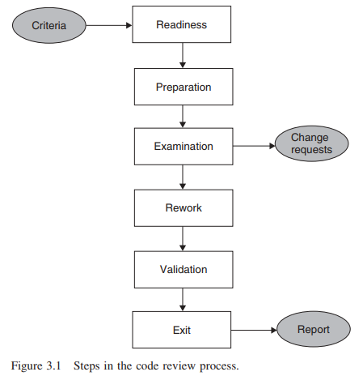
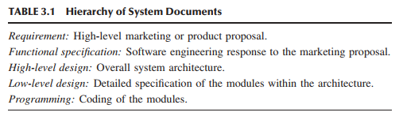

# Unit Testing

Pembahasan bab ini diambil dari bab 1 dari buku [Software Testing and Quality Assurance - Theory and Practice](https://drive.google.com/file/d/1UBdGl16MTPAFDFITc5Os8M84x9qIf3mI/view?usp=sharing)

> Pengetahuan tidaklah berarti jika Anda menerapkannya dalam praktek - Anton Chekhov

## 3.1 KONSEP _UNIT TESTING_
Dalam bab ini, kami mempertimbangkan pengujian tingkat pertama, yaitu _unit testing_. _Unit testing_ mengacu pada _unit testing_ program secara terpisah. Namun, tidak ada konsensus tentang definisi unit. Beberapa contoh unit yang umum dipahami adalah fungsi, prosedur, atau metode. Bahkan kelas dalam bahasa pemrograman berorientasi objek dapat dianggap sebagai unit program. **Secara sintaksis, unit program adalah bagian kode, seperti fungsi atau metode kelas, yang dipanggil dari luar unit dan dapat memanggil unit program lainnya.** Selain itu, unit program diasumsikan mengimplementasikan fungsi yang terdefinisi dengan baik yang menyediakan tingkat abstraksi tertentu untuk implementasi fungsi tingkat yang lebih tinggi. Fungsi yang dilakukan oleh unit program mungkin tidak memiliki hubungan langsung dengan fungsi tingkat sistem. Dengan demikian, unit program dapat dilihat sebagai bagian kode yang mengimplementasikan fungsi tingkat "rendah". Dalam bab ini, penggunaan  istilah _unit_ dan _modul_ secara bergantian.

Sekarang, mengingat bahwa unit program mengimplementasikan suatu fungsi, wajar saja untuk menguji unit tersebut sebelum diintegrasikan dengan unit lain. Dengan demikian, suatu unit program diuji secara terpisah, yaitu dengan cara yang berdiri sendiri. **Ada dua alasan untuk menguji suatu unit secara terpisah. Pertama, kesalahan yang ditemukan selama pengujian dapat dikaitkan dengan unit tertentu sehingga dapat diperbaiki dengan mudah.** ​​Selain itu, _unit testing_ menghilangkan ketergantungan pada unit program lainnya. **Kedua, selama _unit testing_, sebaiknya verifikasi dilakukan untuk memastikan bahwa setiap eksekusi yang berbeda dari suatu unit program menghasilkan hasil yang diharapkan.** Dalam hal detail kode, eksekusi yang berbeda mengacu pada jalur yang berbeda dalam unit tersebut. Idealnya, semua kemungkinan—atau sebanyak mungkin—eksekusi yang berbeda harus dipertimbangkan selama _unit testing_. Hal ini memerlukan pemilihan data input yang cermat untuk setiap eksekusi yang berbeda. Seorang programmer memiliki akses langsung ke vektor input unit dengan mengeksekusi unit program secara terpisah. Akses langsung ini memudahkan eksekusi sebanyak mungkin jalur yang berbeda. Jika beberapa unit disatukan untuk pengujian, maka seorang programmer perlu membuat input pengujian dengan hubungan tidak langsung dengan vektor input dari beberapa unit yang diuji. Hubungan tidak langsung tersebut mempersulit pengendalian eksekusi jalur yang berbeda dalam unit yang dipilih.

_Unit testing_ memiliki cakupan terbatas. Seorang programmer perlu memverifikasi apakah kode berfungsi dengan benar atau tidak dengan melakukan _unit-level testing_. Secara intuitif, seorang programmer perlu menguji unit sebagai berikut:
* Jalankan setiap baris kode. Hal ini diperlukan karena programmer perlu mengetahui apa yang terjadi saat baris kode dieksekusi. Jika hal ini tidak dilakukan, maka kesalahan yang ditemukan terlambat akan memberikan dampak yang lebih merepotkan.
* Jalankan setiap bagian dalam unit untuk mengevaluasinya menjadi benar dan salah secara terpisah.
* Amati bahwa unit menjalankan fungsi yang dimaksudkan dan pastikan tidak mengandung kesalahan yang diketahui.

Terlepas dari pengujian di atas, tidak ada jaminan bahwa unit yang diuji dengan memuaskan berfungsi dengan benar dari perspektif sistem secara keseluruhan. Tidak semua hal yang berkaitan dengan unit dapat diuji secara terpisah karena keterbatasan pengujian secara terpisah. Ini berarti bahwa beberapa kesalahan dalam unit program hanya dapat ditemukan kemudian, saat unit diintegrasikan dengan unit lain dalam fase pengujian integrasi dan pengujian sistem. Meskipun tidak mungkin menemukan semua kesalahan dalam unit program secara terpisah, tetap penting untuk memastikan bahwa unit tersebut berfungsi dengan memuaskan sebelum digunakan oleh unit program lain. Tidak ada gunanya mengintegrasikan unit yang salah dengan unit lain karena alasan berikut: (i) banyak pengujian berikutnya akan membuang-buang sumber daya dan (ii) menemukan akar penyebab kegagalan dalam sistem yang terintegrasi lebih banyak menghabiskan sumber daya.

**_Unit testing_ dilakukan oleh programmer yang menulis unit program karena programmer sangat mengenal detail internal unit tersebut.** Tujuan programmer adalah untuk merasa yakin bahwa unit tersebut berfungsi seperti yang diharapkan. Karena seorang programmer diharapkan untuk membangun unit tanpa kesalahan di dalamnya, _unit testing_ dilakukan olehnya untuk memuaskannya di awal dan untuk memuaskan programmer lain saat unit tersebut diintegrasikan dengan unit lain. Ini berarti bahwa semua programmer bertanggung jawab atas kualitas pekerjaan mereka sendiri, yang dapat mencakup kode baru dan modifikasi pada kode yang sudah ada. Idenya di sini adalah untuk mendorong konsep kualitas ke tingkat terendah organisasi dan memberdayakan setiap programmer untuk bertanggung jawab atas kualitasnya sendiri. Oleh karena itu, demi kepentingan terbaik programmer untuk mengambil tindakan pencegahan guna meminimalkan jumlah _defect_ dalam kode. _Defect_ yang ditemukan selama _unit testing_ bersifat internal bagi kelompok pengembangan perangkat lunak dan tidak dilaporkan ke hierarki personel untuk dihitung dalam metrik pengukuran kualitas. Kode sumber suatu unit tidak digunakan untuk antarmuka oleh anggota kelompok lain hingga programmer menyelesaikan _unit testing_ dan memeriksa unit tersebut ke sistem kontrol versi.

_Unit testing_ dilakukan dalam dua fase yang saling melengkapi:
* _Unit testing_ statis
* _Unit testing_ dinamis

Dalam _unit testing_ statis, seorang programmer tidak mengeksekusi unit; sebaliknya, kode diperiksa berdasarkan semua kemungkinan perilaku yang mungkin muncul selama run time. _Unit testing_ statis juga dikenal sebagai _unit testing_ berbasis non-eksekusi, sedangkan _unit testing_ dinamis berbasis eksekusi. Dalam _unit testing_ statis, kode setiap unit divalidasi terhadap persyaratan unit dengan meninjau kode. Selama proses peninjauan, masalah potensial diidentifikasi dan diselesaikan. Misalnya, dalam bahasa pemrograman C, dua instruksi penghentian program adalah `abort()` dan `exit()`. Meskipun keduanya terkait erat, keduanya memiliki efek yang berbeda seperti yang dijelaskan di bawah ini:
* `abort()`: Ini berarti penghentian program yang tidak normal. Secara default, panggilan ke `abort()` menghasilkan diagnostik _run time_ dan penghancuran diri program. Penghancuran program mungkin atau mungkin tidak membersihkan dan menutup file yang dibuka atau menghapus file sementara, tergantung pada implementasinya.
* `exit()`: Ini berarti penghentian program yang baik. Artinya, panggilan `exit()` menutup file yang dibuka dan mengembalikan kode status ke lingkungan eksekusi.

Apakah akan menggunakan `abort()` atau `exit()` bergantung pada konteks yang dapat dengan mudah dideteksi dan diselesaikan selama _unit testing_ statis. Semakin banyak masalah yang terdeteksi lebih awal menyebabkan lebih sedikit kesalahan yang diidentifikasi dalam fase pengujian dinamis dan menghasilkan lebih sedikit _defect_ pada produk yang dikirim. Selain itu, melakukan pengujian statis lebih murah daripada melakukan pengujian dinamis. Tinjauan kode merupakan salah satu komponen dari proses minimalisasi _defect_ dan dapat membantu mendeteksi masalah yang umum terjadi pada pengembangan perangkat lunak. Setelah satu putaran tinjauan kode, _unit testing_ dinamis dilakukan. Dalam _unit testing_ dinamis, unit program benar-benar dieksekusi dan hasilnya diamati. _Unit testing_ dinamis berarti menguji kode dengan benar-benar menjalankannya. Perlu dicatat bahwa _unit testing_ statis bukanlah alternatif untuk _unit testing_ dinamis. Seorang programmer melakukan kedua jenis pengujian tersebut. Dalam praktiknya, _unit testing_ dinamis parsial dilakukan bersamaan dengan _unit testing_ statis. Jika seluruh _unit testing_ dinamis telah dilakukan dan _unit testing_ statis mengidentifikasi masalah yang signifikan, _unit testing_ dinamis harus diulang. Sebagai akibat dari pengulangan ini, jadwal pengembangan dapat terpengaruh. Untuk meminimalkan kemungkinan kejadian seperti itu, _unit testing_ statis perlu dilakukan sebelum _unit testing_ dinamis akhir.

### 3.2 PENGUJIAN UNIT STATIS (STATIC UNIT TESTING)
Pengujian unit statis dilakukan sebagai bagian dari keyakinan filosofis yang lebih luas bahwa suatu produk perangkat lunak harus menjalani fase pemeriksaan dan koreksi pada setiap tonggak dalam siklus hidupnya. Pada tonggak tertentu, produk tidak perlu berada dalam bentuk akhirnya. Misalnya, penyelesaian pengodean merupakan tonggak, meskipun pengodean semua unit mungkin tidak menghasilkan produk yang diinginkan. Setelah pengodean, tonggak berikutnya adalah pengujian semua atau sejumlah besar unit yang membentuk komponen utama produk. Jadi, sebelum unit diuji secara individual dengan benar-benar menjalankannya, unit tersebut harus melalui peninjauan dan koreksi seperti yang umum dipahami. Ide di balik peninjauan adalah untuk menemukan cacat sedekat mungkin dengan titik asalnya sehingga cacat tersebut dihilangkan dengan lebih sedikit usaha, dan produk sementara mengandung lebih sedikit cacat sebelum tugas berikutnya dilakukan.

Dalam pengujian unit statis, kode ditinjau dengan menerapkan teknik yang umumnya dikenal sebagai inspeksi dan penelusuran:
* **Inspeksi:** Ini adalah peninjauan oleh tim dilakukan _step-by-step_ dari suatu produk kerja, dengan setiap langkah diperiksa berdasarkan kriteria yang telah ditentukan sebelumnya.
* **Walkthrough:** Ini adalah tinjauan di mana penulis memandu tim melalui eksekusi produk secara manual atau simulasi menggunakan skenario yang telah ditentukan sebelumnya.

Terlepas dari apakah tinjauan disebut inspeksi atau walkthrough, ini adalah pendekatan sistematis untuk memeriksa kode sumber secara terperinci. Tujuan dari latihan semacam itu adalah untuk menilai kualitas perangkat lunak yang dimaksud, bukan kualitas proses yang digunakan untuk mengembangkan produk. Tinjauan jenis ini dicirikan oleh persiapan yang signifikan oleh kelompok desainer dan programmer dengan berbagai tingkat minat dalam proyek pengembangan perangkat lunak. Pemeriksaan kode dapat memakan waktu. Selain itu, tidak ada proses pemeriksaan yang sempurna. Pemeriksa dapat mengambil jalan pintas, mungkin tidak memiliki pemahaman yang memadai tentang produk, dan mungkin menerima produk yang seharusnya tidak diterima. Meskipun demikian, proses tinjauan kode yang dirancang dengan baik dapat menemukan kesalahan yang mungkin terlewatkan oleh pengujian berbasis eksekusi. Kunci keberhasilan tinjauan kode adalah membagi dan menaklukkan, yaitu, meminta pemeriksa memeriksa bagian-bagian kecil unit secara terpisah, sambil memastikan hal-hal berikut: (i) tidak ada yang terlewatkan dan (ii) kebenaran semua bagian modul yang diperiksa menyiratkan kebenaran seluruh modul. Penguraian tinjauan ke dalam beberapa langkah terpisah harus memastikan bahwa setiap langkah cukup sederhana sehingga dapat dilakukan tanpa pengetahuan terperinci tentang langkah lainnya.

Tujuan dari peninjauan kode adalah untuk meninjau kode, bukan untuk mengevaluasi penulis kode. **Konflik dapat terjadi antara penulis kode dan peninjau, dan ini dapat membuat rapat menjadi tidak produktif.** Oleh karena itu, peninjauan kode harus direncanakan dan dikelola secara profesional. Ada kebutuhan untuk saling menghormati, keterbukaan, kepercayaan, dan berbagi keahlian dalam kelompok. Pedoman umum untuk melakukan peninjauan kode terdiri dari enam langkah seperti yang diuraikan dalam Gambar 3.1: kesiapan, persiapan, pemeriksaan, pengerjaan ulang, validasi, dan keluar. Masukan untuk langkah kesiapan adalah kriteria yang harus dipenuhi sebelum dimulainya proses peninjauan kode, dan proses tersebut menghasilkan dua jenis dokumen, permintaan perubahan/_change request_ (CR) dan laporan. Langkah-langkah dan dokumen ini dijelaskan sebagai berikut.
* **Langkah 1 - Kesiapan (Readiness):** Penulis unit memastikan bahwa unit yang diuji siap untuk ditinjau. Suatu unit dikatakan siap jika memenuhi kriteria berikut:
    * **Kelengkapan (Completeness)**: Semua kode yang berkaitan dengan unit yang akan ditinjau harus tersedia. Hal ini karena para peninjau akan membaca kode tersebut dan mencoba memahaminya. Tidaklah produktif untuk meninjau kode yang ditulis sebagian atau kode yang akan dimodifikasi secara signifikan oleh programmer.\
    
    * **Fungsionalitas Minimal (Minimal Functionality)**: Kode tersebut harus dikompilasi dan ditautkan. Selain itu, kode tersebut harus telah diuji sampai batas tertentu untuk memastikan bahwa kode tersebut menjalankan fungsi dasarnya.
    * **Keterbacaan (Readability)** : Karena peninjauan kode melibatkan pembacaan kode yang sebenarnya oleh programmer lain, sangat penting bahwa kode tersebut sangat mudah dibaca. Beberapa karakteristik kode yang meningkatkan keterbacaan adalah pemformatan yang tepat, penggunaan nama pengenal yang bermakna, penggunaan konstruksi bahasa pemrograman yang lugas, dan tingkat abstraksi yang sesuai menggunakan pemanggilan fungsi. Jika tidak ada keterbacaan, para peninjau cenderung tidak bersemangat untuk melakukan tugas secara efektif.
    * **Kompleksitas:** Tidak perlu menjadwalkan rapat kelompok untuk meninjau kode langsung yang dapat dengan mudah ditinjau oleh programmer. Kode yang akan ditinjau harus memiliki kompleksitas yang cukup untuk menjamin peninjauan kelompok. Di sini, kompleksitas adalah istilah gabungan yang merujuk pada jumlah pernyataan kondisional dalam kode, jumlah elemen data masukan unit, jumlah elemen data keluaran yang dihasilkan oleh unit, pemrosesan kode secara real-time, dan jumlah unit lain yang berkomunikasi dengan kode tersebut.
    * **Persyaratan dan Dokumen Desain (Requirements and Design Documents)**: Versi terbaru yang disetujui dari spesifikasi desain tingkat rendah atau deskripsi persyaratan program lainnya yang sesuai (lihat Tabel 3.1) harus tersedia. Dokumen-dokumen ini membantu para peninjau dalam memverifikasi apakah kode yang sedang ditinjau mengimplementasikan fungsionalitas yang diharapkan atau tidak. Jika dokumen desain tingkat rendah tersedia, dokumen tersebut membantu para peninjau dalam menilai apakah kode tersebut mengimplementasikan desain dengan tepat atau tidak.\
    

    Semua orang yang terlibat dalam proses peninjauan diberi tahu tentang jadwal rapat peninjauan kelompok dua atau tiga hari sebelum rapat. Mereka juga diberi salinan paket kerja untuk dibaca. Tinjauan dilakukan dalam waktu singkat 1–2 jam. Rapat yang lebih lama kurang produktif karena rentang perhatian manusia yang terbatas. Kecepatan tinjauan kode dibatasi hingga sekitar 125 baris kode (dalam bahasa tingkat tinggi) per jam. Meninjau kode yang rumit dengan kecepatan yang lebih tinggi akan menghasilkan kode yang hanya diabaikan, sehingga mengalahkan tujuan mendasar tinjauan kode. Komposisi kelompok peninjau melibatkan sejumlah orang dengan peran yang berbeda. Peran-peran ini dijelaskan sebagai berikut:
    * **Moderator:** Rapat tinjauan dipimpin oleh moderator. Moderator adalah individu terlatih yang memandu kecepatan proses tinjauan. Moderator memilih peninjau dan menjadwalkan rapat tinjauan. Disarankan agar moderator menjadi anggota kelompok dari proyek yang tidak terkait untuk menjaga objektivitas.
    * **Penulis:** Ini adalah orang yang telah menulis kode yang akan ditinjau.
    * **Presenter:** Presenter adalah seseorang selain penulis kode. Presenter membaca kode terlebih dahulu untuk memahaminya. Presenterlah yang mempresentasikan kode penulis dalam rapat peninjauan karena alasan berikut: (i) pengembang perangkat lunak tambahan akan memahami pekerjaan dalam organisasi perangkat lunak; (ii) jika programmer asli meninggalkan perusahaan dengan pemberitahuan singkat, setidaknya satu programmer lain di perusahaan mengetahui apa yang sedang dilakukan; dan (iii) programmer asli akan merasa senang dengan pekerjaannya, jika orang lain menghargai pekerjaan mereka. Biasanya, presenter menghargai pekerjaan penulis.
    * **Pencatat (Recordkeeper):** Pencatat mendokumentasikan masalah yang ditemukan selama proses peninjauan dan tindakan tindak lanjut yang disarankan. Orang yang ditunjuk harus berbeda dari penulis dan moderator.
    * **Peninjau (Reviewer):** Mereka adalah pakar dalam bidang subjek kode yang sedang ditinjau. Ukuran kelompok bergantung pada konten materi yang sedang ditinjau. Sebagai aturan praktis, ukuran kelompok adalah antara 3 dan 7 orang. Biasanya kelompok ini tidak memiliki manajer yang menjadi bawahan penulis. Ini karena pekerjaan penulis yang sedang ditinjau, dan bukan pekerjaan yang telah selesai maupun penulis sendiri yang sedang ditinjau. 
    * **Pengamat:** Mereka adalah orang-orang yang ingin mempelajari kode yang sedang ditinjau. Orang-orang ini tidak berpartisipasi dalam proses peninjauan, tetapi hanya menjadi pengamat pasif.

* **Langkah 2 - Persiapan:** Sebelum rapat, setiap peninjau meninjau paket kerja dengan saksama. Diharapkan para peninjau membaca kode dan memahami organisasi serta operasinya sebelum rapat peninjauan. Setiap peninjau mengembangkan hal-hal berikut:
    * **Daftar Pertanyaan:** Seorang peninjau menyiapkan daftar pertanyaan yang akan diajukan, jika diperlukan, kepada penulis untuk mengklarifikasi masalah yang timbul dari hasil pembacaannya. Pedoman umum tentang apa yang harus diperiksa saat membaca kode diuraikan dalam Tabel 3.2.

        | Code Review Checklist |
        | --- |
        | 1. Apakah kode tersebut melakukan apa yang telah ditetapkan dalam spesifikasi desain? |
        | 2. Apakah prosedur yang digunakan dalam modul tersebut memecahkan masalah dengan benar? |
        | 3. Apakah modul perangkat lunak menduplikasi modul lain yang sudah ada yang dapat digunakan kembali? |
        | 4. Jika modul pustaka digunakan, apakah pustaka dan versi pustaka yang tepat digunakan? |
        | 5. Apakah setiap modul memiliki satu titik masuk dan satu titik keluar? Beberapa program titik keluar dan masuk lebih sulit untuk diuji. |
        | 6. Apakah kompleksitas siklomatik modul lebih dari 10? Jika ya, maka sangat sulit untuk menguji modul secara memadai. |
        | 7. Dapatkah setiap fungsi atom ditinjau dan dipahami dalam waktu 10–15 menit? Jika tidak, maka dianggap terlalu rumit. |
        | 8. Apakah konvensi penamaan telah diikuti untuk semua pengenal, seperti pointer, indeks, variabel, array, dan konstanta? Penting  untuk mematuhi standar pengkodean guna memudahkan pengenalan kontributor (programmer) baru untuk pengembangan sistem. |
        | 9. Apakah kode tersebut telah dikomentari secara memadai? 10. Apakah semua variabel dan konstanta telah diinisialisasi dengan  benar? Apakah tipe dan cakupan yang benar telah diperiksa? |
        | 11. Apakah variabel global atau variabel bersama, jika ada, dikontrol dengan saksama? |
        | 12. Apakah ada nilai data yang dikodekan secara permanen dalam program? Sebaliknya, nilai-nilai ini harus dideklarasikan sebagai  variabel. |
        | 13. Apakah pointer digunakan dengan benar? |
        | 14. Apakah blok memori yang diperoleh secara dinamis dihapus setelah digunakan? |
        | 15. Apakah modul berakhir secara tidak normal? Apakah modul akhirnya akan berakhir? |
        | 16. Apakah ada kemungkinan loop tak terbatas, loop yang tidak pernah dijalankan, atau loop dengan keluar prematur? |
        | 17. Apakah semua file telah dibuka untuk digunakan dan ditutup saat berakhir? |
        | 18. Apakah ada perhitungan menggunakan variabel dengan tipe data yang tidak konsisten? Apakah kemungkinan terjadi luapan atau  kekurangan luapan? |
        | 19. Apakah kode kesalahan dan pesan kondisi dihasilkan dengan mengakses tabel pesan umum? Setiap kode kesalahan harus memiliki  makna, dan semua makna harus tersedia di satu tempat dalam tabel, bukan tersebar di seluruh kode program. |
        | 20. Apakah kode tersebut portabel? Kode sumber kemungkinan akan dijalankan pada beberapa arsitektur prosesor dan pada sistem  operasi yang berbeda selama masa pakainya. Kode tersebut harus diimplementasikan dengan cara yang tidak menghalangi berbagai lingkungan eksekusi semacam ini. |
        | 21. Apakah kode tersebut efisien? Secara umum, kejelasan, keterbacaan, atau kebenaran tidak boleh dikorbankan demi efisiensi.  Tinjauan kode dimaksudkan untuk mendeteksi pilihan implementasi yang berdampak buruk pada kinerja sistem. |\
        **Tabel 3.2 Code Review Checklist**
    
    * **Potensi CR:** Seorang peninjau dapat mengajukan permintaan formal untuk melakukan perubahan. Ini disebut permintaan perubahan, bukan laporan cacat. Pada tahaP<sub>i</sub>ni, karena programmer belum mempublikasikan kode, lebih tepat untuk memberikan saran kepada penulis untuk melakukan perubahan, daripada melaporkan cacat. Meskipun CR berfokus pada cacat dalam kode, laporan ini tidak termasuk dalam statistik cacat yang terkait dengan produk.
    * **Peluang adanya saran peningkatan (improvement):** Peninjau dapat menyarankan cara memperbaiki masalah, jika ada, dalam kode yang sedang ditinjau. Karena peninjau merupakan pakar di bidang subjek kode, bukan hal yang aneh bagi mereka untuk memberikan saran perbaikan.

* **Langkah 3: Pemeriksaan:** Proses pemeriksaan terdiri dari aktivitas berikut:
    * Penulis membuat presentasi tentang logika prosedural yang digunakan dalam kode, jalur yang menunjukkan komputasi utama, dan ketergantungan unit yang ditinjau pada unit lain.
    * Penyaji membaca kode baris demi baris. Peninjau dapat mengajukan pertanyaan jika kode tersebut dianggap memiliki cacat. Namun, masalah tidak terselesaikan dalam rapat. Peninjau dapat memberikan saran umum tentang cara memperbaiki cacat, tetapi terserah kepada penulis kode untuk mengambil tindakan perbaikan setelah rapat berakhir.
    * Pencatat mendokumentasikan permintaan perubahan dan saran untuk memperbaiki masalah, jika ada. CR mencakup detail berikut:
        1. Berikan deskripsi singkat tentang masalah atau tindakan.
        2. Tetapkan tingkat prioritas (utama atau minor) untuk CR.
        3. Tetapkan seseorang untuk menindaklanjuti masalah tersebut. Karena CR mendokumentasikan potensi masalah, diperlukan interaksi antara penulis kode dan salah satu peninjau, mungkin peninjau yang membuat CR.
        4. Tetapkan tenggat waktu untuk menangani CR

    * Moderator memastikan bahwa rapat tetap fokus pada proses peninjauan. Moderator memastikan bahwa rapat berjalan dengan kecepatan tertentu sehingga tujuan rapat tercapai.
    * Di akhir rapat, keputusan diambil mengenai apakah akan mengadakan rapat lain untuk meninjau kode lebih lanjut atau tidak. Jika proses peninjauan mengarah pada pengerjaan ulang kode secara ekstensif atau masalah kritis diidentifikasi dalam proses tersebut, maka rapat lain biasanya diadakan. Jika tidak, rapat kedua tidak dijadwalkan, dan penulis diberi tanggung jawab untuk memperbaiki CR.

* **Langkah 4: Pengerjaan Ulang:** Di akhir rapat, pencatat membuat ringkasan rapat yang mencakuP<sub>i</sub>nformasi berikut:
    * Daftar semua CR, tanggal perbaikannya, dan nama orang yang bertanggung jawab untuk memvalidasi CR
    * Daftar peluang perbaikan
    * Risalah rapat (opsional)

    Salinan laporan dibagikan kepada semua anggota kelompok peninjau. Setelah pertemuan, penulis mengerjakan CR untuk memperbaiki masalah. Penulis mendokumentasikan perbaikan yang dilakukan pada kode dalam CR. Penulis berupaya mengatasi masalah dalam jangka waktu yang disepakati dengan menggunakan konvensi pengkodean yang berlaku.

* **Langkah 5 - Validasi:** CR divalidasi secara independen oleh moderator atau orang lain yang ditunjuk untuk tujuan ini. Proses validasi melibatkan pengecekan kode yang dimodifikasi sebagaimana didokumentasikan dalam CR dan memastikan bahwa perbaikan yang disarankan telah diterapkan dengan benar. Versi revisi dan final dari hasil rapat tinjauan didistribusikan ke semua anggota kelompok.

* **Langkah 6: Keluar:** Merangkum proses tinjauan, dikatakan selesai jika semua tindakan berikut telah diambil:
    * Setiap baris kode dalam unit telah diperiksa.
    * Jika terlalu banyak cacat ditemukan dalam suatu modul, modul tersebut sekali lagi ditinjau setelah koreksi diterapkan oleh penulis. Sebagai aturan praktis, jika lebih dari 5% dari total baris kode dianggap kontroversial, maka tinjauan kedua dijadwalkan.
    * Penulis dan peninjau mencapai konsensus bahwa ketika koreksi telah diterapkan, kode tersebut berpotensi bebas dari cacat.
    * Semua CR didokumentasikan dan divalidasi oleh moderator atau orang lain. Tindakan tindak lanjut penulis didokumentasikan.
    * Laporan ringkasan rapat termasuk CR didistribusikan ke semua anggota kelompok peninjau.

Efektivitas pengujian statis dibatasi oleh kemampuan peninjau untuk menemukan cacat dalam kode melalui cara visual. Namun, jika kemunculan cacat bergantung pada beberapa nilai variabel aktual, maka merupakan tugas yang sulit untuk mengidentifikasi cacat tersebut melalui cara visual. Oleh karena itu, suatu unit harus dijalankan untuk mengamati perilakunya sebagai respons terhadap berbagai masukan. Akhirnya, apa pun efektivitas pengujian statis, seseorang tidak dapat merasa yakin tanpa benar-benar menjalankan kode.

**Metrik Peninjauan Kode Penting (Code Review Metrics)** untuk mengumpulkan data pengukuran yang berkaitan dengan proses peninjauan, sehingga proses peninjauan dapat dievaluasi, dibuat terlihat oleh manajemen atas sebagai strategi pengujian, dan ditingkatkan agar lebih efektif. Selain itu, pengumpulan metrik selama peninjauan kode memfasilitasi estimasi waktu dan sumber daya peninjauan untuk proyek mendatang. Dengan demikian, peninjauan kode merupakan strategi pengujian yang layak yang dapat digunakan secara efektif untuk meningkatkan kualitas produk pada tahap awal. Metrik berikut dapat dikumpulkan dari tinjauan kode:
* Jumlah baris kode/_Line of Code_ (LOC) yang ditinjau per jam
* Jumlah CR yang dihasilkan per seribu baris kode (KLOC)
* Jumlah CR yang dihasilkan per jam
* Jumlah total CR yang dihasilkan per proyek
* Jumlah total jam yang dihabiskan untuk tinjauan kode per proyek

## 3.3. PENCEGAHAN CACAT PRODUK (DEFECT PREVENTION)
Mengurangi jumlah CR yang dihasilkan selama peninjauan kode merupakan kepentingan terbaik bagi programmer khususnya dan perusahaan secara umum. Hal ini karena CR merupakan indikasi potensi masalah dalam kode, dan masalah tersebut harus diselesaikan sebelum berbagai unit program diintegrasikan. Mengatasi CR berarti menghabiskan lebih banyak sumber daya dan berpotensi menunda proyek. Oleh karena itu, penting untuk mengadopsi konsep pencegahan cacat selama pengembangan kode. Dalam praktiknya, cacat secara tidak sengaja diperkenalkan oleh programmer. Kecelakaan tersebut dapat dikurangi dengan mengambil tindakan pencegahan. Berguna untuk mengembangkan serangkaian pedoman guna menyusun kode untuk meminimalkan cacat seperti yang dijelaskan berikut ini. Pedoman ini berfokus pada penggabungan mekanisme yang sesuai ke dalam kode:
* Bangun alat diagnostik internal, yang juga dikenal sebagai kode instrumentasi, ke dalam unit. Kode instrumentasi berguna dalam memberikan informasi tentang status internal unit. Kode ini memungkinkan programmer untuk mewujudkan mekanisme pelacakan dan penelusuran bawaan. Instrumentasi memainkan peran pasif dalam pengujian unit dinamis. Peran tersebut pasif dalam arti mengamati dan merekam perilaku internal tanpa menguji unit secara aktif. * Gunakan kontrol standar untuk mendeteksi kemungkinan terjadinya kondisi kesalahan. Beberapa contoh deteksi kesalahan dalam kode adalah pembagian dengan nol dan indeks array di luar batas.
* Pastikan bahwa kode tersedia untuk semua nilai yang dikembalikan, beberapa di antaranya mungkin tidak valid. Tindakan tindak lanjut yang tepat perlu diambil untuk menangani nilai yang dikembalikan yang tidak valid.
* Pastikan bahwa bidang data penghitung dan luapan dan kekurangan buffer ditangani dengan tepat.
* Berikan pesan kesalahan dan teks bantuan dari sumber yang sama sehingga perubahan dalam teks tidak menyebabkan ketidakkonsistenan. Pesan kesalahan yang baik mengidentifikasi akar penyebab masalah dan membantu pengguna dalam menyelesaikan masalah.
* Validasi data input, seperti argumen, yang diteruskan ke suatu fungsi.
* Gunakan pernyataan untuk mendeteksi kondisi yang tidak mungkin, penggunaan data yang tidak terdefinisi, dan perilaku program yang tidak diinginkan. Pernyataan adalah pernyataan Boolean yang tidak boleh salah atau dapat salah hanya jika terjadi kesalahan. Dengan kata lain, pernyataan adalah pemeriksaan pada kondisi yang diasumsikan benar, tetapi dapat menyebabkan masalah jika tidak benar. Pernyataan harus digunakan secara rutin untuk melakukan jenis pemeriksaan berikut:
    1. Pastikan bahwa prasyarat terpenuhi sebelum mulai menjalankan unit. Prasyarat adalah fungsi Boolean pada status unit yang menentukan ekspektasi kita terhadap status tersebut sebelum memulai aktivitas dalam kode.
    2. Pastikan bahwa pascakondisi yang diharapkan benar saat keluar dari unit. Pascakondisi adalah fungsi Boolean pada status unit yang menentukan ekspektasi kita terhadap status setelah aktivitas selesai. Pascakondisi dapat mencakuP<sub>i</sub>nvariansi.
    3. Pastikan bahwa invarian berlaku. Yaitu, periksa status invarian—kondisi yang diharapkan tidak berubah selama eksekusi sepotong kode.
* Biarkan pernyataan dalam kode. Anda dapat menonaktifkannya dalam versi kode yang dirilis untuk meningkatkan kinerja operasional sistem.
* Dokumentasikan sepenuhnya pernyataan yang tampaknya tidak jelas.
* Setelah setiap perhitungan utama, hitung balik input dari hasil dalam kode itu sendiri. Kemudian bandingkan hasilnya dengan masukan aktual untuk mengetahui kebenarannya. Misalnya, anggaplah sepotong kode menghitung akar kuadrat dari angka positif. Kemudian kuadratkan nilai keluaran dan bandingkan hasilnya dengan masukan. Mungkin diperlukan toleransi margin kesalahan dalam proses perbandingan.
* Dalam sistem yang melibatkan pengiriman pesan, manajemen buffer merupakan aktivitas internal yang penting. Pesan yang masuk disimpan dalam buffer yang telah dialokasikan. Berguna untuk menghasilkan peristiwa yang menunjukkan ketersediaan buffer rendah sebelum sistem kehabisan buffer. Kembangkan rutinitas untuk terus memantau ketersediaan buffer setelah setiap penggunaan, hitung sisa ruang yang tersedia dalam buffer, dan panggil rutinitas penanganan kesalahan jika jumlah ruang buffer yang tersedia terlalu rendah.
* Kembangkan rutinitas pengatur waktu yang menghitung mundur dari waktu yang telah ditetapkan hingga mencapai nol atau disetel ulang. Jika perangkat lunak terperangkap dalam loop tak terbatas, pengatur waktu akan kedaluwarsa dan rutinitas penanganan pengecualian dapat dipanggil.
* Sertakan penghitung loop dalam setiap loop. Jika loop dieksekusi kurang dari jumlah minimum yang mungkin atau lebih dari jumlah maksimum yang mungkin, maka panggil rutinitas penanganan pengecualian. * Tetapkan variabel untuk menunjukkan cabang logika keputusan yang akan diambil. Periksa nilai ini setelah keputusan dibuat dan cabang yang tepat seharusnya telah diambil. Jika nilai variabel belum ditetapkan sebelumnya, kemungkinan ada kondisi fall-through dalam logika.

## 3.4 PENGUJIAN UNIT DINAMIS (DYNAMIC UNIT TESTING)
Pengujian unit berbasis eksekusi disebut sebagai pengujian unit dinamis. Dalam pengujian ini, unit program sebenarnya dieksekusi secara terpisah, seperti yang umum kita pahami. Namun, eksekusi ini berbeda dari eksekusi biasa dengan cara berikut:
1. Unit yang diuji dikeluarkan dari lingkungan eksekusi aktualnya.
2. Lingkungan eksekusi aktual diemulasi dengan menulis lebih banyak kode (dijelaskan nanti di bagian ini) sehingga unit dan lingkungan yang diemulasi dapat dikompilasi bersama.
3. Agregat yang dikompilasi di atas dieksekusi dengan input yang dipilih. Hasil dari eksekusi tersebut dikumpulkan dengan berbagai cara, seperti pengamatan langsung di layar, pencatatan pada file, dan instrumentasi perangkat lunak kode untuk mengungkap perilaku waktu proses. Hasilnya dibandingkan dengan hasil yang diharapkan. Setiap perbedaan antara hasil aktual dan yang diharapkan menyiratkan kegagalan dan kesalahan ada pada kode.

Lingkungan untuk pengujian unit dinamis dibuat dengan mengemulasi konteks unit yang diuji, seperti yang ditunjukkan pada Gambar 3.2. Konteks pengujian unit terdiri dari dua bagian: (i) pemanggil unit dan (ii) semua unit yang dipanggil oleh unit tersebut. Lingkungan unit diemulasikan karena unit tersebut akan diuji secara terpisah dan lingkungan emulasi harus sederhana sehingga setiap kesalahan yang ditemukan sebagai hasil dari menjalankan unit dapat semata-mata dikaitkan dengan unit yang diuji. Unit pemanggil dikenal sebagai driver pengujian, dan semua emulasi unit yang dipanggil oleh unit yang diuji disebut stub. Driver pengujian dan stub secara bersama-sama disebut scaffolding. Fungsi driver pengujian dan stub dijelaskan sebagai berikut:
    * **Driver Pengujian (Test Driver):** Driver pengujian adalah program yang memanggil unit yang diuji. Unit yang diuji dijalankan dengan nilai input yang diterima dari driver dan, setelah selesai, mengembalikan nilai ke driver. Driver membandingkan hasil aktual, yaitu, nilai aktual yang dikembalikan oleh unit yang diuji, dengan hasil yang diharapkan dari unit dan melaporkan hasil pengujian berikutnya. Driver pengujian berfungsi sebagai unit utama dalam proses eksekusi. Driver tidak hanya memfasilitasi kompilasi, tetapi juga menyediakan data input ke unit yang diuji dalam format yang diharapkan.
    * **Stub:** Stub adalah "subprogram tiruan" yang menggantikan unit yang dipanggil oleh unit yang diuji. Stub menggantikan unit yang dipanggil oleh unit yang diuji. Stub melakukan dua tugas. Pertama, stub menunjukkan bukti bahwa stub memang dipanggil. Bukti tersebut dapat ditunjukkan hanya dengan mencetak pesan. Kedua, stub mengembalikan nilai yang telah dihitung sebelumnya ke pemanggil sehingga unit yang diuji dapat melanjutkan eksekusinya.


Driver dan stub tidak pernah dibuang setelah pengujian unit selesai. Sebaliknya, keduanya digunakan kembali di masa mendatang dalam pengujian regresi unit jika diperlukan. Untuk setiap unit, harus ada satu driver pengujian khusus dan beberapa stub sesuai kebutuhan. Jika hanya satu driver pengujian yang dikembangkan untuk menguji beberapa unit, driver tersebut akan menjadi rumit. Setiap modifikasi pada driver untuk mengakomodasi perubahan pada salah satu unit yang diuji dapat memiliki efek samping dalam pengujian unit lainnya. Demikian pula, driver pengujian tidak boleh bergantung pada berkas data masukan eksternal, tetapi sebaliknya, harus memiliki kumpulan data masukannya sendiri yang terpisah. Pendekatan berkas data masukan terpisah menjadi pilihan yang sangat menarik untuk sejumlah besar data masukan pengujian. Misalnya, jika ratusan elemen data masukan pengujian diperlukan untuk menguji lebih dari satu unit, maka lebih baik membuat berkas data masukan pengujian terpisah daripada menyertakan kumpulan data masukan pengujian yang sama di setiap driver pengujian yang dirancang untuk menguji unit tersebut.

Driver pengujian harus memiliki kemampuan untuk secara otomatis menentukan keberhasilan atau kegagalan unit yang diuji untuk setiap data masukan pengujian. Jika sesuai, driver juga harus memeriksa kebocoran memori dan masalah dalam alokasi dan dealokasi memori. Jika modul membuka dan menutup berkas, driver pengujian harus memeriksa apakah berkas-berkas ini dibiarkan dalam keadaan terbuka atau tertutup yang diharapkan setelah setiap pengujian. Driver pengujian dapat dirancang untuk memeriksa nilai data variabel internal yang biasanya tidak tersedia untuk diperiksa pada tingkat pengujian integrasi, sistem, atau penerimaan.

Driver pengujian harus memiliki kemampuan untuk secara otomatis menentukan keberhasilan atau kegagalan unit yang diuji untuk setiap data pengujian input. Jika sesuai, driver juga harus memeriksa kebocoran memori dan masalah dalam alokasi dan dealokasi memori. Jika modul membuka dan menutup file, driver pengujian harus memeriksa apakah file-file ini dibiarkan dalam keadaan terbuka atau tertutup yang diharapkan setelah setiap pengujian.
Driver pengujian dapat dirancang untuk memeriksa nilai data variabel internal yang biasanya tidak tersedia untuk diperiksa pada tingkat pengujian integrasi, sistem, atau penerimaan.

Driver pengujian dan stub dipasangkan erat dengan unit yang diuji dan harus menyertai unit tersebut selama siklus hidupnya. Driver pengujian dan stub untuk suatu unit harus dapat digunakan kembali dan dipelihara. Setiap kali suatu unit dimodifikasi, programmer harus memeriksa apakah akan memodifikasi driver dan stub yang sesuai atau tidak. Setiap kali kesalahan baru terdeteksi pada unit tersebut, driver pengujian yang sesuai harus diperbarui dengan serangkaian data input baru untuk mendeteksi kesalahan tersebut dan kesalahan serupa di masa mendatang. Jika unit diharapkan berjalan pada platform yang berbeda, driver pengujian dan stub juga harus dibuat untuk menguji unit pada platform baru. Terakhir, driver pengujian dan stub harus ditinjau, dirujuk silang dengan unit yang menjadi tujuan penulisannya, dan diperiksa ke dalam sistem kontrol versi sebagai produk bersama
dengan unit.

Dokumen desain tingkat rendah menyediakan panduan untuk pemilihan data pengujian input yang mungkin mengungkap kesalahan. Pemilihan data pengujian secara umum didasarkan pada teknik-teknik berikut:
* Pengujian Aliran Kontrol: Berikut ini adalah garis besar pengujian aliran kontrol: (i) menggambar grafik aliran kontrol dari unit program; (ii) memilih beberapa kriteria pengujian aliran kontrol; (iii) mengidentifikasi jalur dalam grafik aliran kontrol untuk memenuhi kriteria pemilihan; (iv) memperoleh ekspresi predikat jalur dari jalur yang dipilih; dan (v) dengan memecahkan ekspresi predikat jalur untuk jalur, menghasilkan nilai input ke unit program yang dianggap sebagai kasus uji untuk menjalankan jalur yang sesuai. Pembahasan menyeluruh tentang pengujian aliran kontrol diberikan dalam Bab 4.
* Pengujian Aliran Data: Berikut ini adalah garis besar pengujian aliran data: (i) menggambar grafik aliran data dari unit program; (ii) memilih beberapa kriteria pengujian aliran data; (iii) mengidentifikasi jalur dalam grafik aliran data untuk memenuhi kriteria pemilihan; (iv) memperoleh ekspresi predikat jalur dari jalur yang dipilih; dan (v) dengan memecahkan ekspresi predikat jalur, menghasilkan nilai masukan ke unit program yang dianggap sebagai kasus uji untuk menjalankan jalur yang sesuai. Bab 5 membahas pengujian aliran data secara lebih rinci.
* Pengujian Domain: Dalam pengujian aliran kontrol dan aliran data, tidak ada jenis kesalahan tertentu yang secara eksplisit dipertimbangkan untuk dideteksi. Namun, pengujian domain mengambil pendekatan baru untuk mendeteksi kesalahan. Dalam pendekatan ini, kategori kesalahan yang disebut kesalahan domain didefinisikan dan kemudian data uji dipilih untuk menangkap kesalahan tersebut. Hal ini dibahas secara rinci dalam Bab 6.
* Pengujian Program Fungsional: Dalam pengujian program fungsional, seseorang melakukan langkah-langkah berikut: (i) mengidentifikasi domain input dan output dari suatu program; (ii) untuk domain input tertentu, pilih beberapa nilai khusus dan hitung hasil yang diharapkan; (iii) untuk domain output tertentu, pilih beberapa nilai khusus dan hitung nilai input yang akan menyebabkan unit menghasilkan nilai output tersebut; dan (iv) pertimbangkan berbagai kombinasi nilai input yang dipilih di atas. Bab 9 membahas pengujian fungsional.

## 3.5 MUTATION TESTING
Pengujian mutasi memiliki sejarah yang panjang dan kaya. Pengujian ini dapat ditelusuri kembali hingga akhir tahun 1970-an. Pengujian mutasi awalnya diusulkan oleh Dick Lipton, dan artikel oleh DeMillo, Lipton, dan Sayward umumnya dikutip sebagai referensi penting. Pengujian mutasi adalah teknik yang berfokus pada pengukuran kecukupan data uji (atau kasus uji). Tujuan awal di balik pengujian mutasi adalah untuk mengungkap dan menemukan kelemahan dalam kasus uji. Dengan demikian, pengujian mutasi adalah cara untuk mengukur kualitas kasus uji, dan pengujian unit program yang sebenarnya merupakan manfaat tambahan. Pengujian mutasi bukanlah strategi pengujian seperti pengujian aliran kontrol atau pengujian aliran data. Pengujian ini harus digunakan untuk melengkapi teknik pengujian unit tradisional.
Mutasi program adalah modifikasi program yang dibuat dengan memperkenalkan satu perubahan sintaksis legal yang kecil dan tunggal dalam kode. Program yang dimodifikasi yang diperoleh dengan cara tersebut disebut mutan. Istilah mutan dipinjam dari biologi. Beberapa mutan ini setara dengan program asli, sedangkan yang lainnya cacat. Mutan dikatakan terbunuh ketika eksekusi kasus uji menyebabkannya gagal dan mutan tersebut dianggap mati. Beberapa mutan setara dengan program yang diberikan, yaitu, mutan tersebut selalu menghasilkan keluaran yang sama dengan program aslinya. Di dunia nyata, program besar umumnya cacat, dan kasus uji juga mengandung cacat. Hasil dari eksekusi mutan mungkin berbeda dari hasil yang diharapkan, tetapi rangkaian uji tidak mendeteksi kegagalan karena tidak memiliki kasus uji yang tepat. Dalam skenario ini, mutan disebut dapat dibunuh atau keras kepala, yaitu, rangkaian kasus uji yang ada tidak cukup untuk membunuhnya. Skor mutasi untuk serangkaian kasus uji adalah persentase mutan yang tidak setara yang dibunuh oleh rangkaian uji. Rangkaian uji dikatakan memadai untuk mutasi jika skor mutasinya 100%. Analisis mutasi adalah proses dua langkah:
1. Kecukupan rangkaian uji yang ada ditentukan untuk membedakan program yang diberikan dari mutannya. Rangkaian uji yang diberikan mungkin tidak memadai untuk membedakan semua mutan yang tidak setara. Seperti dijelaskan di atas, mutan yang tidak ekuivalen yang tidak dapat diidentifikasi oleh rangkaian uji yang diberikan disebut mutan yang membandel.
2. Kasus uji baru ditambahkan ke rangkaian uji yang ada untuk membunuh mutan yang membandel. Proses peningkatan rangkaian uji diulang hingga rangkaian uji mencapai tingkat skor mutasi yang diinginkan.

Mari kita perhatikan program berikut `P` yang menemukan peringkat yang sesuai dengan pertama kali nilai maksimum muncul dalam array. Untuk menyederhanakannya, kita berasumsi bahwa program `P` membaca tiga argumen input dan mencetak pesan yang sesuai:

```
1. main(argc,argv)
2. int argc, r, i;
3. char *argv[];
4. { r = 1;
5.    for i = 2 to 3 do
6.      if (atoi(argv[i]) > atoi(argv[r])) r = i;
7. printf("Value of the rank is %d \n", r);
8. exit(0); }
```
Sekarang mari kita asumsikan bahwa kita memiliki rangkaian pengujian berikut yang menguji program _P_:
```
    Test case 1:\
        Input: 1 2 3\
        Output: Value of the rank is 3\
    Test case 2:\
        Input: 1 2 1\
        Output: Values of the rank is 2\
    Test case 3:\
        Input: 3 1 2\
        Output: Value of the rank is 1
```
Sekarang, mari kita ubah program _P_. Kita dapat memulai dengan perubahan berikut:
- Mutant 1: Ganti baris 5 menjadi\
  `for i = 1 to 3 do`
- Mutant 2: Ganti baris 6 menjadi\
  `if (i > atoi(argv[r])) r = i;`
- Mutant 3: Ganti baris 6 menjadi\
  `if (atoi(argv[i]) >= atoi(argv[r])) r = i;`
- Mutant 4: Ganti baris 6 menjadi\
  `if (atoi(argv[r]) > atoi(argv[r])) r = i;`

```
    Jika kita menjalankan program yang dimodifikasi terhadap rangkaian pengujian, kita akan mendapatkan hasil berikut:
    Mutan 1 dan 3: Program akan sepenuhnya lulus rangkaian pengujian. Dengan kata lain, mutan 1 dan 3 tidak terbunuh.
    Mutan 2: Program akan gagal dalam kasus pengujian 2.
    Mutan 4: Program akan gagal dalam kasus pengujian 1 dan kasus pengujian 2.
```

Jika kita menghitung skor mutasi, kita melihat bahwa kita menciptakan empat mutan, dan dua di antaranya terbunuh. Ini memberi tahu kita bahwa skor mutasi adalah 50%, dengan asumsi bahwa mutan 1 dan 3 tidak setara.

Skornya ternyata rendah. Rendah karena kita berasumsi bahwa mutan 1 dan 3 tidak setara dengan program asli. Kita harus menunjukkan bahwa mutan 1 dan 3 adalah mutan yang setara atau keduanya dapat dibunuh. Jika keduanya dapat dibunuh, kita perlu menambahkan kasus uji baru untuk membunuh kedua mutan ini. Pertama, mari kita analisis mutan 1 untuk mendapatkan uji "pembunuh". Selisih antara _P_ dan mutan 1 adalah titik awal. Mutan 1 dimulai dengan `i` = 1, sedangkan _P_ dimulai dengan `i` = 2. Tidak ada dampak pada hasil `r`. Oleh karena itu, kita simpulkan bahwa mutan 1 adalah mutan yang setara. Kedua, kita tambahkan kasus uji keempat sebagai berikut:

```
        Test case 4:
            Input: 2 2 1
```

Kemudian program `P`akan menghasilkan output “Nilai peringkat adalah 1” dan mutan 3 akan menghasilkan output “Nilai peringkat adalah 2.” Dengan demikian, data uji ini membunuh mutan 3, yang memberi kita skor mutasi sebesar 100%.

Untuk menggunakan teknik pengujian mutasi guna membangun rangkaian pengujian yang tangguh, teknisi pengujian perlu mengikuti langkah-langkah yang diuraikan di bawah ini:

1. Mulailah dengan program `P` dan serangkaian kasus uji `T` yang diketahui benar.
2. Jalankan setiap kasus uji di T terhadap program `P`. Jika kasus uji gagal, artinya, outputnya salah, program `P`harus dimodifikasi dan diuji ulang. Jika tidak ada kegagalan, lanjutkan ke langkah 3.
3. Buat serangkaian mutan {P<sub>i</sub>}, yang masing-masing berbeda dari `P`dengan modifikasi `P`yang benar secara sintaksis dan sederhana.
4. Jalankan setiap kasus uji di T terhadap setiap mutan P<sub>i</sub>. Jika output mutan P<sub>i</sub> berbeda dari output program asli P, mutan P<sub>i</sub> dianggap salah dan dikatakan dimatikan oleh kasus uji. Jika P<sub>i</sub> menghasilkan hasil yang sama persis dengan program asli `P`untuk pengujian di T, maka salah satu dari berikut ini benar:
    - `P`dan P<sub>i</sub> setara. Artinya, perilaku mereka tidak dapat dibedakan oleh serangkaian kasus uji apa pun. Perhatikan bahwa masalah umum untuk memutuskan apakah mutan setara dengan program asli atau tidak tidak dapat diputuskan.
    - P<sub>i</sub> dapat dibunuh. Artinya, kasus uji tidak cukup untuk membunuh mutan P<sub>i</sub> . Dalam kasus ini, kasus uji baru harus dibuat.
5. Hitung skor mutasi untuk kumpulan kasus uji T . Skor mutasi adalah persentase mutan non-ekuivalen yang dibunuh oleh data uji, yaitu, Skor `mutasi = 100 × D/(N − E)`, di mana D adalah mutan yang mati, N jumlah total mutan, dan E jumlah mutan yang setara.
6. Jika kecukupan mutasi T yang diestimasikan pada langkah 5 tidak cukup tinggi, maka rancang kasus uji baru yang membedakan P<sub>i</sub> dari P, tambahkan kasus uji baru ke T , dan lanjutkan ke langkah 2. Jika kecukupan T yang dihitung lebih dari ambang batas yang sesuai, maka terima T sebagai ukuran yang baik untuk kebenaran `P`sehubungan dengan himpunan program mutan P<sub>i</sub> , dan hentikan perancangan kasus uji baru.

Pengujian mutasi membuat dua asumsi utama:
1. _Competent Programmer Hypothesis_: Asumsi ini menyatakan bahwa programmer pada umumnya kompeten, dan mereka tidak membuat program "acak".
Oleh karena itu, kita dapat berasumsi bahwa untuk masalah tertentu, seorang programmer akan membuat program yang benar kecuali untuk kesalahan sederhana. Dengan kata lain, mutan yang akan dipertimbangkan adalah mutan yang berada dalam deviasi kecil dari program asli. Dalam praktiknya, mutan tersebut diperoleh dengan menerapkan secara sistematis dan mekanis serangkaian transformasi, yang disebut operator mutasi, ke program yang diuji. Operator mutasi ini diharapkan dapat memodelkan kesalahan pemrograman yang dibuat oleh programmer. Dalam praktiknya, hal ini mungkin hanya sebagian benar.
2. _Coupling Effect_: Asumsi ini pertama kali dihipotesiskan pada tahun 1978 oleh DeMillo dkk. Asumsi tersebut dapat dinyatakan kembali sebagai kesalahan kompleks yang dikoplingkan ke kesalahan sederhana sedemikian rupa sehingga rangkaian pengujian yang mendeteksi semua kesalahan sederhana dalam suatu program akan mendeteksi sebagian besar kesalahan kompleks. Premis dasar pengujian mutasi sebagaimana dicetuskan oleh Geist dkk adalah: Jika perangkat lunak mengandung kesalahan, biasanya akan ada sekumpulan mutan yang hanya dapat dimatikan oleh kasus uji yang juga mendeteksi kesalahan tersebut.

Pengujian mutasi membantu penguji untuk menyuntikkan, berdasarkan hipotesis, berbagai jenis kesalahan dalam kode dan mengembangkan kasus uji untuk mengungkapnya. Selain itu, pengujian komprehensif dapat dilakukan dengan pemilihan operasi mutan yang tepat. Namun, sejumlah besar program mutan perlu diuji terhadap banyak kasus uji sebelum mutan ini dapat dibedakan dari program asli. Menjalankan kasus uji, menganalisis hasil, mengidentifikasi mutan yang setara, dan mengembangkan kasus uji tambahan untuk membunuh mutan yang membandel semuanya memakan waktu. Alat pengujian otomatis yang kuat seperti Mothra dapat digunakan untuk mempercepat proses pengujian mutasi. Baru-baru ini, dengan tersedianya daya komputasi yang besar, telah terjadi kebangkitan kembali proses pengujian mutasi dalam komunitas industri untuk digunakan sebagai metodologi kotak putih untuk pengujian unit. Para peneliti telah menunjukkan bahwa dengan pilihan program mutan yang tepat, pengujian mutasi sama kuatnya dengan pengujian jalur, pengujian domain, dan pengujian aliran data.

## 3.6 DEBUGGING 
Programmer, setelah terjadi kegagalan program, mengidentifikasi kesalahan yang sesuai dan memperbaikinya. Proses penentuan penyebab kegagalan dikenal sebagai debugging. Debugging terjadi sebagai konsekuensi dari pengujian yang mengungkap kegagalan. Myers mengusulkan tiga pendekatan untuk debugging dalam bukunya The Art of Software Testing:
• Brute Force: Pendekatan brute-force untuk debugging lebih disukai oleh banyak programmer. Di sini, filosofi "biarkan komputer menemukan kesalahan" digunakan. Pernyataan cetak tersebar di seluruh kode sumber. Pernyataan cetak ini memberikan jejak kasar tentang cara kode sumber dieksekusi. Ketersediaan alat debugging yang baik membuat pernyataan cetak ini menjadi berlebihan. Debugger dinamis memungkinkan insinyur perangkat lunak untuk menavigasi dengan melangkah melalui kode, mengamati jalur mana yang telah dieksekusi, dan mengamati bagaimana nilai variabel berubah selama eksekusi terkendali. Alat yang baik memungkinkan programmer untuk menetapkan nilai ke beberapa variabel dan menavigasi langkah demi langkah melalui kode. Kode instrumentasi dapat dibangun ke dalam kode sumber untuk mendeteksi masalah dan untuk mencatat nilai antara variabel untuk diagnosis masalah. Seseorang dapat menggunakan dump memori setelah kegagalan terjadi untuk memahami status akhir kode yang sedang di-debug. Log dan dump memori ditinjau untuk memahami apa yang terjadi dan bagaimana kegagalan terjadi.
* Eliminasi Penyebab: Pendekatan eliminasi penyebab dapat digambarkan dengan baik sebagai proses yang melibatkan induksi dan deduksi [21]. Pada bagian induksi, pertama-tama, semua data terkait kegagalan dikumpulkan, seperti apa yang terjadi dan apa saja gejalanya. Selanjutnya, data yang dikumpulkan disusun berdasarkan perilaku dan gejala, dan hubungan keduanya dipelajari untuk menemukan pola guna mengisolasi penyebabnya. Hipotesis penyebab dirancang, dan data di atas digunakan untuk membuktikan atau membantah hipotesis tersebut. Pada bagian deduksi, daftar semua kemungkinan penyebab dikembangkan berdasarkan kemungkinannya, dan pengujian dilakukan untuk menghilangkan atau mendukung setiap penyebab berdasarkan kemungkinan yang menurun. Jika pengujian awal menunjukkan bahwa hipotesis tertentu menunjukkan hasil yang menjanjikan, data pengujian disempurnakan dalam upaya untuk mengisolasi masalah sebagaimana diperlukan.
* Backtracking: Dalam pendekatan ini, programmer memulai pada titik dalam kode tempat kegagalan diamati dan menelusuri kembali eksekusi ke titik terjadinya. Teknik ini sering digunakan oleh programmer, dan ini berguna dalam program kecil. Namun, kemungkinan penelusuran kembali ke kesalahan berkurang seiring bertambahnya ukuran program, karena jumlah jalur mundur yang potensial mungkin menjadi terlalu besar.

Sering kali, teknisi perangkat lunak memperhatikan masalah lain yang sebelumnya tidak terdeteksi saat melakukan debugging dan menerapkan perbaikan. Kesalahan yang baru ditemukan ini tidak boleh diperbaiki bersamaan dengan perbaikan yang difokuskan. Ini karena teknisi perangkat lunak mungkin tidak memiliki pemahaman penuh tentang bagian kode yang bertanggung jawab atas kesalahan baru tersebut. Cara terbaik untuk menangani situasi seperti itu adalah dengan mengajukan CR. CR baru memberi kesempatan kepada programmer untuk membahas masalah tersebut dengan anggota tim dan arsitek perangkat lunak lainnya dan untuk mendapatkan persetujuan mereka atas saran yang dibuat oleh programmer. Setelah CR disetujui, teknisi perangkat lunak harus mengajukan cacat dalam basis data pelacakan cacat dan dapat melanjutkan perbaikan. Proses ini merepotkan, dan mengganggu proses debugging, tetapi berguna untuk proyek yang sangat kritis. Namun, programmer sering tidak mengikuti ini karena kurangnya prosedur untuk menegakkannya.

Heuristik Debugging Tujuan dari debugging adalah untuk mengidentifikasi penyebab kegagalan secara tepat. Setelah penyebabnya teridentifikasi, langkah-langkah perbaikan diambil untuk memperbaiki kesalahan. Debugging dilakukan oleh programmer, sebaiknya oleh mereka yang menulis kode, karena programmer adalah orang yang paling memahami kode sumber dengan cukup baik untuk menganalisis kode secara efisien dan efektif. Debugging biasanya merupakan proses yang memakan waktu dan rawan kesalahan, yang umumnya dilakukan di bawah tekanan. Debugging melibatkan kombinasi evaluasi sistematis, intuisi, dan, terkadang, sedikit keberuntungan. Mengingat adanya gejala masalah, tujuannya adalah untuk mengisolasi dan menentukan penyebab spesifiknya. Heuristik berikut dapat diikuti untuk mengisolasi dan memperbaikinya:
1. Reproduksi gejala.
    * Baca panduan pemecahan masalah produk. Panduan ini dapat mencakup kondisi dan log, yang dihasilkan oleh kode normal, atau kode diagnostik yang secara khusus ditulis untuk tujuan pemecahan masalah yang dapat diaktifkan.
    * Cobalah untuk mereproduksi gejala dengan kode diagnostik diaktifkan. • Kumpulkan semua informasi dan lakukan analisis kausal. Sasaran analisis kausal adalah mengidentifikasi akar penyebab masalah dan memulai tindakan sehingga sumber cacat dapat dihilangkan.
2. Rumuskan beberapa hipotesis yang mungkin untuk penyebab masalah berdasarkan analisis kausal.
3. Kembangkan skenario pengujian untuk setiap hipotesis yang akan dibuktikan atau disangkal. Hal ini dilakukan dengan merancang kasus uji untuk memberikan hasil yang tidak ambigu terkait dengan hipotesis. Kasus uji dapat bersifat statis (meninjau kode dan dokumentasi) dan/atau dinamis. Sebaiknya, kasus uji bersifat nondestruktif, berbiaya rendah, dan memerlukan kebutuhan perangkat keras tambahan minimum. Kasus uji dikatakan destruktif jika merusak pengaturan perangkat keras. Misalnya, memotong kabel selama pengujian disebut pengujian destruktif.
4. Prioritaskan pelaksanaan kasus uji. Kasus uji yang sesuai dengan hipotesis yang sangat mungkin dieksekusi terlebih dahulu. Selain itu, faktor biaya tidak dapat diabaikan. Oleh karena itu, sebaiknya kasus uji berbiaya rendah dieksekusi terlebih dahulu diikuti dengan yang lebih mahal. Programmer perlu mempertimbangkan kedua faktor tersebut.
5. Jalankan kasus uji untuk menemukan penyebab suatu gejala. Setelah menjalankan kasus uji, periksa hasilnya untuk mencari bukti baru. Jika hasil pengujian menunjukkan bahwa hipotesis tertentu menjanjikan, data uji disempurnakan dalam upaya mengisolasi cacat. Jika perlu, kembali ke langkah sebelumnya atau hilangkan hipotesis tertentu.
6. Perbaiki masalah.
    * Memperbaiki masalah dapat berupa tugas sederhana, seperti menambahkan baris kode atau mengubah variabel dalam baris kode, atau tugas yang lebih rumit seperti memodifikasi beberapa baris kode atau mendesain unit baru. Dalam kasus yang rumit, perbaikan cacat merupakan aktivitas yang ketat.
    * Jika tinjauan kode telah diselesaikan untuk modul yang menerima perbaikan, maka tinjauan kode harus dilakukan sekali lagi untuk menghindari efek samping (kerusakan tambahan) karena perubahan yang dilakukan pada
    modul.
    * Setelah tinjauan kode yang memungkinkan, terapkan perbaikan.
    * Uji ulang unit untuk memastikan bahwa penyebab kegagalan yang sebenarnya telah ditemukan. Unit tersebut di-debug dan diperbaiki dengan benar jika pengujian menunjukkan bahwa kegagalan yang diamati tidak terjadi lagi.
    * Jika tidak ada kasus uji unit dinamis yang mengungkap masalah tersebut, maka tambahkan kasus uji baru ke pengujian unit dinamis untuk mendeteksi kemungkinan terulangnya masalah atau masalah serupa lainnya.
    * Untuk unit yang dipertimbangkan, identifikasi semua kasus uji yang telah lulus. Sekarang, lakukan uji regresi pada unit dengan kasus uji tersebut untuk memastikan bahwa tidak ada kesalahan baru yang muncul. Itulah mengapa sangat penting untuk mengarsipkan semua kasus uji yang telah dirancang untuk suatu unit. Dengan demikian, bahkan kasus uji tingkat unit harus dikelola secara sistematis untuk mengurangi biaya pengembangan perangkat lunak.
7. Dokumentasikan perubahan yang telah dilakukan. Setelah cacat diperbaiki, perubahan berikut harus diterapkan:
    * Dokumentasikan perubahan dalam kode sumber itu sendiri untuk mencerminkan perubahan tersebut.
    * Perbarui dokumentasi sistem secara keseluruhan.
    * Perubahan pada kasus uji unit dinamis.
    * Catat _defect_ jika masalah ditemukan setelah kode diperiksa dalam _version control_.

## 3.7 UNIT TESTING PADA EXTREME PROGRAMMING
Pendekatan TDD untuk pengembangan kode digunakan dalam metodologi XP. Aspek utama dari pendekatan TDD adalah bahwa seorang programmer menulis pengujian tingkat rendah sebelum menulis kode produksi. Ini disebut sebagai pengujian terlebih dahulu dalam pengembangan perangkat lunak. Menulis unit yang digerakkan oleh pengujian merupakan konsep penting dalam metodologi XP. Dalam XP, beberapa pengujian unit dikodekan terlebih dahulu, kemudian sistem parsial yang sederhana diimplementasikan untuk lulus pengujian. Kemudian, satu pengujian unit baru dibuat, dan kode tambahan ditulis untuk lulus pengujian baru, tetapi tidak lebih, hingga pengujian unit baru dibuat. Proses ini dilanjutkan hingga tidak ada yang tersisa untuk diuji. Proses ini diilustrasikan dalam Gambar 3.3 dan diuraikan di bawah ini:
1. Pilih persyaratan, yaitu cerita.
2. Tulis kasus pengujian yang akan memverifikasi sebagian kecil cerita dan menetapkan putusan gagal untuknya.
3. Tulis kode yang mengimplementasikan bagian tertentu dari cerita untuk lulus pengujian.
4. Jalankan semua pengujian. 5. Kerjakan ulang kode, dan uji kode tersebut hingga semua pengujian berhasil.
6. Ulangi langkah 2–5 hingga cerita tersebut sepenuhnya terimplementasikan.


Siklus sederhana pada Gambar 3.3 menunjukkan bahwa, di awal setiap siklus, tujuannya adalah agar semua pengujian berhasil kecuali kasus pengujian yang baru ditambahkan. Kasus pengujian yang baru diperkenalkan untuk mendorong pengembangan kode yang baru. Di akhir siklus, programmer menjalankan semua pengujian unit, memastikan bahwa setiap pengujian berhasil dan, dengan demikian, tugas kode yang direncanakan masih berfungsi. Pengembang TDD harus mengikuti tiga
hukum yang diusulkan oleh Robert C. Martin:
* Seseorang tidak boleh menulis kode produksi kecuali pengujian unit pertama yang gagal ditulis.
* Seseorang tidak boleh menulis lebih banyak pengujian unit daripada yang cukup untuk membuat pengujian unit yang gagal berhasil.
* Seseorang tidak boleh menulis lebih banyak kode produksi daripada yang cukup untuk membuat pengujian unit yang gagal berhasil.

Ketiga hukum ini memastikan bahwa seseorang harus menulis sebagian pengujian unit yang gagal dan kemudian menulis kode produksi yang cukup untuk membuat pengujian unit tersebut berhasil. Tujuan dari ketiga hukum ini bukanlah untuk mengikutinya secara ketat—melainkan untuk memperpendek interval antara penulisan pengujian unit dan kode produksi.

Membuat pengujian unit membantu pengembang untuk fokus pada apa yang perlu dilakukan. Persyaratan, yaitu, cerita pengguna, ditetapkan dengan kuat oleh pengujian unit. Pengujian unit dirilis ke repositori kode bersama dengan kode yang diuji. Kode tanpa pengujian unit mungkin tidak dirilis. Jika pengujian unit ditemukan tidak ada, pengujian tersebut harus segera dibuat. Membuat pengujian unit secara independen sebelum pengodean menyiapkan pemeriksaan dan keseimbangan serta meningkatkan peluang untuk mendapatkan sistem yang benar pada saat pertama. Pengujian unit menyediakan jaring pengaman berupa pengujian regresi dan pengujian validasi sehingga programmer XP dapat melakukan refaktor dan integrasi secara efektif.

Dalam XP, kode dikembangkan oleh dua programmer yang bekerja sama secara berdampingan. Konsep ini disebut pemrograman berpasangan. Kedua programmer duduk berdampingan di depan monitor. Satu orang mengembangkan kode secara taktis dan yang lainnya memeriksanya secara metodis dengan mengingat cerita yang mereka terapkan. Pemeriksaan kode dilakukan oleh pasangan penulis-pemeriksa dalam langkah-langkah terpisah, memeriksa sebagian kecil implementasi cerita secara terpisah, yang merupakan kunci keberhasilan proses peninjauan kode.
